# CodePilot — Architecture Document

> **Version:** 1.0  
> **Last Updated:** 2026-07-19  
> **Status:** Draft  
> **Source:** [implementation_plan.md](file:///c:/ai-engineering/codepilot-agent/docs/implementation_plan.md)

---

## Table of Contents

1. [System Overview](#1-system-overview)
2. [Design Principles](#2-design-principles)
3. [High-Level Architecture](#3-high-level-architecture)
4. [Component Architecture](#4-component-architecture)
   - 4.1 [Abstraction Layer (`core/`)](#41-abstraction-layer-core)
   - 4.2 [Agent System (`agents/`)](#42-agent-system-agents)
   - 4.3 [Context Engineering (`context/`)](#43-context-engineering-context)
   - 4.4 [Memory System (`memory/`)](#44-memory-system-memory)
   - 4.5 [Skills System (`skills/`)](#45-skills-system-skills)
   - 4.6 [Guardrails & Security (`guardrails/`)](#46-guardrails--security-guardrails)
   - 4.7 [Sandbox Execution (`sandbox/`)](#47-sandbox-execution-sandbox)
   - 4.8 [GitHub Integration (`github_integration/`)](#48-github-integration-github_integration)
   - 4.9 [Terminal UI (`tui/`)](#49-terminal-ui-tui)
5. [Data Flow & Sequences](#5-data-flow--sequences)
6. [State Management](#6-state-management)
7. [Security Architecture](#7-security-architecture)
8. [Technology Stack](#8-technology-stack)
9. [Directory Structure](#9-directory-structure)
10. [Deployment & Configuration](#10-deployment--configuration)
11. [Extension Points (Bonus)](#11-extension-points-bonus)

---

## 1. System Overview

CodePilot is a **terminal-based, multi-agent AI coding platform** that autonomously triages GitHub issues, implements fixes in a sandboxed environment, and opens pull requests — all while keeping a human in the loop for risky operations.

```
┌──────────────────────────────────────────────────────────────────┐
│                         CodePilot                                │
│                                                                  │
│   GitHub Issues ──► Triage ──► Explore ──► Code ──► Test ──► PR  │
│                         ▲                                   │    │
│                         └──── Human-in-the-Loop ◄───────────┘    │
│                                                                  │
│   Built on: deepagents · LangGraph · Textual · ChromaDB          │
└──────────────────────────────────────────────────────────────────┘
```

### Key Capabilities

| Capability | Description |
|---|---|
| **Autonomous Issue Resolution** | Polls GitHub for `ai-assignable` issues and resolves them end-to-end |
| **Manual Task Execution** | Accepts free-form coding tasks from the user via TUI |
| **Multi-Agent Orchestration** | Root Orchestrator delegates to specialized subagents |
| **Sandboxed Execution** | All code changes run in isolated directories (or cloud sandboxes) |
| **Human-in-the-Loop** | Risky operations require explicit human approval |
| **Cross-Session Learning** | Semantic memory stores lessons learned; episodic memory tracks sessions |

---

## 2. Design Principles

| Principle | Rationale |
|---|---|
| **Abstraction over frameworks** | All agents interact with `deepagents` only through a wrapper layer. If the API changes, swap one file — not every agent. |
| **Context engineering over brute-force** | Never dump full file contents into prompts. Use Repo Maps, on-demand `read_file`, and auto-summarization to stay within token budgets. |
| **Defense in depth** | Multiple guardrail layers — custom filters, NeMo Guardrails, filesystem permissions, and HITL gates — prevent unsafe operations. |
| **Explicit state machines** | Every task follows a well-defined state machine (`TRIAGED → … → DONE | FAILED`) for observability and debuggability. |
| **Separation of concerns** | Pure helpers (e.g., `pr_builder.py`) contain no API calls. Service wrappers (e.g., `github_service.py`) abstract external APIs. Agents contain orchestration logic. |

---

## 3. High-Level Architecture

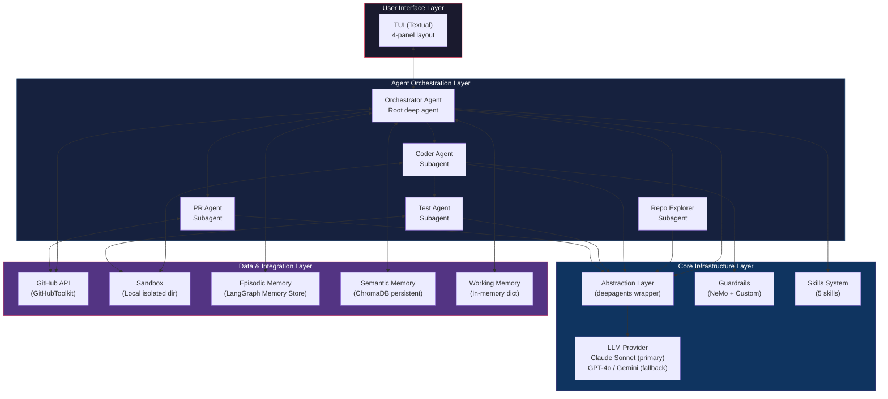

### Layered Architecture Summary

| Layer | Responsibility | Key Components |
|---|---|---|
| **User Interface** | User interaction, TUI panels, keyboard shortcuts, HITL prompts | `tui/app.py`, `panels/*` |
| **Agent Orchestration** | Task decomposition, subagent spawning, state machine management | `agents/orchestrator.py`, `agents/*` |
| **Core Infrastructure** | Framework abstraction, LLM management, guardrails, skills | `core/*`, `guardrails/*`, `skills/*` |
| **Data & Integration** | External APIs, storage, sandbox isolation, memory persistence | `github_integration/*`, `sandbox/*`, `memory/*` |

---

## 4. Component Architecture

### 4.1 Abstraction Layer (`core/`)

> The single most important architectural decision: isolate all `deepagents` usage behind a clean interface so the rest of the system is framework-agnostic.

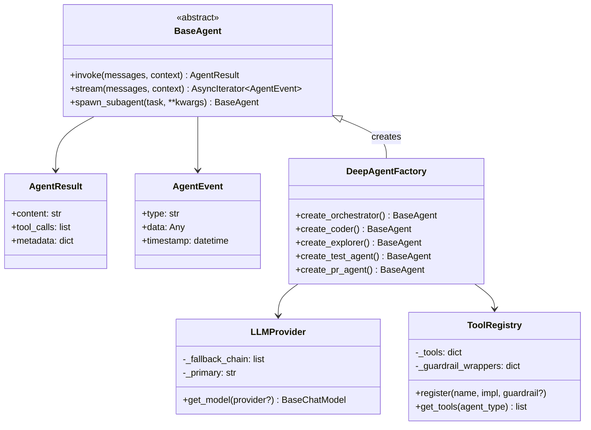

**Key files:**

| File | Responsibility |
|---|---|
| [base_agent.py](file:///c:/ai-engineering/codepilot-agent/src/codepilot/core/base_agent.py) | Abstract `BaseAgent` interface — the contract all agents follow |
| [agent_factory.py](file:///c:/ai-engineering/codepilot-agent/src/codepilot/core/agent_factory.py) | Concrete `DeepAgentFactory` wrapping `create_deep_agent()` |
| [llm_provider.py](file:///c:/ai-engineering/codepilot-agent/src/codepilot/core/llm_provider.py) | Multi-provider LLM factory with fallback chain: Claude → GPT-4o → Gemini |
| [tool_registry.py](file:///c:/ai-engineering/codepilot-agent/src/codepilot/core/tool_registry.py) | Centralized tool registration with guardrail wrapper injection |

**Fallback Strategy:**

```
Claude Sonnet (primary)
    │ rate limit / API error
    ▼
GPT-4o (fallback #1)
    │ rate limit / API error
    ▼
Gemini 1.5 Pro (fallback #2)
```

---

### 4.2 Agent System (`agents/`)

CodePilot uses a **hierarchical multi-agent architecture** where the Orchestrator is the root agent and all others are spawned as subagents.

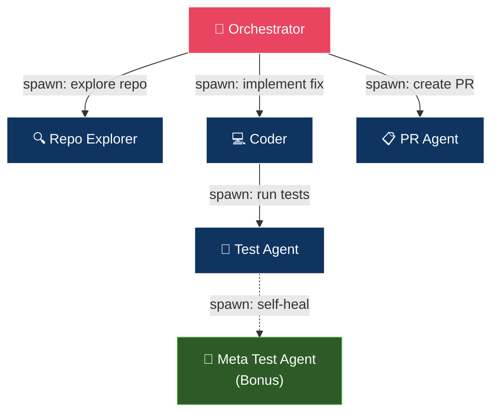

#### Agent Responsibilities & Tools

| Agent | Role | Tools Available | Input | Output |
|---|---|---|---|---|
| **Orchestrator** | Root planner, state machine, memory manager | `write_todos`, `task` (spawn), GitHub API, Memory Store | Issues / manual tasks | State transitions, delegation |
| **Repo Explorer** | Codebase analysis & file discovery | `ls`, `read_file`, semantic search, repo map | Task description + repo path | List of relevant file paths |
| **Coder** | Code implementation | `read_file`, `write_file`, `edit_file`, `execute`, `write_todos`, `spawn_subagent` | File paths, Skill, working memory | Diff + modified files |
| **Test Agent** | Test execution & reporting | `write_file`, `execute` | Sandbox path, test config | `TestResult` (pass/fail/coverage) |
| **PR Agent** | Branch/commit/PR creation | GitHub API (branch, commit, PR) | Approved diff, issue metadata | PR URL |

#### Orchestrator State Machine

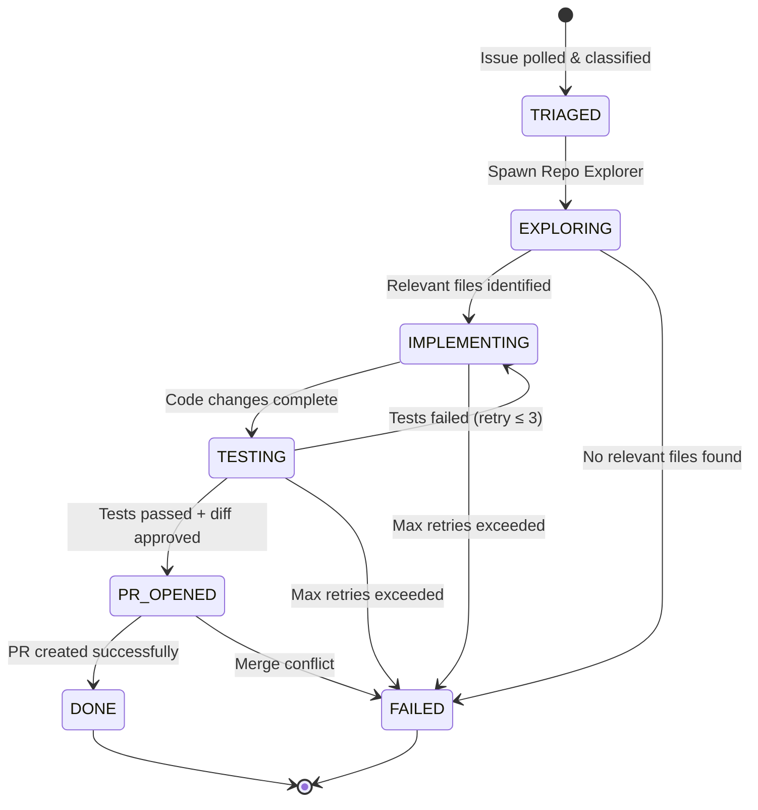

#### Task Sources

The Orchestrator handles two types of tasks through a unified `TaskSource` interface:

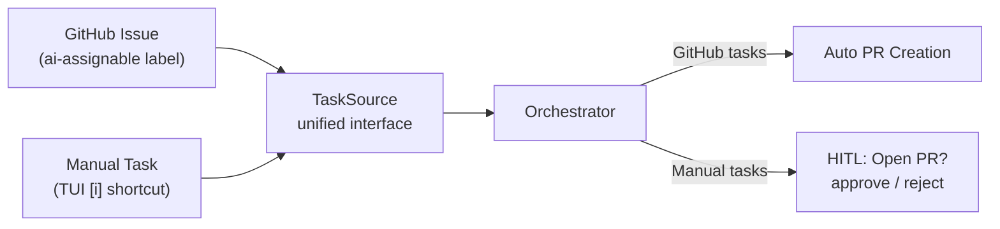

---

### 4.3 Context Engineering (`context/`)

The context engineering subsystem ensures agents never exceed token budgets and always have the most relevant information.

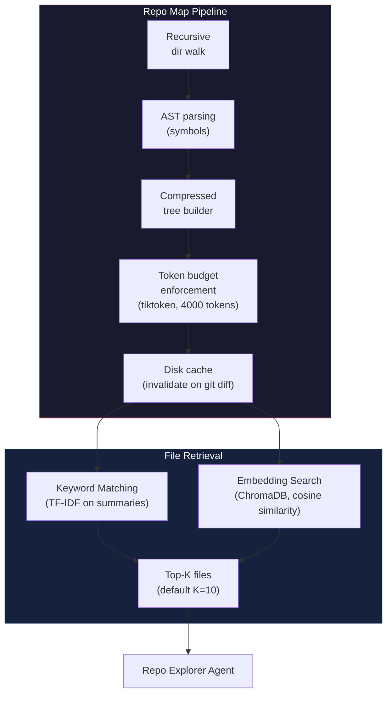

#### Context Engineering Rules

| Rule | Enforcement |
|---|---|
| **No file contents in spawn prompts** | Orchestrator passes only file paths when delegating to subagents |
| **On-demand file reading** | Subagents use `read_file` tool to load files as needed |
| **Auto-summarization** | `summarization=True` in `backend_config` compacts older conversation turns (threshold: 20 turns) |
| **Token budget** | Repo Map capped at 4000 tokens via `tiktoken`; truncate deepest leaves first |

---

### 4.4 Memory System (`memory/`)

Three-tier memory architecture providing task-scoped, session-scoped, and cross-session persistence:

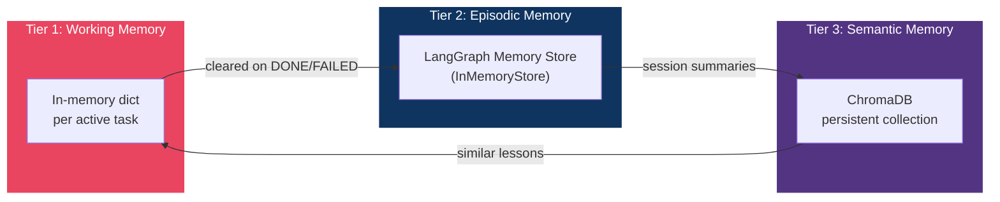

| Tier | Scope | Storage | Data | Lifecycle |
|---|---|---|---|---|
| **Working Memory** | Single task | In-memory `dict` | Issue metadata, repo map, relevant files, current diff, test results, retry count, state | Created at task start; cleared on `DONE` or `FAILED` |
| **Episodic Memory** | Session | LangGraph `InMemoryStore` with namespaces | Session summaries, task records, failed issue IDs | Written at session end; last 3 loaded at startup |
| **Semantic Memory** | Cross-session | ChromaDB persistent directory | "Lessons learned" — issue summary, files changed, approach, outcome | Written after successful PR; queried before each new task (top-3 similar) |

#### Episodic Memory Namespace Convention

```
("sessions", session_id)  → session summaries
("tasks", issue_id)       → individual task records
("failed", repository)    → recently failed issues (avoid retrying)
```

---

### 4.5 Skills System (`skills/`)

Skills are structured, reusable coding workflows loaded by the Orchestrator based on task classification.

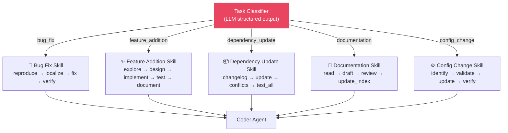

#### Skill Data Structure

```python
@dataclass
class Skill:
    name: str                       # e.g., "bug_fix"
    instructions: str               # Detailed instructions for the agent
    workflow_steps: list[str]       # Ordered steps: ["reproduce", "localize", "fix", "verify"]
    example_prompts: list[str]      # Example input prompts for few-shot learning
    forbidden_actions: list[str]    # Actions the agent must NOT take
```

| Skill | Workflow | Forbidden Actions |
|---|---|---|---|
| **Bug Fix** | reproduce → localize → fix → verify | Modifying test infrastructure, skipping tests |
| **Feature Addition** | explore_pattern → design → implement → test → document | Breaking public APIs without HITL approval |
| **Dependency Update** | check_changelog → update → resolve_conflicts → test_all | Major version updates without HITL approval |
| **Documentation** | read_existing → draft → review_accuracy → update_index | Removing existing docs, changing code behavior |
| **Config Change** | identify → validate → update → verify | Modifying credentials/secrets, changing validation logic |

---

### 4.6 Guardrails & Security (`guardrails/`)

Multi-layered defense preventing unsafe agent operations:

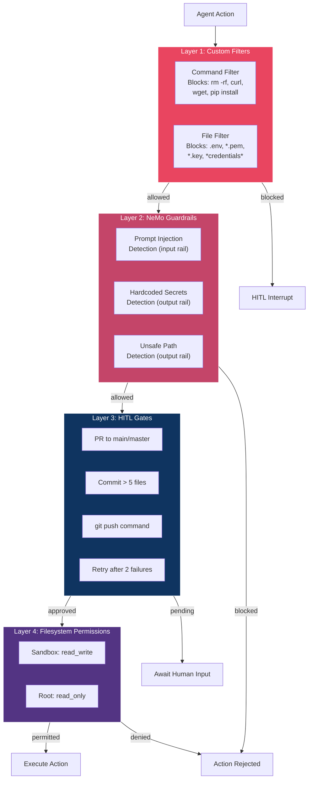

#### NeMo Guardrails Integration (Colang 2.0)

NeMo Guardrails wraps the Coder agent's LLM calls via `RunnableRails`:

```
Input → NeMo (input rails) → LLM → NeMo (output rails) → Output
```

| Rail | Type | Check |
|---|---|---|
| `check prompt injection` | Input | Detects prompt override attempts |
| `check hardcoded secrets` | Output | Detects API keys/passwords in generated code |
| `check unsafe file paths` | Output | Detects paths outside the sandbox |

#### HITL Gate Configuration

| Gate | Trigger Condition | User Options |
|---|---|---|
| PR to `main`/`master` | PR Agent targets protected branch | approve / reject / inspect |
| Large commit | Commit touches > 5 files | approve / reject / inspect |
| `git push` | Any `execute` containing `git push` | approve / reject / inspect |
| Retry after failures | `retry_count >= 2` | approve / reject |

---

### 4.7 Sandbox Execution (`sandbox/`)

All code execution happens in isolated sandbox directories — never in the live repository.

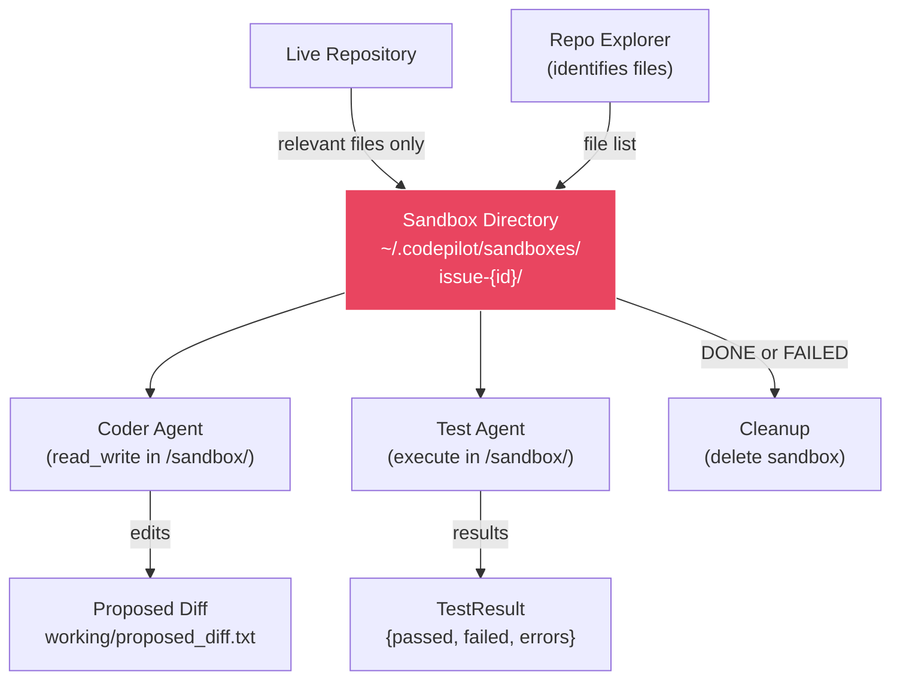

**Filesystem Permissions:**

| Path | Access Level |
|---|---|
| `/sandbox/` | `read_write` — Coder and Test Agent can modify |
| `/` (everything else) | `read_only` — prevents escape |

**Sandbox Providers (extensible):**

| Provider | Description |
|---|---|
| `local` (default) | Isolated directory on the local filesystem |
| `daytona` (Bonus) | Daytona cloud workspace |
| `modal` (Bonus) | Modal cloud sandbox |

---

### 4.8 GitHub Integration (`github_integration/`)

Wraps all GitHub API interactions behind a clean service interface.

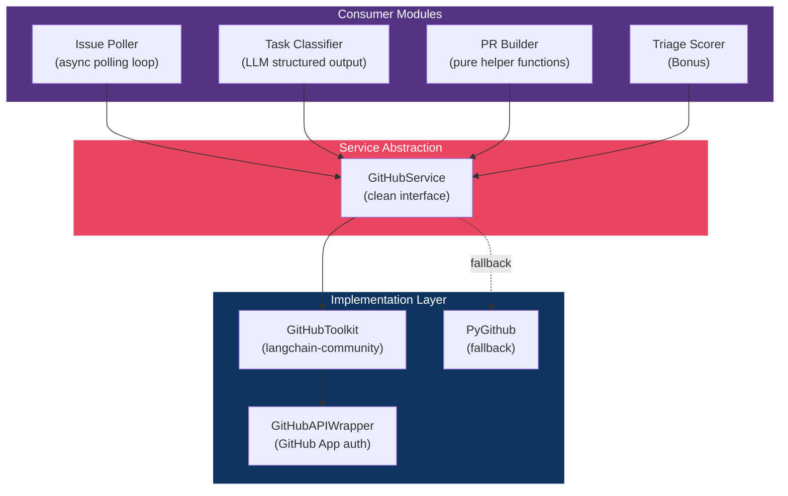

#### GitHub Authentication

CodePilot uses **GitHub App authentication** (App ID + private key `.pem` file), which provides:
- Fine-grained permissions per repository
- Higher rate limits than PATs
- Installation-level access tokens

#### Issue Polling Flow

```
Poll (every N min) → Filter (ai-assignable, unassigned) → Classify (LLM) → Score (Bonus) → Yield to Orchestrator
```

---

### 4.9 Terminal UI (`tui/`)

The TUI is built with the **Textual** framework and provides a 4-panel fixed layout.

```
┌──────────────────────┬──────────────────────────────────┐
│   GitHub Issues      │          Active Task              │
│  ──────────────      │  ────────────────────────────     │
│  #42 open ●          │  Issue #42: Fix null pointer      │
│  #38 in-progress ◐   │  Status: IMPLEMENTING             │
│  #31 done ✓          │  Agent: Coder (retry 1/3)         │
│  #27 failed ✗        │  Skill: bug_fix                   │
│  ⌨ manual-a3f [manual] │  Todo: [✓] Reproduce             │
│                      │        [✓] Localize               │
│                      │        [ ] Fix                    │
├──────────────────────┼──────────────────────────────────┤
│   Agent Logs         │        Human Approval             │
│  ──────────────      │  ────────────────────────────     │
│  [Orchestrator]      │  ⚠ Coder wants to open PR         │
│  Spawning Repo       │  to main (5 files changed)        │
│  Explorer...         │                                    │
│  [RepoExplorer]      │  > approve / reject / inspect     │
│  Found 8 relevant    │                                    │
│  files               │                                    │
└──────────────────────┴──────────────────────────────────┘
  [i] New task   [s] Skip issue   [q] Quit   [l] Logs
```

#### Panel Responsibilities

| Panel | Widget | Updates Via | Content |
|---|---|---|---|
| **GitHub Issues** | `ListView` | Polling loop events | Issue list with status indicators (●◐✓✗⌨) |
| **Active Task** | Custom widget | State machine transitions | Current task details, agent, skill, todo checklist |
| **Agent Logs** | `RichLog` | `BaseAgent.stream()` | Streaming agent thoughts and tool calls (prefixed by agent name) |
| **Human Approval** | Custom widget | HITL events | Actionable requests (approve/reject/inspect) + non-actionable alerts (merge conflicts) |

#### Keyboard Shortcuts

| Key | Action |
|---|---|
| `i` | Open input modal for free-form manual task |
| `s` | Skip the current issue |
| `q` | Quit CodePilot |
| `l` | Toggle full-screen agent logs |

---

## 5. Data Flow & Sequences

### End-to-End Issue Resolution Flow

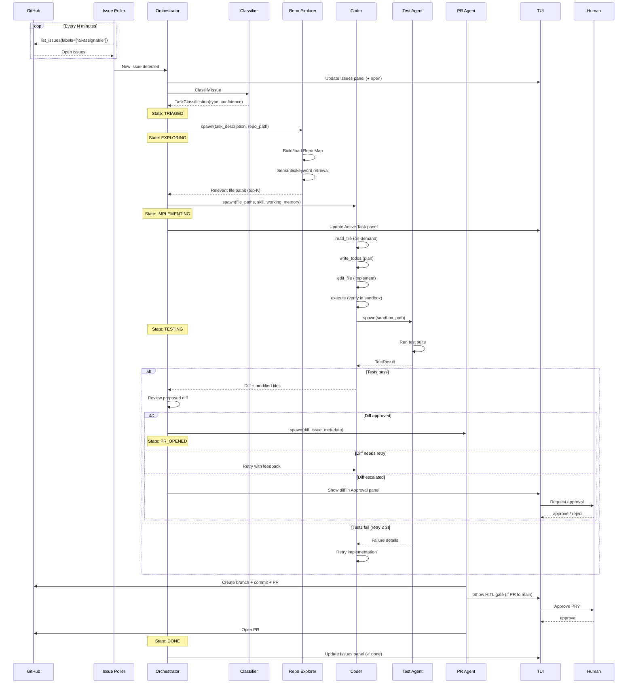

### Manual Task Flow

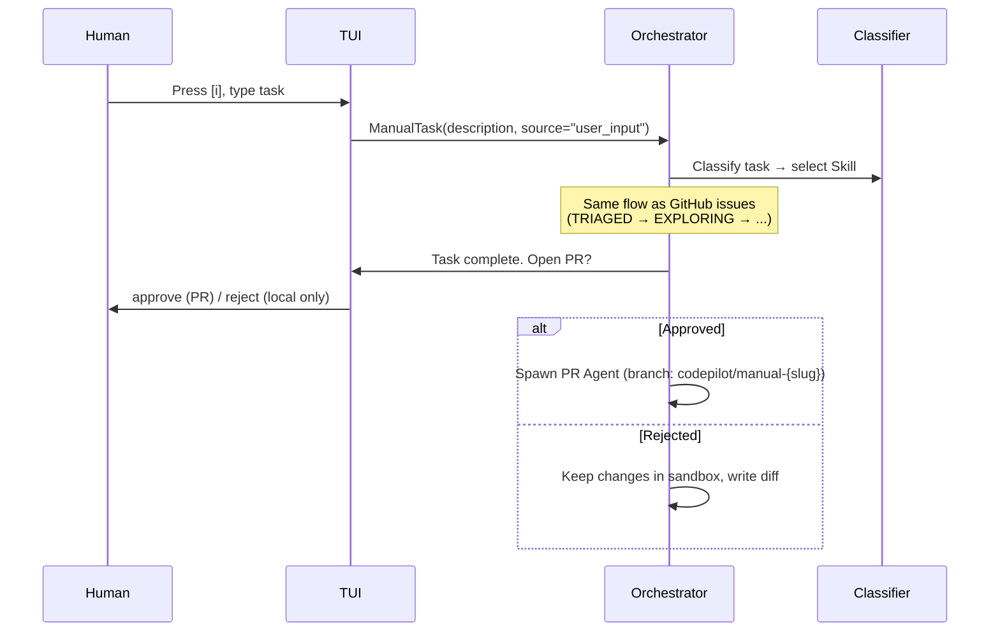

---

## 6. State Management

### Task State Machine

```python
class TaskState(str, Enum):
    TRIAGED       = "TRIAGED"        # Issue classified, skill selected
    EXPLORING     = "EXPLORING"      # Repo Explorer analyzing codebase
    IMPLEMENTING  = "IMPLEMENTING"   # Coder Agent making changes
    TESTING       = "TESTING"        # Test Agent running test suite
    PR_OPENED     = "PR_OPENED"      # PR Agent creating pull request
    DONE          = "DONE"           # Task completed successfully
    FAILED        = "FAILED"         # Task failed (max retries, merge conflict, human rejection)
```

### Valid State Transitions

```
TRIAGED      → EXPLORING
EXPLORING    → IMPLEMENTING | FAILED
IMPLEMENTING → TESTING | FAILED
TESTING      → IMPLEMENTING (retry) | PR_OPENED (via diff review)
PR_OPENED    → DONE | FAILED (merge conflict)
```

### Working Memory Lifecycle

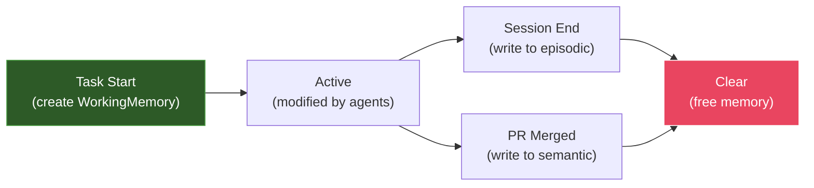

---

## 7. Security Architecture

### Threat Model

| Threat | Mitigation |
|---|---|
| **Sandbox escape** | Filesystem permissions (`read_only` outside `/sandbox/`), path validation in command filter |
| **Dangerous commands** | Command filter blocks `rm -rf`, `curl`, `wget`, `pip install`; NeMo output rails |
| **Credential exposure** | File filter blocks `.env`, `*.pem`, `*.key`; NeMo detects hardcoded secrets |
| **Prompt injection** | NeMo input rails detect override attempts |
| **Unreviewed changes** | HITL gates for PR to main, large commits, git push, excessive retries |
| **Infinite loops** | Max retry count (`MAX_CODER_RETRIES = 3`); HITL gate after 2 test failures |

### Security Layers (ordered by execution)

```
1. Custom Filters (command_filter.py, file_filter.py)
   ↓ pass
2. NeMo Guardrails (input rails → LLM → output rails)
   ↓ pass
3. HITL Gates (hitl.py → TUI approval panel)
   ↓ approved
4. Filesystem Permissions (sandbox/manager.py)
   ↓ permitted
5. Execution in sandboxed directory
```

---

## 8. Technology Stack

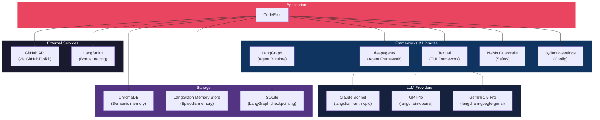

### Package Summary

| Package | Purpose |
|---|---|
| `deepagents` | Core agent framework |
| `langchain-anthropic` | Primary LLM — Claude Sonnet |
| `langchain-openai` | Fallback LLM — GPT-4o |
| `langchain-google-genai` | Fallback LLM — Gemini 1.5 Pro |
| `langchain-community` | GitHub Toolkit |
| `langgraph` | Agent runtime + checkpointing |
| `chromadb` | Semantic memory vector store |
| `textual` | TUI framework |
| `nemoguardrails` | Guardrails framework (Colang 2.0) |
| `pydantic-settings` | Configuration management |
| `tiktoken` | Token counting for Repo Map budget |
| `pygithub` | GitHub API fallback |
| `aiosqlite` | Async SQLite for LangGraph checkpointing |
| `pytest` + `pytest-asyncio` | Testing |

---

## 9. Directory Structure

```
c:\ai-engineering\codepilot-agent\
├── src/
│   └── codepilot/
│       ├── __init__.py
│       ├── main.py                  # Entry point
│       ├── config.py                # Settings (pydantic-settings)
│       │
│       ├── core/                    # ★ Abstraction layer over deepagents
│       │   ├── __init__.py
│       │   ├── agent_factory.py     # Wraps create_deep_agent()
│       │   ├── base_agent.py        # Abstract agent interface
│       │   ├── tool_registry.py     # Tool management abstraction
│       │   ├── llm_provider.py      # Multi-provider LLM factory
│       │   └── tracing.py           # LangSmith instrumentation (Bonus)
│       │
│       ├── agents/                  # Agent implementations
│       │   ├── __init__.py
│       │   ├── orchestrator.py      # Root Orchestrator agent
│       │   ├── repo_explorer.py     # Repo Explorer subagent
│       │   ├── coder.py             # Coder subagent
│       │   ├── test_agent.py        # Test Agent subagent
│       │   ├── pr_agent.py          # PR Agent subagent
│       │   └── meta_test_agent.py   # Self-healing meta-agent (Bonus)
│       │
│       ├── skills/                  # Reusable coding workflows
│       │   ├── __init__.py
│       │   ├── base.py              # Skill dataclass & registry
│       │   ├── bug_fix.py
│       │   ├── feature_addition.py
│       │   ├── dependency_update.py
│       │   ├── documentation.py
│       │   └── config_change.py
│       │
│       ├── memory/                  # 3-tier memory system
│       │   ├── __init__.py
│       │   ├── episodic.py          # LangGraph Memory Store
│       │   ├── semantic.py          # ChromaDB vector store
│       │   └── working.py           # In-memory task state
│       │
│       ├── guardrails/              # Safety & approval gates
│       │   ├── __init__.py
│       │   ├── command_filter.py    # Dangerous command blocker
│       │   ├── file_filter.py       # Sensitive file write blocker
│       │   ├── hitl.py              # Human-in-the-loop gate logic
│       │   └── config/              # NeMo Guardrails configs
│       │       ├── config.yml
│       │       ├── rails.co
│       │       └── actions.py
│       │
│       ├── github_integration/      # GitHub API abstraction
│       │   ├── __init__.py
│       │   ├── github_service.py    # Wraps GitHubToolkit
│       │   ├── issue_poller.py      # Async polling loop
│       │   ├── pr_builder.py        # PR metadata helpers (pure)
│       │   ├── classifier.py        # Issue → task type classifier
│       │   └── triage_scorer.py     # Complexity scoring (Bonus)
│       │
│       ├── context/                 # Context engineering
│       │   ├── __init__.py
│       │   ├── repo_map.py          # Repo Map builder & cache
│       │   └── retriever.py         # Keyword + embedding retrieval
│       │
│       ├── sandbox/                 # Sandboxed execution
│       │   ├── __init__.py
│       │   ├── manager.py           # Local sandbox setup/teardown
│       │   └── cloud_sandbox.py     # Cloud sandbox (Bonus)
│       │
│       ├── tui/                     # Terminal UI
│       │   ├── __init__.py
│       │   ├── app.py               # Textual App class
│       │   ├── panels/
│       │   │   ├── __init__.py
│       │   │   ├── issues.py        # GitHub Issues panel
│       │   │   ├── active_task.py   # Active Task panel
│       │   │   ├── agent_logs.py    # Streaming Agent Logs panel
│       │   │   └── approval.py      # Human Approval panel
│       │   └── styles.tcss          # Textual CSS
│       │
│       └── acp_server.py            # ACP HTTP server (Bonus)
│
├── tests/
│   ├── __init__.py
│   ├── test_core/
│   │   ├── test_agent_factory.py
│   │   └── test_llm_provider.py
│   ├── test_orchestrator.py
│   ├── test_repo_explorer.py
│   ├── test_coder.py
│   ├── test_skills.py
│   ├── test_memory.py
│   ├── test_guardrails.py
│   └── test_tui.py
│
├── docs/
│   ├── architecture.md              # ← This document
│   ├── implementation_plan.md
│   └── coding_platform.md
│
├── pyproject.toml
├── Makefile
├── .env.example
├── .gitignore
└── README.md
```

---

## 10. Deployment & Configuration

### Configuration (via `pydantic-settings`)

All settings are loaded from `.env` + environment variables:

| Setting | Default | Description |
|---|---|---|
| `PRIMARY_LLM` | `anthropic:claude-sonnet-4-20250514` | Primary LLM model |
| `FALLBACK_LLMS` | `openai:gpt-4o,google:gemini-1.5-pro` | Fallback chain |
| `GITHUB_APP_ID` | — | GitHub App ID |
| `GITHUB_APP_PRIVATE_KEY_PATH` | — | Path to `.pem` file |
| `GITHUB_REPOSITORY` | `codepilot-test-repo` | Target repository |
| `POLL_INTERVAL_MINUTES` | `5` | Issue polling frequency |
| `REPO_MAP_TOKEN_BUDGET` | `4000` | Max tokens for Repo Map |
| `MAX_RELEVANT_FILES` | `10` | Top-K files from retriever |
| `MAX_CODER_RETRIES` | `3` | Max retry attempts |
| `SANDBOX_BASE_DIR` | `~/.codepilot/sandboxes/` | Sandbox root directory |
| `CHROMADB_PERSIST_DIR` | `~/.codepilot/data/chromadb/` | ChromaDB directory |
| `COMPLEXITY_THRESHOLD` | `7` | Max issue complexity (1–10) |
| `AUTO_SUMMARIZATION_ENABLED` | `True` | Enable conversation summarization |
| `SUMMARIZATION_THRESHOLD` | `20` | Turns before summarization triggers |

### Data Directory Layout

```
~/.codepilot/
├── sandboxes/                    # Sandbox directories (temporary)
│   └── issue-{id}/              # Per-task sandbox
├── data/
│   └── chromadb/                 # ChromaDB persistent storage
└── cache/
    └── repo_maps/                # Cached Repo Maps (JSON)
```

---

## 11. Extension Points (Bonus)

These are additive features designed after core stability is achieved:

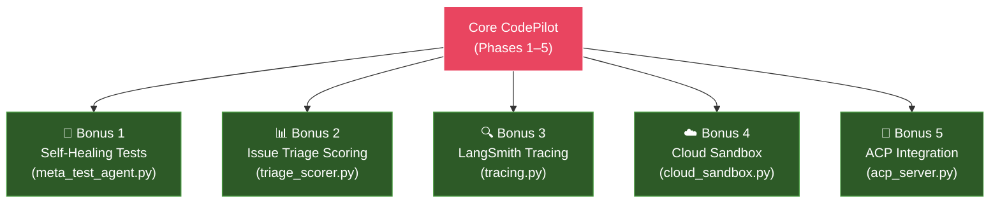

| Bonus | Description | Key Addition |
|---|---|---|
| **Self-Healing Tests** | Meta-agent debugs broken test infrastructure | New agent: `meta_test_agent.py` |
| **Issue Triage Scoring** | LLM-based complexity scoring (1–10) with threshold filtering | New module: `triage_scorer.py` |
| **LangSmith Tracing** | Full observability via LangSmith trace trees | New module: `tracing.py` |
| **Cloud Sandbox** | Daytona or Modal for true container isolation | New module: `cloud_sandbox.py`; `SandboxInterface` ABC |
| **ACP Integration** | HTTP API for Zed/Cursor integration | New module: `acp_server.py` |

---

## Risk Mitigation Summary

| Risk | Impact | Mitigation Strategy |
|---|---|---|
| `deepagents` API instability | High | Abstraction layer isolates all agents; swap to `LangGraphFactory` in one file |
| `langchain-community` GitHub Toolkit deprecation | Medium | `GitHubService` wrapper can swap to `PyGithub` |
| Claude Sonnet rate limits | Medium | Multi-provider fallback chain |
| Sandbox escape via `execute` | High | 4-layer guardrails: filters → NeMo → HITL → filesystem permissions |
| TUI complexity | Medium | Incremental panel development; Textual's built-in `RichLog` + `ListView` |
| LLM rate limits during polling | Medium | Classification caching; configurable poll intervals |

---

*This document is the authoritative architecture reference for CodePilot. For implementation details and phased build plan, see [implementation_plan.md](file:///c:/ai-engineering/codepilot-agent/docs/implementation_plan.md).*
