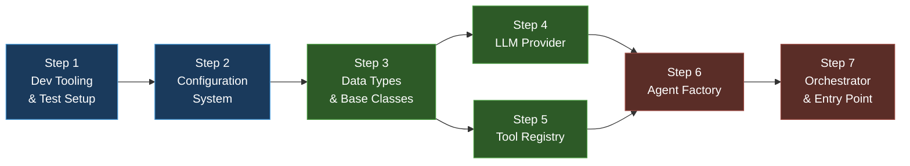

# Phase 1 — Detailed Implementation Plan

**Goal:** Set up the project structure, install dependencies, build the `deepagents` abstraction layer, create the Orchestrator agent with a basic tool-calling loop, and verify end-to-end integration.

**Total Estimated Effort:** ~3 days

> [!IMPORTANT]
> This plan breaks Phase 1 into **7 incremental steps**. Each step introduces ONLY the packages, directories, and files it needs — nothing more. You install a dependency when you need it, create a directory when you write code in it.

---

## Dependency Graph



**Legend:** 🔵 Foundation → 🟢 Abstraction Layer → 🔴 Agent Wiring

---

## Step 1 — Dev Tooling & Test Setup

**Goal:** Install dev tools (pytest, ruff) and set up the test infrastructure so we can write and run tests from Step 2 onward.

**Estimated Effort:** ~30 minutes

### Why this step exists

Before writing any code, we need the ability to **test** and **lint** it. No runtime dependencies yet — just the dev tools.

### New packages to install

| Package | Why we need it |
|---------|---------------|
| `pytest` | Run unit tests |
| `pytest-asyncio` | Support `async def` test functions (our codebase is async-first) |
| `pytest-cov` | Measure test coverage |
| `ruff` | Fast Python linter & formatter |

```bash
uv add --dev pytest pytest-asyncio pytest-cov ruff
```

### pyproject.toml additions

After the `uv add` command, also add these tool config sections to the **bottom** of `pyproject.toml`:

```toml
[tool.pytest.ini_options]
asyncio_mode = "auto"
testpaths = ["tests"]

[tool.ruff]
target-version = "py313"
src = ["src", "tests"]

[tool.ruff.lint]
select = ["E", "F", "I", "N", "W"]
```

**What these do:**
- `asyncio_mode = "auto"` — pytest-asyncio automatically handles `async def test_*` without decorators
- `testpaths` — pytest knows to look in `tests/`
- `ruff target-version` — lint rules match Python 3.13 syntax
- `ruff.lint.select` — E=errors, F=pyflakes, I=import sorting, N=naming, W=warnings

### Files to create

**`tests/__init__.py`** — empty file, makes `tests/` a Python package:
```python
```

**`tests/conftest.py`** — shared fixtures (minimal for now, we'll add to it):
```python
"""Shared test fixtures for CodePilot."""
```

### Verification ✅

```bash
# 1. Pytest runs (0 tests collected, no errors)
uv run pytest tests/ -v

# 2. Ruff lint passes on existing code
uv run ruff check src/ tests/

# 3. Ruff format check
uv run ruff format --check src/ tests/

# 4. Existing entry point still works
uv run python -m codepilot.main
```

---

## Step 2 — Configuration System

**Goal:** Create `config.py` using `pydantic-settings` so all settings are loaded from `.env` and environment variables.

**Estimated Effort:** ~1–2 hours

### Why this step exists

Every module we build next (LLM provider, agent factory, etc.) needs configuration — API keys, model names, thresholds. We build the config system first so everything else can depend on it.

### New packages to install

| Package | Why we need it |
|---------|---------------|
| `pydantic-settings` | Load config from `.env` files + environment variables into type-safe Python classes |

```bash
uv add pydantic-settings
```

### .env additions

Add these to your `.env` file (the actual secrets file, git-ignored):

```env
# LLM API Keys
ANTHROPIC_API_KEY=your-key-here
OPENAI_API_KEY=your-key-here
GOOGLE_API_KEY=your-key-here
```

Add the same keys (without values) to `.env.sample` so others know what's needed.

### Files to create

**`src/codepilot/config.py`** — the Config class:

```python
"""CodePilot configuration — loaded from .env and environment variables."""

from pydantic_settings import BaseSettings, SettingsConfigDict


class Config(BaseSettings):
    """Application settings.

    Values are loaded from environment variables and .env file.
    Each field name maps to an env var (case-insensitive).
    """

    model_config = SettingsConfigDict(
        env_file=".env",
        env_file_encoding="utf-8",
        case_sensitive=False,
    )

    # --- LLM ---
    primary_llm: str = "anthropic:claude-sonnet-4-20250514"
    fallback_llms: str = "openai:gpt-4o,google:gemini-1.5-pro"

    # --- API Keys ---
    anthropic_api_key: str = ""
    openai_api_key: str = ""
    google_api_key: str = ""

    # --- GitHub ---
    github_app_id: str = ""
    github_app_private_key_path: str = ""
    github_repository: str = "codepilot-test-repo"

    # --- Polling ---
    poll_interval_minutes: int = 5

    # --- Context ---
    repo_map_token_budget: int = 4000
    max_relevant_files: int = 10

    # --- Agent ---
    max_coder_retries: int = 3
    complexity_threshold: int = 7

    # --- Summarization ---
    auto_summarization_enabled: bool = True
    summarization_threshold: int = 20

    # --- Storage ---
    sandbox_base_dir: str = "~/.codepilot/sandboxes/"
    chromadb_persist_dir: str = "~/.codepilot/data/chromadb/"

    # --- Helpers ---
    @property
    def primary_provider(self) -> str:
        """Extract provider name from primary_llm (e.g., 'anthropic')."""
        return self.primary_llm.split(":")[0]

    @property
    def primary_model(self) -> str:
        """Extract model name from primary_llm (e.g., 'claude-sonnet-4-20250514')."""
        return self.primary_llm.split(":")[1]

    @property
    def fallback_chain(self) -> list[tuple[str, str]]:
        """Parse fallback_llms into a list of (provider, model) tuples."""
        return [
            (entry.split(":")[0], entry.split(":")[1])
            for entry in self.fallback_llms.split(",")
        ]
```

**`tests/test_config.py`** — unit tests:

```python
"""Tests for the configuration system."""

import os

import pytest

from codepilot.config import Config


class TestConfigDefaults:
    """Test that Config loads with sensible defaults."""

    def test_loads_without_env_file(self, monkeypatch):
        """Config should work even if .env is missing."""
        monkeypatch.delenv("ANTHROPIC_API_KEY", raising=False)
        config = Config(_env_file=None)  # Skip .env loading
        assert config.primary_llm == "anthropic:claude-sonnet-4-20250514"

    def test_default_poll_interval(self):
        config = Config(_env_file=None)
        assert config.poll_interval_minutes == 5

    def test_default_max_coder_retries(self):
        config = Config(_env_file=None)
        assert config.max_coder_retries == 3

    def test_default_summarization_enabled(self):
        config = Config(_env_file=None)
        assert config.auto_summarization_enabled is True

    def test_default_summarization_threshold(self):
        config = Config(_env_file=None)
        assert config.summarization_threshold == 20


class TestConfigParsing:
    """Test the helper properties that parse compound config values."""

    def test_primary_provider(self):
        config = Config(_env_file=None)
        assert config.primary_provider == "anthropic"

    def test_primary_model(self):
        config = Config(_env_file=None)
        assert config.primary_model == "claude-sonnet-4-20250514"

    def test_fallback_chain(self):
        config = Config(_env_file=None)
        assert config.fallback_chain == [
            ("openai", "gpt-4o"),
            ("google", "gemini-1.5-pro"),
        ]

    def test_custom_primary_llm(self, monkeypatch):
        monkeypatch.setenv("PRIMARY_LLM", "openai:gpt-4o")
        config = Config(_env_file=None)
        assert config.primary_provider == "openai"
        assert config.primary_model == "gpt-4o"


class TestConfigEnvOverrides:
    """Test that environment variables override defaults."""

    def test_env_overrides_poll_interval(self, monkeypatch):
        monkeypatch.setenv("POLL_INTERVAL_MINUTES", "10")
        config = Config(_env_file=None)
        assert config.poll_interval_minutes == 10

    def test_env_overrides_max_retries(self, monkeypatch):
        monkeypatch.setenv("MAX_CODER_RETRIES", "5")
        config = Config(_env_file=None)
        assert config.max_coder_retries == 5

    def test_env_overrides_api_key(self, monkeypatch):
        monkeypatch.setenv("ANTHROPIC_API_KEY", "sk-ant-test-key")
        config = Config(_env_file=None)
        assert config.anthropic_api_key == "sk-ant-test-key"
```

### Verification ✅

```bash
# 1. Config loads with defaults
uv run python -c "
from codepilot.config import Config
config = Config()
print(f'Primary LLM: {config.primary_llm}')
print(f'Provider: {config.primary_provider}')
print(f'Model: {config.primary_model}')
print(f'Fallbacks: {config.fallback_chain}')
print(f'Poll interval: {config.poll_interval_minutes} min')
print('✅ Config works')
"

# 2. Tests pass
uv run pytest tests/test_config.py -v

# 3. Lint
uv run ruff check src/codepilot/config.py tests/test_config.py
```

---

## Step 3 — Data Types & Base Classes

**Goal:** Define the core data types (`AgentResult`, `AgentEvent`) and the `BaseAgent` abstract class. These are pure Python — zero third-party dependencies.

**Estimated Effort:** ~1–2 hours

### Why this step exists

Every agent, factory, and tool in the system communicates through these types. They form the **abstraction boundary** between our code and `deepagents`. By defining them as pure Python dataclasses, we ensure no third-party types leak into our business logic.

### New packages to install

**None.** This step uses only the Python standard library (`abc`, `dataclasses`, `enum`, `typing`).

### Directories to create

```bash
# Create the core/ package — this is where the abstraction layer lives
mkdir src/codepilot/core
```

Then create `src/codepilot/core/__init__.py` (empty for now).

### Files to create

**`src/codepilot/core/__init__.py`** — empty:
```python
```

**`src/codepilot/core/base_agent.py`** — the abstraction boundary:

```python
"""Base agent interface and core data types.

This module defines the contract that ALL CodePilot agents implement.
No deepagents types appear here — this is the abstraction boundary.

If we ever swap deepagents for raw LangGraph, only the agent_factory.py
needs to change. Everything else depends on these types.
"""

from abc import ABC, abstractmethod
from dataclasses import dataclass, field
from enum import Enum
from typing import Any, AsyncIterator


class AgentEventType(str, Enum):
    """Types of events an agent can emit during streaming."""

    THINKING = "thinking"
    TOOL_CALL = "tool_call"
    TOOL_RESULT = "tool_result"
    MESSAGE = "message"
    TODO_UPDATE = "todo_update"
    ERROR = "error"
    DONE = "done"


@dataclass
class AgentEvent:
    """A single event emitted during agent streaming.

    Attributes:
        type: The kind of event (thinking, tool_call, message, etc.)
        agent_name: Which agent emitted this event.
        content: The event payload (text content, tool output, etc.)
        metadata: Optional extra data (tool name, error details, etc.)
    """

    type: AgentEventType
    agent_name: str
    content: str
    metadata: dict[str, Any] = field(default_factory=dict)


@dataclass
class AgentResult:
    """The final result of an agent invocation.

    Attributes:
        success: Whether the agent completed its task successfully.
        output: The agent's final text output.
        tool_calls_made: Record of tools the agent used.
        todos: Checklist items from write_todos calls.
        metadata: Optional extra data.
    """

    success: bool
    output: str
    tool_calls_made: list[dict[str, Any]] = field(default_factory=list)
    todos: list[str] = field(default_factory=list)
    metadata: dict[str, Any] = field(default_factory=dict)


class BaseAgent(ABC):
    """Abstract base for all CodePilot agents.

    All agents interact through this interface — never through
    deepagents types directly. This is the abstraction boundary.

    Subclasses must implement: invoke(), stream(), spawn_subagent().
    """

    def __init__(self, name: str, config: Any):
        """Initialize with agent name and config.

        Args:
            name: Human-readable agent name (e.g., "Orchestrator", "Coder").
            config: Config instance — typed as Any here to avoid circular imports.
        """
        self.name = name
        self.config = config

    @abstractmethod
    async def invoke(
        self, messages: list[dict], context: dict | None = None
    ) -> AgentResult:
        """Run the agent to completion and return the final result.

        Args:
            messages: List of message dicts (role + content).
            context: Optional context dict (working memory, file paths, etc.)
        """
        ...

    @abstractmethod
    async def stream(
        self, messages: list[dict], context: dict | None = None
    ) -> AsyncIterator[AgentEvent]:
        """Run the agent and yield events as they occur.

        Args:
            messages: List of message dicts (role + content).
            context: Optional context dict.
        """
        ...

    @abstractmethod
    async def spawn_subagent(
        self, task: str, agent_type: str, **kwargs: Any
    ) -> "BaseAgent":
        """Create and return a subagent for delegated work.

        Args:
            task: Description of the task to delegate.
            agent_type: Type of subagent (e.g., "coder", "test_agent").
            **kwargs: Additional config for the subagent.
        """
        ...
```

**`tests/test_core/__init__.py`** — empty:
```python
```

(Create `tests/test_core/` directory first if not exists.)

**`tests/test_core/test_base_agent.py`** — unit tests:

```python
"""Tests for base agent interface and core data types."""

import pytest

from codepilot.core.base_agent import (
    AgentEvent,
    AgentEventType,
    AgentResult,
    BaseAgent,
)


class TestAgentResult:
    """Tests for the AgentResult dataclass."""

    def test_create_with_required_fields(self):
        result = AgentResult(success=True, output="done")
        assert result.success is True
        assert result.output == "done"

    def test_defaults_for_optional_fields(self):
        result = AgentResult(success=True, output="done")
        assert result.tool_calls_made == []
        assert result.todos == []
        assert result.metadata == {}

    def test_create_with_all_fields(self):
        result = AgentResult(
            success=False,
            output="failed",
            tool_calls_made=[{"name": "read_file", "args": {"path": "x.py"}}],
            todos=["Fix bug", "Add test"],
            metadata={"retry_count": 2},
        )
        assert result.success is False
        assert len(result.tool_calls_made) == 1
        assert len(result.todos) == 2
        assert result.metadata["retry_count"] == 2


class TestAgentEvent:
    """Tests for the AgentEvent dataclass."""

    def test_create_event(self):
        event = AgentEvent(
            type=AgentEventType.MESSAGE,
            agent_name="Orchestrator",
            content="Planning task...",
        )
        assert event.type == AgentEventType.MESSAGE
        assert event.agent_name == "Orchestrator"
        assert event.content == "Planning task..."

    def test_event_metadata_defaults_to_empty(self):
        event = AgentEvent(
            type=AgentEventType.THINKING,
            agent_name="Coder",
            content="Analyzing...",
        )
        assert event.metadata == {}

    def test_all_event_types_are_strings(self):
        """AgentEventType values should be usable as plain strings."""
        assert AgentEventType.THINKING == "thinking"
        assert AgentEventType.TOOL_CALL == "tool_call"
        assert AgentEventType.DONE == "done"


class TestBaseAgent:
    """Tests for the BaseAgent abstract class."""

    def test_cannot_instantiate_directly(self):
        """BaseAgent is abstract — instantiation must fail."""
        with pytest.raises(TypeError):
            BaseAgent("test", None)

    def test_subclass_missing_methods_fails(self):
        """A subclass that doesn't implement all abstract methods can't be instantiated."""

        class IncompleteAgent(BaseAgent):
            async def invoke(self, messages, context=None):
                return AgentResult(success=True, output="ok")
            # Missing: stream() and spawn_subagent()

        with pytest.raises(TypeError):
            IncompleteAgent("test", None)

    def test_complete_subclass_works(self):
        """A subclass implementing all methods can be instantiated."""

        class FakeAgent(BaseAgent):
            async def invoke(self, messages, context=None):
                return AgentResult(success=True, output="ok")

            async def stream(self, messages, context=None):
                yield AgentEvent(
                    type=AgentEventType.DONE,
                    agent_name=self.name,
                    content="done",
                )

            async def spawn_subagent(self, task, agent_type, **kwargs):
                return FakeAgent("sub", self.config)

        agent = FakeAgent("test-agent", None)
        assert agent.name == "test-agent"
```

### Verification ✅

```bash
# 1. Types are importable
uv run python -c "
from codepilot.core.base_agent import BaseAgent, AgentResult, AgentEvent, AgentEventType
result = AgentResult(success=True, output='hello')
event = AgentEvent(type=AgentEventType.MESSAGE, agent_name='test', content='hi')
print(f'AgentResult: {result}')
print(f'AgentEvent: {event}')
print('✅ Core data types work')
"

# 2. Tests pass
uv run pytest tests/test_core/test_base_agent.py -v

# 3. Lint
uv run ruff check src/codepilot/core/ tests/test_core/
```

---

## Step 4 — LLM Provider

**Goal:** Build the multi-provider LLM factory with fallback logic (Claude → GPT-4o → Gemini).

**Estimated Effort:** ~2–3 hours

### Why this step exists

Every agent needs an LLM. The `LLMProvider` is a factory that:
- Returns the right LLM based on config
- Automatically falls back to another provider if the primary fails (rate limit, API error)

### New packages to install

| Package | Why we need it |
|---------|---------------|
| `langchain-anthropic` | Claude Sonnet — our primary LLM |
| `langchain-openai` | GPT-4o — first fallback |
| `langchain-google-genai` | Gemini 1.5 Pro — second fallback |

```bash
uv add langchain-anthropic langchain-openai langchain-google-genai
```

### .env additions

Make sure your `.env` has at least one valid API key:

```env
ANTHROPIC_API_KEY=sk-ant-your-key-here
```

(OpenAI and Google keys are optional — only needed if fallback is triggered.)

### Files to create

**`src/codepilot/core/llm_provider.py`**:

```python
"""Multi-provider LLM factory with automatic fallback.

Primary: Claude Sonnet (Anthropic)
Fallback chain: GPT-4o (OpenAI) → Gemini 1.5 Pro (Google)

The fallback activates when the primary provider returns a rate limit
or API error. This ensures the system stays operational even when
one provider is temporarily unavailable.
"""

import logging
from typing import Any

from langchain_anthropic import ChatAnthropic
from langchain_core.language_models import BaseChatModel
from langchain_google_genai import ChatGoogleGenerativeAI
from langchain_openai import ChatOpenAI

from codepilot.config import Config

logger = logging.getLogger(__name__)


class LLMProviderError(Exception):
    """Raised when all LLM providers fail."""


class LLMProvider:
    """Factory for creating LLM instances with automatic fallback."""

    def __init__(self, config: Config):
        self._config = config

    def _create_model(self, provider: str, model: str) -> BaseChatModel:
        """Create an LLM instance for the given provider and model.

        Args:
            provider: One of 'anthropic', 'openai', 'google'.
            model: The model identifier (e.g., 'claude-sonnet-4-20250514').

        Raises:
            ValueError: If the provider is unknown.
        """
        match provider:
            case "anthropic":
                return ChatAnthropic(
                    model=model,
                    api_key=self._config.anthropic_api_key,
                )
            case "openai":
                return ChatOpenAI(
                    model=model,
                    api_key=self._config.openai_api_key,
                )
            case "google":
                return ChatGoogleGenerativeAI(
                    model=model,
                    google_api_key=self._config.google_api_key,
                )
            case _:
                raise ValueError(f"Unknown LLM provider: {provider}")

    def get_primary(self) -> BaseChatModel:
        """Return the primary LLM (Claude Sonnet by default)."""
        return self._create_model(
            self._config.primary_provider,
            self._config.primary_model,
        )

    def get_model(
        self, provider: str | None = None, model: str | None = None
    ) -> BaseChatModel:
        """Return a specific provider's model, or the primary if unspecified."""
        if provider and model:
            return self._create_model(provider, model)
        return self.get_primary()

    def get_fallback_chain(self) -> list[BaseChatModel]:
        """Return the ordered list: [primary, fallback1, fallback2, ...]."""
        chain = [self.get_primary()]
        for provider, model in self._config.fallback_chain:
            try:
                chain.append(self._create_model(provider, model))
            except Exception as e:
                logger.warning(f"Could not create fallback {provider}:{model}: {e}")
        return chain

    async def invoke_with_fallback(
        self, messages: list, **kwargs: Any
    ) -> Any:
        """Try each provider in order until one succeeds.

        Args:
            messages: The messages to send to the LLM.
            **kwargs: Additional arguments passed to the LLM.

        Returns:
            The LLM response from the first successful provider.

        Raises:
            LLMProviderError: If all providers fail.
        """
        chain = self.get_fallback_chain()
        last_error: Exception | None = None

        for i, llm in enumerate(chain):
            try:
                logger.debug(f"Trying LLM provider {i + 1}/{len(chain)}")
                result = await llm.ainvoke(messages, **kwargs)
                return result
            except Exception as e:
                logger.warning(f"LLM provider {i + 1} failed: {e}")
                last_error = e
                continue

        raise LLMProviderError(
            f"All {len(chain)} LLM providers failed. Last error: {last_error}"
        )
```

**`tests/test_core/test_llm_provider.py`**:

```python
"""Tests for the LLM provider — all LLM calls are mocked."""

from unittest.mock import AsyncMock, MagicMock, patch

import pytest

from codepilot.config import Config
from codepilot.core.llm_provider import LLMProvider, LLMProviderError


@pytest.fixture
def config():
    """Config with test defaults (no real API keys needed for mocked tests)."""
    return Config(
        _env_file=None,
        anthropic_api_key="test-anthropic-key",
        openai_api_key="test-openai-key",
        google_api_key="test-google-key",
    )


@pytest.fixture
def provider(config):
    return LLMProvider(config)


class TestGetPrimary:
    """Test primary model creation."""

    def test_returns_anthropic_by_default(self, provider):
        model = provider.get_primary()
        # ChatAnthropic stores the model name
        assert "claude" in str(model.model).lower() or hasattr(model, "model")

    def test_custom_primary_from_config(self):
        config = Config(
            _env_file=None,
            primary_llm="openai:gpt-4o",
            openai_api_key="test-key",
        )
        provider = LLMProvider(config)
        model = provider.get_primary()
        # Should be a ChatOpenAI instance
        from langchain_openai import ChatOpenAI
        assert isinstance(model, ChatOpenAI)


class TestGetModel:
    """Test explicit model creation by provider."""

    def test_get_anthropic(self, provider):
        from langchain_anthropic import ChatAnthropic
        model = provider.get_model("anthropic", "claude-sonnet-4-20250514")
        assert isinstance(model, ChatAnthropic)

    def test_get_openai(self, provider):
        from langchain_openai import ChatOpenAI
        model = provider.get_model("openai", "gpt-4o")
        assert isinstance(model, ChatOpenAI)

    def test_get_google(self, provider):
        from langchain_google_genai import ChatGoogleGenerativeAI
        model = provider.get_model("google", "gemini-1.5-pro")
        assert isinstance(model, ChatGoogleGenerativeAI)

    def test_unknown_provider_raises(self, provider):
        with pytest.raises(ValueError, match="Unknown LLM provider"):
            provider.get_model("unknown", "some-model")

    def test_no_args_returns_primary(self, provider):
        model = provider.get_model()
        assert model is not None


class TestFallbackChain:
    """Test the fallback chain ordering."""

    def test_chain_has_three_models(self, provider):
        chain = provider.get_fallback_chain()
        assert len(chain) == 3  # primary + 2 fallbacks

    def test_chain_order(self, provider):
        from langchain_anthropic import ChatAnthropic
        from langchain_openai import ChatOpenAI
        from langchain_google_genai import ChatGoogleGenerativeAI

        chain = provider.get_fallback_chain()
        assert isinstance(chain[0], ChatAnthropic)
        assert isinstance(chain[1], ChatOpenAI)
        assert isinstance(chain[2], ChatGoogleGenerativeAI)


class TestInvokeWithFallback:
    """Test fallback behavior — all LLM calls mocked."""

    @pytest.mark.asyncio
    async def test_uses_primary_when_it_succeeds(self, provider):
        mock_response = MagicMock()
        mock_response.content = "Hello from Claude"

        with patch.object(provider, "get_fallback_chain") as mock_chain:
            mock_llm = AsyncMock()
            mock_llm.ainvoke.return_value = mock_response
            mock_chain.return_value = [mock_llm]

            result = await provider.invoke_with_fallback([{"role": "user", "content": "hi"}])
            assert result.content == "Hello from Claude"
            mock_llm.ainvoke.assert_called_once()

    @pytest.mark.asyncio
    async def test_falls_back_on_primary_failure(self, provider):
        mock_response = MagicMock()
        mock_response.content = "Hello from GPT-4o"

        with patch.object(provider, "get_fallback_chain") as mock_chain:
            failing_llm = AsyncMock()
            failing_llm.ainvoke.side_effect = Exception("Rate limit")

            fallback_llm = AsyncMock()
            fallback_llm.ainvoke.return_value = mock_response

            mock_chain.return_value = [failing_llm, fallback_llm]

            result = await provider.invoke_with_fallback([{"role": "user", "content": "hi"}])
            assert result.content == "Hello from GPT-4o"

    @pytest.mark.asyncio
    async def test_raises_when_all_fail(self, provider):
        with patch.object(provider, "get_fallback_chain") as mock_chain:
            llm1 = AsyncMock()
            llm1.ainvoke.side_effect = Exception("Error 1")
            llm2 = AsyncMock()
            llm2.ainvoke.side_effect = Exception("Error 2")

            mock_chain.return_value = [llm1, llm2]

            with pytest.raises(LLMProviderError, match="All 2 LLM providers failed"):
                await provider.invoke_with_fallback([{"role": "user", "content": "hi"}])
```

### Verification ✅

```bash
# 1. LLMProvider instantiates
uv run python -c "
from codepilot.core.llm_provider import LLMProvider
from codepilot.config import Config
provider = LLMProvider(Config())
print(f'Primary: {provider.get_primary()}')
print('✅ LLMProvider works')
"

# 2. Tests pass
uv run pytest tests/test_core/test_llm_provider.py -v

# 3. Lint
uv run ruff check src/codepilot/core/llm_provider.py tests/test_core/test_llm_provider.py
```

---

## Step 5 — Tool Registry

**Goal:** Create the centralized tool registration system that manages which tools are available to each agent role.

**Estimated Effort:** ~1–2 hours

### Why this step exists

Different agents need different tools (Coder gets `edit_file` + `execute`, Test Agent gets `execute` only, etc.). The registry is where tools are registered and assigned to roles. It also marks which tools need guardrail wrappers.

### New packages to install

**None.** This is pure Python — no third-party dependencies.

### Files to create

**`src/codepilot/core/tool_registry.py`**:

```python
"""Centralized tool registration and management.

The ToolRegistry is where:
- Tools are registered by name with their handler functions
- Tools are assigned to agent roles (orchestrator, coder, test_agent, etc.)
- Tools are flagged for guardrail wrapping (sensitive operations)
- The AgentFactory queries to get tools for each agent it creates
"""

import logging
from dataclasses import dataclass, field
from typing import Any, Awaitable, Callable

logger = logging.getLogger(__name__)


@dataclass
class ToolDefinition:
    """Definition of a tool available to agents.

    Attributes:
        name: Unique tool identifier (e.g., 'read_file', 'execute').
        description: Human-readable description for the LLM.
        handler: Async function that implements the tool.
        parameters: JSON schema for tool parameters.
        requires_guardrail: If True, guardrail wrapper is injected before handler.
        requires_approval: If True, HITL approval is needed before execution.
    """

    name: str
    description: str
    handler: Callable[..., Awaitable[Any]]
    parameters: dict[str, Any] = field(default_factory=dict)
    requires_guardrail: bool = False
    requires_approval: bool = False


class ToolNotFoundError(Exception):
    """Raised when a requested tool is not registered."""


class ToolRegistry:
    """Centralized tool registration and role-based access.

    Usage:
        registry = ToolRegistry()
        registry.register(ToolDefinition(name="read_file", ...))
        registry.register_role_tools("coder", ["read_file", "edit_file"])
        tools = registry.get_tools_for_role("coder")
    """

    def __init__(self) -> None:
        self._tools: dict[str, ToolDefinition] = {}
        self._role_tools: dict[str, list[str]] = {}

    def register(self, tool: ToolDefinition) -> None:
        """Register a tool. Overwrites if name already exists."""
        if tool.name in self._tools:
            logger.warning(f"Overwriting existing tool: {tool.name}")
        self._tools[tool.name] = tool
        logger.debug(f"Registered tool: {tool.name}")

    def get_tool(self, name: str) -> ToolDefinition:
        """Get a tool by name.

        Raises:
            ToolNotFoundError: If the tool is not registered.
        """
        if name not in self._tools:
            raise ToolNotFoundError(f"Tool not found: {name}")
        return self._tools[name]

    def register_role_tools(self, role: str, tool_names: list[str]) -> None:
        """Assign a list of tool names to an agent role.

        Args:
            role: Agent role (e.g., 'orchestrator', 'coder', 'test_agent').
            tool_names: List of registered tool names this role can use.
        """
        self._role_tools[role] = tool_names
        logger.debug(f"Role '{role}' assigned tools: {tool_names}")

    def get_tools_for_role(self, role: str) -> list[ToolDefinition]:
        """Get all tool definitions for a given role.

        Returns an empty list for unregistered roles.
        """
        tool_names = self._role_tools.get(role, [])
        tools = []
        for name in tool_names:
            try:
                tools.append(self.get_tool(name))
            except ToolNotFoundError:
                logger.warning(
                    f"Role '{role}' references unregistered tool: {name}"
                )
        return tools

    def list_all(self) -> list[str]:
        """Return all registered tool names."""
        return list(self._tools.keys())

    def list_roles(self) -> list[str]:
        """Return all registered roles."""
        return list(self._role_tools.keys())
```

**`tests/test_core/test_tool_registry.py`**:

```python
"""Tests for the tool registry."""

import pytest

from codepilot.core.tool_registry import (
    ToolDefinition,
    ToolNotFoundError,
    ToolRegistry,
)


async def mock_handler(**kwargs):
    """Dummy async handler for testing."""
    return "ok"


@pytest.fixture
def registry():
    return ToolRegistry()


@pytest.fixture
def sample_tool():
    return ToolDefinition(
        name="read_file",
        description="Read contents of a file",
        handler=mock_handler,
    )


class TestToolRegistration:
    """Test registering and retrieving tools."""

    def test_register_and_get(self, registry, sample_tool):
        registry.register(sample_tool)
        retrieved = registry.get_tool("read_file")
        assert retrieved.name == "read_file"
        assert retrieved.description == "Read contents of a file"

    def test_get_unknown_tool_raises(self, registry):
        with pytest.raises(ToolNotFoundError, match="Tool not found: unknown"):
            registry.get_tool("unknown")

    def test_duplicate_registration_overwrites(self, registry):
        tool_v1 = ToolDefinition(name="x", description="v1", handler=mock_handler)
        tool_v2 = ToolDefinition(name="x", description="v2", handler=mock_handler)
        registry.register(tool_v1)
        registry.register(tool_v2)
        assert registry.get_tool("x").description == "v2"

    def test_list_all(self, registry, sample_tool):
        registry.register(sample_tool)
        registry.register(
            ToolDefinition(name="execute", description="Run command", handler=mock_handler)
        )
        assert sorted(registry.list_all()) == ["execute", "read_file"]


class TestRoleTools:
    """Test role-based tool assignment."""

    def test_assign_and_retrieve_role_tools(self, registry, sample_tool):
        registry.register(sample_tool)
        registry.register_role_tools("coder", ["read_file"])
        tools = registry.get_tools_for_role("coder")
        assert len(tools) == 1
        assert tools[0].name == "read_file"

    def test_unknown_role_returns_empty(self, registry):
        tools = registry.get_tools_for_role("nonexistent")
        assert tools == []

    def test_role_with_missing_tool_skips_it(self, registry):
        registry.register_role_tools("coder", ["read_file", "nonexistent"])
        registry.register(
            ToolDefinition(name="read_file", description="Read", handler=mock_handler)
        )
        tools = registry.get_tools_for_role("coder")
        assert len(tools) == 1  # Only read_file, nonexistent skipped

    def test_list_roles(self, registry):
        registry.register_role_tools("coder", ["read_file"])
        registry.register_role_tools("orchestrator", ["write_todos"])
        assert sorted(registry.list_roles()) == ["coder", "orchestrator"]


class TestToolFlags:
    """Test guardrail and approval flags."""

    def test_guardrail_flag(self, registry):
        tool = ToolDefinition(
            name="execute",
            description="Run a command",
            handler=mock_handler,
            requires_guardrail=True,
        )
        registry.register(tool)
        assert registry.get_tool("execute").requires_guardrail is True

    def test_approval_flag(self, registry):
        tool = ToolDefinition(
            name="git_push",
            description="Push to remote",
            handler=mock_handler,
            requires_approval=True,
        )
        registry.register(tool)
        assert registry.get_tool("git_push").requires_approval is True

    def test_default_flags_are_false(self, registry, sample_tool):
        registry.register(sample_tool)
        tool = registry.get_tool("read_file")
        assert tool.requires_guardrail is False
        assert tool.requires_approval is False
```

### Verification ✅

```bash
# 1. ToolRegistry works
uv run python -c "
from codepilot.core.tool_registry import ToolRegistry, ToolDefinition

async def noop(**kw): return 'ok'

registry = ToolRegistry()
registry.register(ToolDefinition(name='read_file', description='Read a file', handler=noop))
registry.register_role_tools('coder', ['read_file'])
tools = registry.get_tools_for_role('coder')
print(f'Coder tools: {[t.name for t in tools]}')
print('✅ ToolRegistry works')
"

# 2. Tests pass
uv run pytest tests/test_core/test_tool_registry.py -v

# 3. Lint
uv run ruff check src/codepilot/core/tool_registry.py tests/test_core/test_tool_registry.py
```

---

## Step 6 — Agent Factory

**Goal:** Build `DeepAgentFactory` — the single bridge between our abstraction layer and `deepagents`. This is the ONLY file that imports `deepagents`.

**Estimated Effort:** ~3–4 hours

### Why this step exists

We need a concrete implementation that maps our `BaseAgent` interface to actual `deepagents` API calls. By isolating all `deepagents` usage here, we can swap the entire underlying engine later by replacing just this one file.

### New packages to install

| Package | Why we need it |
|---------|---------------|
| `deepagents` | The core agent framework — `create_deep_agent()` |
| `langgraph` | Agent runtime, checkpointing, memory store |

```bash
uv add deepagents langgraph
```

### Files to create

**`src/codepilot/core/agent_factory.py`**:

```python
"""Agent factory — the bridge between our abstraction and deepagents.

THIS IS THE ONLY FILE THAT IMPORTS DEEPAGENTS.

If deepagents breaks or we want to swap to raw LangGraph, replace this
single file with a LangGraphFactory. No other code needs to change.
"""

import logging
from typing import Any, AsyncIterator

from codepilot.config import Config
from codepilot.core.base_agent import (
    AgentEvent,
    AgentEventType,
    AgentResult,
    BaseAgent,
)
from codepilot.core.llm_provider import LLMProvider
from codepilot.core.tool_registry import ToolRegistry

logger = logging.getLogger(__name__)

# --- deepagents imports (ONLY HERE) ---
try:
    from deepagents.agents import create_deep_agent
    DEEPAGENTS_AVAILABLE = True
except ImportError:
    logger.warning("deepagents not installed — using mock agent")
    DEEPAGENTS_AVAILABLE = False


class DeepAgent(BaseAgent):
    """Concrete agent backed by deepagents.

    Translates between our BaseAgent interface and the deepagents API.
    All deepagents types are converted to AgentResult/AgentEvent at this boundary.
    """

    def __init__(
        self,
        name: str,
        config: Config,
        deep_agent_instance: Any,
        tool_registry: ToolRegistry,
        llm_provider: LLMProvider,
        factory: "DeepAgentFactory",
    ):
        super().__init__(name, config)
        self._agent = deep_agent_instance
        self._tool_registry = tool_registry
        self._llm_provider = llm_provider
        self._factory = factory

    async def invoke(
        self, messages: list[dict], context: dict | None = None
    ) -> AgentResult:
        """Run the deepagents agent and translate result to AgentResult."""
        try:
            # Build the prompt from messages
            prompt = "\n".join(
                f"{m.get('role', 'user')}: {m.get('content', '')}"
                for m in messages
            )

            # Run through deepagents
            if self._agent is not None:
                result = await self._agent.ainvoke(prompt)
                return AgentResult(
                    success=True,
                    output=str(result) if result else "",
                    metadata={"agent_name": self.name},
                )
            else:
                # Mock mode when deepagents isn't available
                return AgentResult(
                    success=True,
                    output=f"[{self.name}] Mock response — deepagents not available",
                    metadata={"agent_name": self.name, "mock": True},
                )
        except Exception as e:
            logger.error(f"Agent {self.name} invoke failed: {e}")
            return AgentResult(
                success=False,
                output=str(e),
                metadata={"agent_name": self.name, "error": str(e)},
            )

    async def stream(
        self, messages: list[dict], context: dict | None = None
    ) -> AsyncIterator[AgentEvent]:
        """Stream events from the agent."""
        yield AgentEvent(
            type=AgentEventType.THINKING,
            agent_name=self.name,
            content=f"{self.name} is processing...",
        )

        result = await self.invoke(messages, context)

        yield AgentEvent(
            type=AgentEventType.MESSAGE,
            agent_name=self.name,
            content=result.output,
        )

        yield AgentEvent(
            type=AgentEventType.DONE,
            agent_name=self.name,
            content="Complete",
            metadata={"success": result.success},
        )

    async def spawn_subagent(
        self, task: str, agent_type: str, **kwargs: Any
    ) -> BaseAgent:
        """Spawn a subagent using the factory."""
        return self._factory.create_agent(
            name=f"{self.name}/{agent_type}",
            system_prompt=task,
            role=agent_type,
        )


class DeepAgentFactory:
    """Factory for creating agents through deepagents.

    This is the abstraction boundary. If deepagents breaks, replace
    this class with LangGraphFactory — nothing else changes.
    """

    def __init__(
        self,
        config: Config,
        llm_provider: LLMProvider,
        tool_registry: ToolRegistry,
    ):
        self._config = config
        self._llm_provider = llm_provider
        self._tool_registry = tool_registry

    def create_agent(
        self,
        name: str,
        system_prompt: str,
        role: str,
        tools: list[str] | None = None,
    ) -> BaseAgent:
        """Create an agent with the specified role and tools.

        Args:
            name: Human-readable agent name.
            system_prompt: The system prompt for the agent.
            role: Agent role (used to look up tools from registry).
            tools: Optional explicit tool list (overrides role-based lookup).
        """
        deep_agent = None

        if DEEPAGENTS_AVAILABLE:
            try:
                llm = self._llm_provider.get_primary()
                role_tools = self._tool_registry.get_tools_for_role(role)

                deep_agent = create_deep_agent(
                    model=llm,
                    task=system_prompt,
                    tools=[t.handler for t in role_tools] if role_tools else None,
                )
                logger.info(f"Created deepagents agent: {name} (role={role})")
            except Exception as e:
                logger.warning(
                    f"Failed to create deepagents agent '{name}': {e}. "
                    "Falling back to mock agent."
                )
        else:
            logger.info(f"Created mock agent: {name} (deepagents not available)")

        return DeepAgent(
            name=name,
            config=self._config,
            deep_agent_instance=deep_agent,
            tool_registry=self._tool_registry,
            llm_provider=self._llm_provider,
            factory=self,
        )

    def create_orchestrator(self) -> BaseAgent:
        """Create the Orchestrator agent with its specific config.

        Convenience method — the Orchestrator always uses the same
        system prompt and role.
        """
        from codepilot.agents.orchestrator import ORCHESTRATOR_SYSTEM_PROMPT

        return self.create_agent(
            name="Orchestrator",
            system_prompt=ORCHESTRATOR_SYSTEM_PROMPT,
            role="orchestrator",
        )
```

**`tests/test_core/test_agent_factory.py`**:

```python
"""Tests for the agent factory — deepagents is mocked."""

from unittest.mock import AsyncMock, MagicMock, patch

import pytest

from codepilot.config import Config
from codepilot.core.agent_factory import DeepAgent, DeepAgentFactory
from codepilot.core.base_agent import AgentEventType, AgentResult, BaseAgent
from codepilot.core.llm_provider import LLMProvider
from codepilot.core.tool_registry import ToolRegistry


@pytest.fixture
def config():
    return Config(
        _env_file=None,
        anthropic_api_key="test-key",
        openai_api_key="test-key",
        google_api_key="test-key",
    )


@pytest.fixture
def llm_provider(config):
    return LLMProvider(config)


@pytest.fixture
def tool_registry():
    return ToolRegistry()


@pytest.fixture
def factory(config, llm_provider, tool_registry):
    return DeepAgentFactory(config, llm_provider, tool_registry)


class TestDeepAgentFactory:
    """Test the factory creates agents correctly."""

    @patch("codepilot.core.agent_factory.DEEPAGENTS_AVAILABLE", False)
    def test_creates_mock_agent_when_deepagents_unavailable(self, factory):
        agent = factory.create_agent(
            name="TestAgent",
            system_prompt="You are a test agent.",
            role="test",
        )
        assert isinstance(agent, BaseAgent)
        assert agent.name == "TestAgent"

    @patch("codepilot.core.agent_factory.DEEPAGENTS_AVAILABLE", False)
    def test_create_orchestrator(self, factory):
        # Need orchestrator module to exist — tested in Step 7
        # For now, test the generic create_agent
        agent = factory.create_agent(
            name="Orchestrator",
            system_prompt="You are the orchestrator.",
            role="orchestrator",
        )
        assert agent.name == "Orchestrator"


class TestDeepAgent:
    """Test the DeepAgent concrete implementation."""

    @pytest.fixture
    def mock_agent(self, config, tool_registry, llm_provider, factory):
        return DeepAgent(
            name="TestAgent",
            config=config,
            deep_agent_instance=None,  # Mock mode
            tool_registry=tool_registry,
            llm_provider=llm_provider,
            factory=factory,
        )

    @pytest.mark.asyncio
    async def test_invoke_returns_agent_result(self, mock_agent):
        result = await mock_agent.invoke([{"role": "user", "content": "hello"}])
        assert isinstance(result, AgentResult)
        assert result.success is True
        assert "Mock response" in result.output

    @pytest.mark.asyncio
    async def test_stream_yields_events(self, mock_agent):
        events = []
        async for event in mock_agent.stream([{"role": "user", "content": "hi"}]):
            events.append(event)

        assert len(events) == 3
        assert events[0].type == AgentEventType.THINKING
        assert events[1].type == AgentEventType.MESSAGE
        assert events[2].type == AgentEventType.DONE

    @pytest.mark.asyncio
    async def test_spawn_subagent(self, mock_agent):
        sub = await mock_agent.spawn_subagent(
            task="Fix the bug",
            agent_type="coder",
        )
        assert isinstance(sub, BaseAgent)
        assert "coder" in sub.name

    @pytest.mark.asyncio
    async def test_invoke_with_real_deepagent(self, config, tool_registry, llm_provider, factory):
        """Test that a real deepagents instance is called when available."""
        mock_deep = AsyncMock()
        mock_deep.ainvoke.return_value = "Fixed the bug!"

        agent = DeepAgent(
            name="TestAgent",
            config=config,
            deep_agent_instance=mock_deep,
            tool_registry=tool_registry,
            llm_provider=llm_provider,
            factory=factory,
        )

        result = await agent.invoke([{"role": "user", "content": "Fix the bug"}])
        assert result.success is True
        assert result.output == "Fixed the bug!"
        mock_deep.ainvoke.assert_called_once()
```

### Verification ✅

```bash
# 1. Factory instantiates
uv run python -c "
from codepilot.core.agent_factory import DeepAgentFactory
from codepilot.core.llm_provider import LLMProvider
from codepilot.core.tool_registry import ToolRegistry
from codepilot.config import Config

config = Config()
factory = DeepAgentFactory(config, LLMProvider(config), ToolRegistry())
print('✅ DeepAgentFactory instantiates')
"

# 2. Tests pass
uv run pytest tests/test_core/test_agent_factory.py -v

# 3. Lint
uv run ruff check src/codepilot/core/agent_factory.py tests/test_core/test_agent_factory.py

# 4. Verify deepagents is only imported in agent_factory.py
# (Search the codebase — should only appear in agent_factory.py)
```

---

## Step 7 — Orchestrator Agent & Entry Point

**Goal:** Create the Orchestrator agent and wire up `main.py` so the full startup flow works.

**Estimated Effort:** ~2–3 hours

### Why this step exists

This is where everything comes together. The Orchestrator is the root agent that manages the entire task lifecycle. The entry point (`main.py`) wires up: Config → LLMProvider → ToolRegistry → Factory → Orchestrator.

### New packages to install

**None.** Everything needed is already installed.

### Directories to create

```bash
# Create the agents/ package — this is where all agent implementations live
mkdir src/codepilot/agents
```

Then create `src/codepilot/agents/__init__.py` (empty).

### Files to create / modify

**`src/codepilot/agents/__init__.py`** — empty:
```python
```

**`src/codepilot/agents/orchestrator.py`**:

```python
"""Orchestrator — the root agent that manages the task lifecycle.

The Orchestrator:
1. Receives tasks (from GitHub issues or manual input)
2. Creates a TODO checklist via write_todos
3. Delegates work to subagents (Repo Explorer, Coder, Test Agent, PR Agent)
4. Monitors progress through the state machine
5. Handles failures and retries

It uses BaseAgent (via AgentFactory) — never touches deepagents directly.
"""

import logging

from codepilot.config import Config
from codepilot.core.base_agent import AgentResult, BaseAgent

logger = logging.getLogger(__name__)

ORCHESTRATOR_SYSTEM_PROMPT = """You are the Orchestrator agent for CodePilot, a multi-agent coding platform.

Your responsibilities:
1. Receive tasks (from GitHub issues or manual input)
2. Decompose tasks into actionable steps using write_todos
3. Delegate work to specialized subagents:
   - Repo Explorer: find relevant files in the repository
   - Coder: implement changes in a sandboxed environment
   - Test Agent: run and verify tests
   - PR Agent: create pull requests
4. Monitor progress and handle failures
5. Maintain task state through the state machine:
   TRIAGED → EXPLORING → IMPLEMENTING → TESTING → PR_OPENED → DONE | FAILED

Always start by creating a TODO checklist using write_todos before delegating work.
"""


class Orchestrator:
    """Root orchestrator for CodePilot.

    Manages the task lifecycle from triage to PR creation.
    Uses the BaseAgent interface — never touches deepagents directly.
    """

    def __init__(self, agent: BaseAgent, config: Config):
        self._agent = agent
        self._config = config
        logger.info("Orchestrator initialized")

    @classmethod
    def create(cls, factory: "DeepAgentFactory", config: Config) -> "Orchestrator":
        """Create an Orchestrator using the agent factory.

        Args:
            factory: The agent factory (creates the underlying agent).
            config: Application configuration.
        """
        agent = factory.create_orchestrator()
        return cls(agent=agent, config=config)

    async def handle_message(self, message: str) -> AgentResult:
        """Process a single message through the orchestrator.

        Args:
            message: The user message or task description.

        Returns:
            AgentResult with the orchestrator's response.
        """
        logger.info(f"Orchestrator handling message: {message[:100]}...")
        messages = [{"role": "user", "content": message}]
        result = await self._agent.invoke(messages)
        logger.info(f"Orchestrator result: success={result.success}")
        return result

    async def start_idle_loop(self) -> None:
        """Enter the idle loop waiting for tasks.

        In Phase 1, this just logs and returns.
        Phase 2 will add issue polling here.
        """
        logger.info("Orchestrator idle — waiting for tasks...")
        logger.info("(Issue polling will be added in Phase 2)")
```

**`src/codepilot/main.py`** — replace the existing content:

```python
"""CodePilot entry point.

Wires up all components and starts the Orchestrator.
"""

import asyncio
import logging

from codepilot.agents.orchestrator import Orchestrator
from codepilot.config import Config
from codepilot.core.agent_factory import DeepAgentFactory
from codepilot.core.llm_provider import LLMProvider
from codepilot.core.tool_registry import ToolRegistry

logging.basicConfig(
    level=logging.INFO,
    format="%(asctime)s [%(name)s] %(levelname)s: %(message)s",
)
logger = logging.getLogger(__name__)


async def startup() -> Orchestrator:
    """Initialize all components and return the Orchestrator.

    Startup order (follows dependency chain):
    1. Config — loads .env and environment variables
    2. LLMProvider — creates LLM instances with fallback
    3. ToolRegistry — manages available tools per role
    4. DeepAgentFactory — creates agents through deepagents
    5. Orchestrator — the root agent
    """
    logger.info("Starting CodePilot...")

    # 1. Load config
    config = Config()
    logger.info(f"Config loaded — primary LLM: {config.primary_llm}")

    # 2. Create LLM provider
    llm_provider = LLMProvider(config)
    logger.info("LLM provider initialized")

    # 3. Create tool registry (tools will be registered in Phase 3+)
    tool_registry = ToolRegistry()
    logger.info("Tool registry initialized")

    # 4. Create agent factory
    factory = DeepAgentFactory(config, llm_provider, tool_registry)
    logger.info("Agent factory initialized")

    # 5. Create Orchestrator
    orchestrator = Orchestrator.create(factory, config)
    logger.info("Orchestrator created — ready for tasks")

    return orchestrator


async def main() -> None:
    """Main async entry point."""
    orchestrator = await startup()
    await orchestrator.start_idle_loop()


def entrypoint() -> None:
    """Sync entry point for console_scripts."""
    asyncio.run(main())


if __name__ == "__main__":
    entrypoint()
```

**`tests/test_orchestrator.py`**:

```python
"""Tests for the Orchestrator agent."""

from unittest.mock import AsyncMock, patch

import pytest

from codepilot.agents.orchestrator import ORCHESTRATOR_SYSTEM_PROMPT, Orchestrator
from codepilot.config import Config
from codepilot.core.agent_factory import DeepAgentFactory
from codepilot.core.base_agent import AgentResult, BaseAgent
from codepilot.core.llm_provider import LLMProvider
from codepilot.core.tool_registry import ToolRegistry


@pytest.fixture
def config():
    return Config(
        _env_file=None,
        anthropic_api_key="test-key",
        openai_api_key="test-key",
        google_api_key="test-key",
    )


@pytest.fixture
def mock_agent():
    """A mock BaseAgent that returns predictable results."""
    agent = AsyncMock(spec=BaseAgent)
    agent.name = "Orchestrator"
    agent.invoke.return_value = AgentResult(
        success=True,
        output="I will create a TODO list for this task.",
        todos=["Analyze the issue", "Find relevant files", "Implement fix"],
    )
    return agent


class TestOrchestratorCreation:
    """Test Orchestrator creation."""

    def test_create_with_mock_agent(self, mock_agent, config):
        orchestrator = Orchestrator(agent=mock_agent, config=config)
        assert orchestrator._agent == mock_agent

    @patch("codepilot.core.agent_factory.DEEPAGENTS_AVAILABLE", False)
    def test_create_via_factory(self, config):
        factory = DeepAgentFactory(
            config, LLMProvider(config), ToolRegistry()
        )
        orchestrator = Orchestrator.create(factory, config)
        assert orchestrator is not None


class TestOrchestratorSystemPrompt:
    """Test the system prompt content."""

    def test_prompt_mentions_write_todos(self):
        assert "write_todos" in ORCHESTRATOR_SYSTEM_PROMPT

    def test_prompt_mentions_subagents(self):
        assert "Repo Explorer" in ORCHESTRATOR_SYSTEM_PROMPT
        assert "Coder" in ORCHESTRATOR_SYSTEM_PROMPT
        assert "Test Agent" in ORCHESTRATOR_SYSTEM_PROMPT
        assert "PR Agent" in ORCHESTRATOR_SYSTEM_PROMPT

    def test_prompt_mentions_state_machine(self):
        assert "TRIAGED" in ORCHESTRATOR_SYSTEM_PROMPT
        assert "DONE" in ORCHESTRATOR_SYSTEM_PROMPT
        assert "FAILED" in ORCHESTRATOR_SYSTEM_PROMPT


class TestOrchestratorHandleMessage:
    """Test message handling."""

    @pytest.mark.asyncio
    async def test_handle_message_returns_result(self, mock_agent, config):
        orchestrator = Orchestrator(agent=mock_agent, config=config)
        result = await orchestrator.handle_message("Fix the division by zero bug")
        assert isinstance(result, AgentResult)
        assert result.success is True

    @pytest.mark.asyncio
    async def test_handle_message_passes_to_agent(self, mock_agent, config):
        orchestrator = Orchestrator(agent=mock_agent, config=config)
        await orchestrator.handle_message("Add modulo operation")
        mock_agent.invoke.assert_called_once()
        # Verify the message was passed correctly
        call_args = mock_agent.invoke.call_args
        messages = call_args[0][0]
        assert messages[0]["role"] == "user"
        assert messages[0]["content"] == "Add modulo operation"

    @pytest.mark.asyncio
    async def test_handle_message_with_todos(self, mock_agent, config):
        orchestrator = Orchestrator(agent=mock_agent, config=config)
        result = await orchestrator.handle_message("Fix a bug")
        assert len(result.todos) == 3
        assert "Analyze the issue" in result.todos


class TestStartupFlow:
    """Test the full startup sequence."""

    @patch("codepilot.core.agent_factory.DEEPAGENTS_AVAILABLE", False)
    @pytest.mark.asyncio
    async def test_startup_returns_orchestrator(self):
        from codepilot.main import startup

        orchestrator = await startup()
        assert isinstance(orchestrator, Orchestrator)
```

### Verification ✅

```bash
# 1. Full startup flow
uv run python -m codepilot.main
# Expected output:
#   Starting CodePilot...
#   Config loaded — primary LLM: anthropic:claude-sonnet-4-20250514
#   LLM provider initialized
#   Tool registry initialized
#   Agent factory initialized
#   Orchestrator created — ready for tasks
#   Orchestrator idle — waiting for tasks...

# 2. Orchestrator tests pass
uv run pytest tests/test_orchestrator.py -v

# 3. ALL Phase 1 tests pass
uv run pytest tests/ -v

# 4. Full lint
uv run ruff check src/ tests/
```

---

## Phase 1 Completion Checklist

Run this final validation after all 7 steps:

```bash
# Full test suite
uv run pytest tests/ -v --tb=short

# Lint entire codebase
uv run ruff check src/ tests/

# Smoke test: startup works
uv run python -m codepilot.main

# Verify deepagents isolation: should only appear in agent_factory.py
# (Search for "from deepagents" or "import deepagents" across src/)
```

### What's installed at the end of Phase 1

| Package | Installed In | Purpose |
|---------|-------------|---------|
| `pytest` | Step 1 | Run tests |
| `pytest-asyncio` | Step 1 | Async test support |
| `pytest-cov` | Step 1 | Test coverage |
| `ruff` | Step 1 | Linting & formatting |
| `pydantic-settings` | Step 2 | Config from .env |
| `langchain-anthropic` | Step 4 | Claude Sonnet (primary LLM) |
| `langchain-openai` | Step 4 | GPT-4o (fallback) |
| `langchain-google-genai` | Step 4 | Gemini (fallback) |
| `deepagents` | Step 6 | Agent framework |
| `langgraph` | Step 6 | Agent runtime |

### What Phase 1 enables for Phase 2+

| Capability | Used By |
|------------|---------|
| Config loads from `.env` | Everything |
| LLM calls with fallback | All agents |
| Tool registration per role | Coder, Test Agent |
| Agent creation via factory | All agents |
| Orchestrator receives messages | Phase 2 (issue polling) |
| Subagent spawning defined | Phase 3 (Repo Explorer, Coder) |
