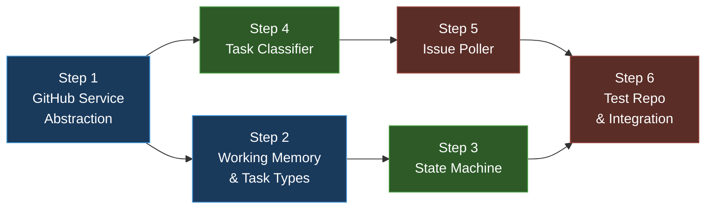

# Phase 2 — GitHub Integration, Issue Polling & Task Classification

**Goal:** Set up GitHub App auth, connect to GitHub, poll a test repo for issues, classify them, and manage the Orchestrator state machine.

**Total Estimated Effort:** ~2–3 days

> [!IMPORTANT]
> This plan breaks Phase 2 into **6 incremental steps**. Each step introduces ONLY the packages, directories, and files it needs — nothing more. You install a dependency when you need it, create a directory when you write code in it.

---

## Dependency Graph



**Legend:** 🔵 Foundation → 🟢 Business Logic → 🔴 Integration

---

## Step 1 — GitHub Service Abstraction

**Goal:** Create `GitHubService` — a clean abstraction over the GitHub API that agents use instead of calling `GitHubToolkit` or `PyGithub` directly.

**Estimated Effort:** ~2–3 hours

### Why this step exists

All GitHub interactions (listing issues, creating branches, opening PRs) go through this service. By wrapping the API behind our own interface, we can swap the underlying library later without touching agent code.

### New packages to install

| Package | Why we need it |
|---------|---------------|
| `langchain-community` | Provides `GitHubToolkit` / `GitHubAPIWrapper` |
| `pygithub` | Fallback GitHub API library (used when `langchain-community` is unavailable) |

```bash
uv add langchain-community pygithub
```

### .env additions

Add these to your `.env` file:

```env
# GitHub App Authentication
GITHUB_APP_ID=123456
GITHUB_APP_PRIVATE_KEY_PATH=./keys/codepilot.pem
GITHUB_REPOSITORY=owner/codepilot-test-repo
```

Also update `.env.sample` with these keys (empty values).

### Directories to create

```bash
mkdir src/codepilot/github_integration
```

### Files to create

**`src/codepilot/github_integration/__init__.py`** — empty:
```python
```

**`src/codepilot/github_integration/github_service.py`**:

```python
"""GitHub API abstraction layer.

Wraps GitHubToolkit (or PyGithub as fallback) behind a clean interface
so agent code never depends on a specific GitHub library.
"""

import logging
from dataclasses import dataclass, field
from typing import Any

from codepilot.config import Config

logger = logging.getLogger(__name__)


@dataclass
class Issue:
    """A GitHub issue with fields relevant to CodePilot."""
    id: int
    number: int
    title: str
    body: str
    labels: list[str]
    state: str
    assignee: str | None = None


@dataclass
class Branch:
    """A Git branch."""
    name: str
    ref: str


@dataclass
class PullRequest:
    """A GitHub pull request."""
    number: int
    title: str
    body: str
    html_url: str
    state: str


class GitHubServiceError(Exception):
    """Raised when a GitHub API call fails."""


class GitHubService:
    """Abstraction over the GitHub API.

    Uses GitHubToolkit by default, falls back to PyGithub.
    """

    def __init__(self, config: Config):
        self._config = config
        self._client: Any = None
        self._init_client()

    def _init_client(self) -> None:
        """Initialize the GitHub API client.

        Tries GitHubToolkit first, then PyGithub.
        """
        # Try GitHubToolkit (from langchain-community)
        try:
            from langchain_community.tools.github.tool import GitHubToolkit
            from langchain_community.utilities.github import GitHubAPIWrapper

            github_wrapper = GitHubAPIWrapper(
                github_app_id=self._config.github_app_id,
                github_app_private_key=self._config.github_app_private_key_path,
                github_repository=self._config.github_repository,
            )
            self._client = GitHubToolkit.from_github_api_wrapper(github_wrapper)
            self._client_type = "github_toolkit"
            logger.info("GitHubService initialized with GitHubToolkit")
            return
        except ImportError:
            logger.warning("GitHubToolkit not available, trying PyGithub...")
        except Exception as e:
            logger.warning(f"GitHubToolkit init failed: {e}")

        # Fallback to PyGithub
        try:
            import github  # type: ignore

            with open(self._config.github_app_private_key_path) as f:
                private_key = f.read()

            integration = github.GithubIntegration(
                integration_id=self._config.github_app_id,
                private_key=private_key,
            )
            # Get installation for the repository
            owner, repo_name = self._config.github_repository.split("/")
            installation = integration.get_installations()[0]
            self._client = installation.get_github_for_installation()
            self._repo = self._client.get_repo(self._config.github_repository)
            self._client_type = "pygithub"
            logger.info("GitHubService initialized with PyGithub")
        except Exception as e:
            raise GitHubServiceError(f"Failed to initialize GitHub client: {e}") from e

    async def list_issues(
        self, labels: list[str] | None = None, state: str = "open"
    ) -> list[Issue]:
        """List issues matching the given labels and state.

        Args:
            labels: Filter by labels (e.g., ["ai-assignable"]).
            state: "open", "closed", or "all".

        Returns:
            A list of Issue dataclasses.
        """
        try:
            if self._client_type == "github_toolkit":
                has_get = hasattr(
                    self._client, "get_issues"
                )
                raw = (
                    await self._client.get_issues(
                        labels=labels, state=state
                    )
                    if has_get
                    else []
                )
                # Parse raw response into Issue dataclasses
                issues = []
                for item in raw or []:
                    if not hasattr(item, "get"):
                        continue
                    assignee_raw = item.get("assignee")
                    assignee_login = (
                        assignee_raw.get("login")
                        if assignee_raw
                        else None
                    )
                    labels_raw = item.get("labels", [])
                    issues.append(Issue(
                        id=item.get("id", 0),
                        number=item.get("number", 0),
                        title=item.get("title", ""),
                        body=item.get("body", ""),
                        labels=[
                            lbl.get("name", "")
                            for lbl in labels_raw
                        ],
                        state=item.get("state", "open"),
                        assignee=assignee_login,
                    ))
                return issues
            else:
                # PyGithub
                raw_issues = self._repo.get_issues(state=state, labels=labels)
                return [
                    Issue(
                        id=issue.id,
                        number=issue.number,
                        title=issue.title,
                        body=issue.body or "",
                        labels=[lbl.name for lbl in issue.labels],
                        state=issue.state,
                        assignee=issue.assignee.login if issue.assignee else None,
                    )
                    for issue in raw_issues
                ]
        except Exception as e:
            raise GitHubServiceError(f"Failed to list issues: {e}") from e

    async def create_branch(self, name: str, from_ref: str = "main") -> Branch:
        """Create a new branch from the given reference."""
        try:
            if self._client_type == "pygithub":
                source_branch = self._repo.get_branch(from_ref)
                self._repo.create_git_ref(
                    ref=f"refs/heads/{name}",
                    sha=source_branch.commit.sha,
                )
            else:
                # GitHubToolkit — use create_branch tool
                await self._client.create_branch(branch_name=name, base_branch=from_ref)
            return Branch(name=name, ref=f"refs/heads/{name}")
        except Exception as e:
            raise GitHubServiceError(f"Failed to create branch '{name}': {e}") from e

    async def create_pull_request(
        self,
        title: str,
        body: str,
        head: str,
        base: str = "main",
        labels: list[str] | None = None,
    ) -> PullRequest:
        """Create a pull request."""
        try:
            if self._client_type == "pygithub":
                pr = self._repo.create_pull(
                    title=title,
                    body=body,
                    head=head,
                    base=base,
                )
                if labels:
                    pr.add_to_labels(*labels)
                return PullRequest(
                    number=pr.number,
                    title=pr.title,
                    body=pr.body or "",
                    html_url=pr.html_url,
                    state=pr.state,
                )
            else:
                # GitHubToolkit
                result = await self._client.create_pull_request(
                    title=title,
                    body=body,
                    head=head,
                    base=base,
                )
                return PullRequest(
                    number=result.get("number", 0),
                    title=title,
                    body=body,
                    html_url=result.get("html_url", ""),
                    state="open",
                )
        except Exception as e:
            raise GitHubServiceError(f"Failed to create PR: {e}") from e
```

**`tests/test_github_service.py`**:

```python
"""Tests for the GitHub service — all API calls are mocked."""

from unittest.mock import AsyncMock, MagicMock, patch

import pytest

from codepilot.config import Config
from codepilot.github_integration.github_service import (
    GitHubService,
    GitHubServiceError,
    Issue,
)


@pytest.fixture
def config():
    return Config(
        _env_file=None,
        github_app_id="12345",
        github_app_private_key_path="./fake-key.pem",
        github_repository="owner/test-repo",
    )


class TestGitHubServiceInit:
    """Test initialization with different backends."""

    @patch("codepilot.github_integration.github_service.GitHubService._init_client")
    def test_init_does_not_raise(self, mock_init, config):
        mock_init.return_value = None
        service = GitHubService(config)
        assert service._config == config

    def test_init_fails_without_valid_auth(self, config):
        """Should raise if neither backend is available."""
        with patch.object(GitHubService, "_init_client") as mock_init:
            mock_init.side_effect = GitHubServiceError("No backend available")
            with pytest.raises(GitHubServiceError):
                GitHubService(config)


class TestListIssues:
    """Test listing issues with mocked backend."""

    @pytest.mark.asyncio
    async def test_returns_issue_list(self, config):
        service = GitHubService.__new__(GitHubService)
        service._config = config
        service._client = MagicMock()
        service._client_type = "pygithub"

        mock_issue = MagicMock()
        mock_issue.id = 1
        mock_issue.number = 42
        mock_issue.title = "Test issue"
        mock_issue.body = "Description"
        mock_issue.labels = [MagicMock(name="bug")]
        mock_issue.state = "open"
        mock_issue.assignee = None
        mock_issue.labels[0].name = "bug"

        mock_repo = MagicMock()
        mock_repo.get_issues.return_value = [mock_issue]
        service._repo = mock_repo

        issues = await service.list_issues(labels=["bug"])
        assert len(issues) == 1
        assert issues[0].number == 42
        assert issues[0].title == "Test issue"
```

### Verification ✅

```bash
# 1. GitHubService instantiates (will show warning if no backend, that's OK)
uv run python -c "
from codepilot.github_integration.github_service import GitHubService
from codepilot.config import Config
config = Config()
print('✅ GitHubService module loads')
"

# 2. Tests pass
uv run pytest tests/test_github_service.py -v

# 3. Lint
uv run ruff check src/codepilot/github_integration/ tests/test_github_service.py
```

---

## Step 2 — Working Memory & Task Types

**Goal:** Define the `WorkingMemory` dataclass, `TaskState` enum, and `TaskSource` types used to track active tasks through the system.

**Estimated Effort:** ~1 hour

### Why this step exists

The Orchestrator needs to track task state, retry counts, relevant files, and other per-task data. These types form the shared vocabulary between all agents. The state machine in Step 3 depends on `TaskState`.

### New packages to install

**None.** This is pure Python using `dataclasses`, `enum`, and `typing`.

### Directories to create

```bash
mkdir src/codepilot/memory
```

### Files to create

**`src/codepilot/memory/__init__.py`** — empty:
```python
```

**`src/codepilot/memory/working.py`**:

```python
"""Working memory — per-task in-memory state.

Working memory tracks the active task's metadata, state machine position,
relevant files, and retry count. It is passed explicitly to subagents
at spawn time (not through conversation history).
"""

from dataclasses import dataclass, field
from enum import Enum
from typing import Any


class TaskState(str, Enum):
    """Valid states in the task lifecycle state machine."""

    TRIAGED = "TRIAGED"
    EXPLORING = "EXPLORING"
    IMPLEMENTING = "IMPLEMENTING"
    TESTING = "TESTING"
    PR_OPENED = "PR_OPENED"
    DONE = "DONE"
    FAILED = "FAILED"


# Valid transitions: current_state -> set of allowed next states
VALID_TRANSITIONS: dict[TaskState, set[TaskState]] = {
    TaskState.TRIAGED: {TaskState.EXPLORING, TaskState.FAILED},
    TaskState.EXPLORING: {TaskState.IMPLEMENTING, TaskState.FAILED},
    TaskState.IMPLEMENTING: {TaskState.TESTING, TaskState.FAILED},
    TaskState.TESTING: {TaskState.PR_OPENED, TaskState.IMPLEMENTING, TaskState.FAILED},
    TaskState.PR_OPENED: {TaskState.DONE, TaskState.FAILED},
    TaskState.DONE: set(),
    TaskState.FAILED: set(),
}


class InvalidTransitionError(Exception):
    """Raised when an invalid state transition is attempted."""


@dataclass
class TaskSource:
    """Identifies the origin of a task.

    Attributes:
        source: 'github_issue' for polled issues, 'user_input' for manual tasks.
        issue_id: GitHub issue ID (None for manual tasks).
        issue_number: GitHub issue number (None for manual tasks).
        description: Full task description.
        title: Short title.
    """

    source: str  # "github_issue" | "user_input"
    issue_id: int | None = None
    issue_number: int | None = None
    description: str = ""
    title: str = ""


@dataclass
class TestResult:
    """Structured result from the Test Agent."""

    passed: int = 0
    failed: int = 0
    errors: int = 0
    failure_details: list[str] = field(default_factory=list)
    coverage: float | None = None


@dataclass
class WorkingMemory:
    """Per-task state tracked during execution.

    This is passed to subagents at spawn time so they have the full
    context without relying on conversation history.
    """

    issue_id: int
    issue_metadata: dict[str, Any] = field(default_factory=dict)
    repo_map: str = ""
    relevant_files: list[str] = field(default_factory=list)
    current_diff: str | None = None
    test_results: list[TestResult] = field(default_factory=list)
    retry_count: int = 0
    state: TaskState = TaskState.TRIAGED
    failure_reason: str = ""

    def transition_to(self, new_state: TaskState) -> None:
        """Transition to a new state, validating the move.

        Args:
            new_state: The state to transition to.

        Raises:
            InvalidTransitionError: If the transition is not allowed.
        """
        allowed = VALID_TRANSITIONS.get(self.state, set())
        if new_state not in allowed:
            raise InvalidTransitionError(
                f"Cannot transition from {self.state.value} to {new_state.value}. "
                f"Allowed next states: {[s.value for s in allowed]}"
            )
        self.state = new_state
```

**`tests/test_working_memory.py`**:

```python
"""Tests for working memory and state machine."""

import pytest

from codepilot.memory.working import (
    InvalidTransitionError,
    TaskState,
    WorkingMemory,
)


class TestTaskState:
    """Test the TaskState enum."""

    def test_all_states_defined(self):
        assert TaskState.TRIAGED.value == "TRIAGED"
        assert TaskState.EXPLORING.value == "EXPLORING"
        assert TaskState.IMPLEMENTING.value == "IMPLEMENTING"
        assert TaskState.TESTING.value == "TESTING"
        assert TaskState.PR_OPENED.value == "PR_OPENED"
        assert TaskState.DONE.value == "DONE"
        assert TaskState.FAILED.value == "FAILED"


class TestWorkingMemory:
    """Test working memory state transitions."""

    def test_initial_state_is_triaged(self):
        wm = WorkingMemory(issue_id=1)
        assert wm.state == TaskState.TRIAGED

    def test_valid_transition(self):
        wm = WorkingMemory(issue_id=1)
        wm.transition_to(TaskState.EXPLORING)
        assert wm.state == TaskState.EXPLORING

    def test_invalid_transition_raises(self):
        wm = WorkingMemory(issue_id=1)
        # Can't go from TRIAGED directly to DONE
        with pytest.raises(InvalidTransitionError):
            wm.transition_to(TaskState.DONE)

    def test_full_valid_flow(self):
        wm = WorkingMemory(issue_id=1)
        wm.transition_to(TaskState.EXPLORING)
        wm.transition_to(TaskState.IMPLEMENTING)
        wm.transition_to(TaskState.TESTING)
        wm.transition_to(TaskState.PR_OPENED)
        wm.transition_to(TaskState.DONE)
        assert wm.state == TaskState.DONE

    def test_any_state_to_failed(self):
        wm = WorkingMemory(issue_id=1)
        wm.transition_to(TaskState.FAILED)
        assert wm.state == TaskState.FAILED

    def test_retry_transition_back_to_implementing(self):
        wm = WorkingMemory(issue_id=1)
        wm.transition_to(TaskState.EXPLORING)
        wm.transition_to(TaskState.IMPLEMENTING)
        wm.transition_to(TaskState.TESTING)
        # Test failure → retry: back to IMPLEMENTING
        wm.transition_to(TaskState.IMPLEMENTING)
        assert wm.state == TaskState.IMPLEMENTING

    def test_defaults(self):
        wm = WorkingMemory(issue_id=42)
        assert wm.issue_id == 42
        assert wm.relevant_files == []
        assert wm.retry_count == 0
        assert wm.failure_reason == ""
```

### Verification ✅

```bash
# 1. Types are importable
uv run python -c "
from codepilot.memory.working import WorkingMemory, TaskState
wm = WorkingMemory(issue_id=1)
print(f'State: {wm.state.value}')
print('✅ Working memory works')
"

# 2. Tests pass
uv run pytest tests/test_working_memory.py -v

# 3. Lint
uv run ruff check src/codepilot/memory/ tests/test_working_memory.py
```

---

## Step 3 — Orchestrator State Machine

**Goal:** Add the `TaskState` state machine to the Orchestrator so it tracks each task through its lifecycle.

**Estimated Effort:** ~1–2 hours

### Why this step exists

The Orchestrator needs to know what stage each task is in (triaged, exploring, implementing, etc.) so it can make correct decisions about what to do next and handle failures gracefully.

### New packages to install

**None.** Everything needed is already installed. We only modify existing files.

### Files to modify

**`src/codepilot/agents/orchestrator.py`** — **replace the entire file** with the version below.

> [!WARNING]
> This changes the `handle_message()` signature from `(self, message: str)` to `(self, message: str, issue_id: int | None = None)`. The `issue_id` parameter is optional (default `None`), so existing Phase 1 tests that call `handle_message("...")` without `issue_id` will still compile, but you should update `tests/test_orchestrator.py` to match the new version below.

```python
"""Orchestrator — the root agent that manages the task lifecycle.

The Orchestrator:
1. Receives tasks (from GitHub issues or manual input)
2. Creates a TODO checklist via write_todos
3. Delegates work to subagents (Repo Explorer, Coder, Test Agent, PR Agent)
4. Monitors progress through the state machine
5. Handles failures and retries

It uses BaseAgent (via AgentFactory) — never touches deepagents directly.
"""

from __future__ import annotations

import logging
from typing import TYPE_CHECKING

from codepilot.config import Config
from codepilot.core.base_agent import AgentResult, BaseAgent
from codepilot.memory.working import (
    InvalidTransitionError,
    TaskState,
    WorkingMemory,
)

if TYPE_CHECKING:
    from codepilot.core.agent_factory import DeepAgentFactory

logger = logging.getLogger(__name__)

ORCHESTRATOR_SYSTEM_PROMPT = """You are the Orchestrator agent for CodePilot, a multi-agent coding platform.

Your responsibilities:
1. Receive tasks (from GitHub issues or manual input)
2. Decompose tasks into actionable steps using write_todos
3. Delegate work to specialized subagents:
   - Repo Explorer: find relevant files in the repository
   - Coder: implement changes in a sandboxed environment
   - Test Agent: run and verify tests
   - PR Agent: create pull requests
4. Monitor progress and handle failures
5. Maintain task state through the state machine:
   TRIAGED → EXPLORING → IMPLEMENTING → TESTING → PR_OPENED → DONE | FAILED

Always start by creating a TODO checklist using write_todos before delegating work.
"""


class Orchestrator:
    """Root orchestrator for CodePilot.

    Manages the task lifecycle from triage to PR creation.
    Uses the BaseAgent interface — never touches deepagents directly.
    """

    def __init__(self, agent: BaseAgent, config: Config):
        self._agent = agent
        self._config = config
        self._active_tasks: dict[int, WorkingMemory] = {}
        logger.info("Orchestrator initialized")

    @classmethod
    def create(cls, factory: "DeepAgentFactory", config: Config) -> "Orchestrator":
        """Create an Orchestrator using the agent factory."""
        agent = factory.create_orchestrator()
        return cls(agent=agent, config=config)

    async def handle_message(
        self, message: str, issue_id: int | None = None
    ) -> AgentResult:
        """Process a single message through the orchestrator.

        Creates a new WorkingMemory entry for new tasks and tracks
        state through the lifecycle.

        Args:
            message: The user message or task description.
            issue_id: Optional GitHub issue ID for tracking.

        Returns:
            AgentResult with the orchestrator's response.
        """
        # Create or find working memory for this task
        task_id = issue_id or hash(message) % 100000
        if task_id not in self._active_tasks:
            self._active_tasks[task_id] = WorkingMemory(issue_id=task_id)
            logger.info(f"Created new task {task_id}: {message[:80]}...")

        wm = self._active_tasks[task_id]

        logger.info(
            f"Orchestrator handling message (task={task_id}, state={wm.state.value})"
        )

        messages = [{"role": "user", "content": message}]
        result = await self._agent.invoke(messages)

        if result.success:
            try:
                wm.transition_to(TaskState.EXPLORING)
            except InvalidTransitionError:
                pass  # Already past TRIAGED, that's fine

        logger.info(f"Orchestrator result: success={result.success}")
        return result

    def get_task_state(self, task_id: int) -> TaskState | None:
        """Get the current state of a task."""
        wm = self._active_tasks.get(task_id)
        return wm.state if wm else None

    def transition_task(self, task_id: int, new_state: TaskState) -> bool:
        """Attempt to transition a task to a new state.

        Returns True if the transition was valid and applied.
        """
        wm = self._active_tasks.get(task_id)
        if not wm:
            logger.warning(f"Cannot transition unknown task {task_id}")
            return False
        try:
            wm.transition_to(new_state)
            logger.info(f"Task {task_id} → {new_state.value}")
            return True
        except InvalidTransitionError as e:
            logger.warning(f"Invalid transition for task {task_id}: {e}")
            return False

    def fail_task(self, task_id: int, reason: str = "") -> None:
        """Mark a task as failed with an optional reason."""
        wm = self._active_tasks.get(task_id)
        if wm:
            wm.state = TaskState.FAILED
            wm.failure_reason = reason
            logger.info(f"Task {task_id} failed: {reason}")

    async def start_idle_loop(self) -> None:
        """Enter the idle loop waiting for tasks.

        In Phase 1, this just logs and returns.
        Phase 2 will add issue polling here.
        """
        logger.info("Orchestrator idle — waiting for tasks...")
        logger.info("(Issue polling will be added in Phase 2, Step 5)")
```

**`tests/test_orchestrator.py`** — update existing tests (add state machine tests):

```python
"""Tests for the Orchestrator agent — including state machine."""

from unittest.mock import AsyncMock, patch

import pytest

from codepilot.agents.orchestrator import ORCHESTRATOR_SYSTEM_PROMPT, Orchestrator
from codepilot.config import Config
from codepilot.core.agent_factory import DeepAgentFactory
from codepilot.core.base_agent import AgentResult, BaseAgent
from codepilot.core.llm_provider import LLMProvider
from codepilot.core.tool_registry import ToolRegistry
from codepilot.memory.working import TaskState


@pytest.fixture
def config():
    return Config(
        _env_file=None,
        anthropic_api_key="test-key",
        openai_api_key="test-key",
        google_api_key="test-key",
    )


@pytest.fixture
def mock_agent():
    agent = AsyncMock(spec=BaseAgent)
    agent.name = "Orchestrator"
    agent.invoke.return_value = AgentResult(
        success=True,
        output="I will create a TODO list for this task.",
        todos=["Analyze the issue", "Find relevant files", "Implement fix"],
    )
    return agent


class TestOrchestratorStateMachine:
    """Test state machine integration."""

    def test_initial_task_state(self, mock_agent, config):
        orchestrator = Orchestrator(agent=mock_agent, config=config)
        state = orchestrator.get_task_state(1)
        assert state is None  # No task yet

    @pytest.mark.asyncio
    async def test_handle_message_creates_task(self, mock_agent, config):
        orchestrator = Orchestrator(agent=mock_agent, config=config)
        await orchestrator.handle_message("Fix the bug", issue_id=42)
        state = orchestrator.get_task_state(42)
        assert state == TaskState.EXPLORING

    @pytest.mark.asyncio
    async def test_valid_transition(
        self, mock_agent, config
    ):
        orchestrator = Orchestrator(
            agent=mock_agent, config=config
        )
        await orchestrator.handle_message(
            "Test", issue_id=1
        )
        result = orchestrator.transition_task(
            1, TaskState.IMPLEMENTING
        )
        assert result is True
        assert (
            orchestrator.get_task_state(1)
            == TaskState.IMPLEMENTING
        )

    @pytest.mark.asyncio
    async def test_invalid_transition(
        self, mock_agent, config
    ):
        orchestrator = Orchestrator(
            agent=mock_agent, config=config
        )
        await orchestrator.handle_message(
            "Test", issue_id=2
        )
        # Can't go directly to DONE from EXPLORING
        result = orchestrator.transition_task(
            2, TaskState.DONE
        )
        assert result is False
        assert (
            orchestrator.get_task_state(2)
            == TaskState.EXPLORING
        )

    @pytest.mark.asyncio
    async def test_fail_task(
        self, mock_agent, config
    ):
        orchestrator = Orchestrator(
            agent=mock_agent, config=config
        )
        await orchestrator.handle_message(
            "Test", issue_id=3
        )
        orchestrator.fail_task(3, "Something went wrong")
        assert (
            orchestrator.get_task_state(3)
            == TaskState.FAILED
        )
```

### Verification ✅

```bash
# 1. Test state machine
uv run pytest tests/test_orchestrator.py -v

# 2. All previous tests still pass
uv run pytest tests/ -v

# 3. Lint
uv run ruff check src/codepilot/agents/ tests/test_orchestrator.py
```

---

## Step 4 — Task Classifier

**Goal:** Classify each issue into a task type (`bug_fix`, `feature_addition`, `dependency_update`, `documentation`, `config_change`) using the LLM.

**Estimated Effort:** ~2 hours

### Why this step exists

The Orchestrator needs to know what kind of task an issue represents to load the right Skill (Phase 4). The classifier uses Claude Sonnet to determine the type from the issue's title, body, and labels.

### New packages to install

**None.** This uses the existing `LLMProvider` from Phase 1.

### Files to create

**`src/codepilot/github_integration/classifier.py`**:

```python
"""Issue task classifier.

Uses Claude Sonnet (via LLMProvider) to classify each GitHub issue
into one of: bug_fix, feature_addition, dependency_update,
documentation, or config_change.
"""

import hashlib
import json
import logging
from dataclasses import dataclass, field

from codepilot.config import Config
from codepilot.core.llm_provider import LLMProvider
from codepilot.github_integration.github_service import Issue

logger = logging.getLogger(__name__)

TASK_TYPES = [
    "bug_fix",
    "feature_addition",
    "dependency_update",
    "documentation",
    "config_change",
]


@dataclass
class TaskClassification:
    """Result of classifying an issue."""

    type: str  # One of TASK_TYPES
    confidence: float  # 0.0 to 1.0
    reasoning: str = ""


class ClassifierError(Exception):
    """Raised when classification fails."""


class IssueClassifier:
    """Classifies GitHub issues into task types using an LLM.

    Results are cached by issue ID to avoid redundant LLM calls.
    """

    def __init__(self, llm_provider: LLMProvider, config: Config):
        self._llm = llm_provider
        self._config = config
        self._cache: dict[str, TaskClassification] = {}

    def _cache_key(self, issue: Issue) -> str:
        """Generate a cache key from issue content."""
        raw = f"{issue.number}:{issue.title}:{issue.body}"
        return hashlib.md5(raw.encode()).hexdigest()

    async def classify(self, issue: Issue) -> TaskClassification:
        """Classify an issue into a task type.

        Args:
            issue: The GitHub issue to classify.

        Returns:
            A TaskClassification with type, confidence, and reasoning.
        """
        # Check cache first
        key = self._cache_key(issue)
        if key in self._cache:
            logger.debug(f"Cache hit for issue #{issue.number}")
            return self._cache[key]

        prompt = (
            f"Classify this GitHub issue into exactly one task type.\n\n"
            f"Title: {issue.title}\n"
            f"Body: {issue.body[:2000]}\n"
            f"Labels: {', '.join(issue.labels)}\n\n"
            f"Choose from: {', '.join(TASK_TYPES)}\n\n"
            f"Respond with JSON: {{\"type\": \"...\", \"confidence\": 0.0-1.0, \"reasoning\": \"...\"}}"
        )

        try:
            messages = [
                {"role": "system", "content": "You classify GitHub issues into task types. Respond with valid JSON only."},
                {"role": "user", "content": prompt},
            ]
            response = await self._llm.invoke_with_fallback(messages)
            raw = response.content if hasattr(response, "content") else str(response)

            # Parse JSON from response
            result = self._parse_json_response(raw)

            classification = TaskClassification(
                type=result.get("type", "bug_fix"),
                confidence=float(result.get("confidence", 0.5)),
                reasoning=result.get("reasoning", ""),
            )

            # Validate type
            if classification.type not in TASK_TYPES:
                logger.warning(
                    f"Invalid classification '{classification.type}' for issue "
                    f"#{issue.number}, defaulting to bug_fix"
                )
                classification.type = "bug_fix"

            # Cache result
            self._cache[key] = classification
            logger.info(
                f"Classified issue #{issue.number} as {classification.type} "
                f"(confidence={classification.confidence:.2f})"
            )
            return classification

        except Exception as e:
            raise ClassifierError(f"Failed to classify issue #{issue.number}: {e}") from e

    def _parse_json_response(self, raw: str) -> dict:
        """Extract JSON from LLM response (handles markdown fences)."""
        # Strip markdown code fences if present
        text = raw.strip()
        if "```json" in text:
            text = text.split("```json")[1].split("```")[0].strip()
        elif "```" in text:
            text = text.split("```")[1].split("```")[0].strip()
        return json.loads(text)

    def clear_cache(self) -> None:
        """Clear the classification cache."""
        self._cache.clear()
```

**`tests/test_classifier.py`**:

```python
"""Tests for the issue classifier — LLM calls are mocked."""

from unittest.mock import AsyncMock, MagicMock, patch

import pytest

from codepilot.config import Config
from codepilot.github_integration.classifier import (
    IssueClassifier,
    TaskClassification,
)
from codepilot.github_integration.github_service import Issue


@pytest.fixture
def config():
    return Config(_env_file=None)


@pytest.fixture
def mock_llm():
    provider = MagicMock()
    mock_response = MagicMock()
    mock_response.content = '{"type": "bug_fix", "confidence": 0.95, "reasoning": "Clear bug report"}'
    provider.invoke_with_fallback = AsyncMock(return_value=mock_response)
    return provider


@pytest.fixture
def classifier(config, mock_llm):
    return IssueClassifier(mock_llm, config)


class TestClassify:
    """Test issue classification."""

    @pytest.mark.asyncio
    async def test_classify_bug(self, classifier, mock_llm):
        issue = Issue(
            id=1, number=42,
            title="Fix division by zero",
            body="Calculator crashes when dividing by zero",
            labels=["bug"],
            state="open",
        )
        result = await classifier.classify(issue)
        assert result.type == "bug_fix"
        assert result.confidence > 0.9

    @pytest.mark.asyncio
    async def test_classify_enhancement(self, classifier):
        issue = Issue(
            id=2, number=43,
            title="Add modulo operation",
            body="Support the % operator",
            labels=["enhancement"],
            state="open",
        )
        # Override the mock for this test
        classifier._llm.invoke_with_fallback = AsyncMock(return_value=MagicMock(
            content='{"type": "feature_addition", "confidence": 0.88, "reasoning": "New feature request"}'
        ))
        result = await classifier.classify(issue)
        assert result.type == "feature_addition"

    @pytest.mark.asyncio
    async def test_cache_prevents_duplicate_calls(self, classifier, mock_llm):
        issue = Issue(
            id=1, number=42,
            title="Fix division by zero",
            body="Calculator crashes",
            labels=["bug"],
            state="open",
        )
        await classifier.classify(issue)
        await classifier.classify(issue)
        # invoke_with_fallback should only be called once
        assert mock_llm.invoke_with_fallback.call_count == 1

    @pytest.mark.asyncio
    async def test_handles_markdown_json(self, classifier):
        issue = Issue(
            id=3, number=44,
            title="Update requests library",
            body="Bump from 2.28 to 2.31",
            labels=["dependencies"],
            state="open",
        )
        classifier._llm.invoke_with_fallback = AsyncMock(return_value=MagicMock(
            content='```json\n{"type": "dependency_update", "confidence": 0.9, "reasoning": "Dependency bump"}\n```'
        ))
        result = await classifier.classify(issue)
        assert result.type == "dependency_update"
```

### Verification ✅

```bash
# 1. Classifier works
uv run pytest tests/test_classifier.py -v

# 2. Lint
uv run ruff check src/codepilot/github_integration/classifier.py tests/test_classifier.py
```

---

## Step 5 — Issue Poller

**Goal:** Create the async polling loop that fetches issues from GitHub, classifies them, and yields them for the Orchestrator to process.

**Estimated Effort:** ~2–3 hours

### Why this step exists

The polling loop is the system's entry point for GitHub issues. It runs continuously, checking for new unassigned issues with the `ai-assignable` label, classifying them, and feeding them into the Orchestrator.

### New packages to install

**None.** Uses `GitHubService` (Step 1) and `IssueClassifier` (Step 4).

### Files to create

**`src/codepilot/github_integration/issue_poller.py`**:

```python
"""Async polling loop for GitHub issues.

Runs continuously, checking for new unassigned issues with
the configured labels, classifies them, and yields them
to the Orchestrator for processing.
"""

import asyncio
import logging
from dataclasses import dataclass

from codepilot.config import Config
from codepilot.github_integration.classifier import (
    IssueClassifier,
    TaskClassification,
)
from codepilot.github_integration.github_service import (
    GitHubService,
    Issue,
)

logger = logging.getLogger(__name__)


@dataclass
class PolledIssue:
    """An issue returned by the poller, already classified."""

    issue: Issue
    classification: TaskClassification


class IssuePoller:
    """Polls GitHub for new issues and classifies them.

    Usage:
        poller = IssuePoller(github, classifier, config)
        async for polled in poller.poll():
            orchestrator.handle_issue(polled)
    """

    def __init__(
        self,
        github: GitHubService,
        classifier: IssueClassifier,
        config: Config,
    ):
        self._github = github
        self._classifier = classifier
        self._config = config
        self._seen_ids: set[int] = set()

    async def poll(self) -> PolledIssue:
        """Poll for new issues indefinitely.

        Yields PolledIssue for each new, unassigned issue found.
        """
        while True:
            try:
                issues = await self._github.list_issues(
                    labels=["ai-assignable"],
                    state="open",
                )

                for issue in issues:
                    if issue.id in self._seen_ids:
                        continue
                    if issue.assignee:
                        continue  # Already assigned

                    self._seen_ids.add(issue.id)

                    # Classify the issue
                    try:
                        classification = await self._classifier.classify(issue)
                    except Exception as e:
                        logger.error(f"Failed to classify issue #{issue.number}: {e}")
                        continue

                    logger.info(
                        f"New issue #{issue.number}: {issue.title} "
                        f"→ {classification.type} "
                        f"(confidence={classification.confidence:.2f})"
                    )

                    yield PolledIssue(issue=issue, classification=classification)

            except Exception as e:
                logger.error(f"Polling error: {e}")

            interval = self._config.poll_interval_minutes
            logger.debug(f"Next poll in {interval} minute(s)")
            await asyncio.sleep(interval * 60)
```

**`tests/test_issue_poller.py`**:

```python
"""Tests for the issue poller — all external calls are mocked."""

import asyncio

from unittest.mock import AsyncMock, MagicMock, patch

import pytest

from codepilot.config import Config
from codepilot.github_integration.classifier import (
    TaskClassification,
)
from codepilot.github_integration.github_service import (
    Issue,
)
from codepilot.github_integration.issue_poller import (
    IssuePoller,
    PolledIssue,
)


@pytest.fixture
def config():
    return Config(
        _env_file=None,
        poll_interval_minutes=1,
    )


@pytest.fixture
def mock_github():
    github = MagicMock()
    github.list_issues = AsyncMock()
    return github


@pytest.fixture
def mock_classifier():
    classifier = MagicMock()
    classifier.classify = AsyncMock()
    return classifier


class TestIssuePoller:
    """Test the polling loop."""

    @pytest.mark.asyncio
    async def test_yields_new_issues(
        self, config, mock_github, mock_classifier
    ):
        issue = Issue(
            id=1,
            number=42,
            title="Test issue",
            body="Description",
            labels=["ai-assignable", "bug"],
            state="open",
        )
        mock_github.list_issues.return_value = [issue]
        mock_classifier.classify.return_value = (
            TaskClassification(
                type="bug_fix",
                confidence=0.95,
                reasoning="Bug report",
            )
        )

        poller = IssuePoller(
            mock_github, mock_classifier, config
        )

        # Collect first yielded item
        async def collect_first():
            async for polled in poller.poll():
                return polled

        polled = await asyncio.wait_for(
            collect_first(), timeout=2
        )
        assert isinstance(polled, PolledIssue)
        assert polled.issue.number == 42
        assert polled.classification.type == "bug_fix"

    @pytest.mark.asyncio
    async def test_skips_seen_issues(
        self, config, mock_github, mock_classifier
    ):
        issue = Issue(
            id=1,
            number=42,
            title="Test",
            body="",
            labels=["ai-assignable"],
            state="open",
        )
        mock_github.list_issues.return_value = [issue]
        mock_classifier.classify.return_value = (
            TaskClassification(
                type="bug_fix",
                confidence=0.8,
                reasoning="",
            )
        )

        poller = IssuePoller(
            mock_github, mock_classifier, config
        )
        poller._seen_ids.add(1)  # Already seen

        # Mock sleep to raise after first iteration
        # so the test doesn't hang
        with patch(
            "codepilot.github_integration"
            ".issue_poller.asyncio.sleep",
            side_effect=StopAsyncIteration,
        ):
            results = []
            with pytest.raises(StopAsyncIteration):
                async for polled in poller.poll():
                    results.append(polled)
            assert len(results) == 0

    @pytest.mark.asyncio
    async def test_skips_assigned_issues(
        self, config, mock_github, mock_classifier
    ):
        issue = Issue(
            id=2,
            number=43,
            title="Assigned",
            body="",
            labels=["ai-assignable"],
            state="open",
            assignee="someuser",
        )
        mock_github.list_issues.return_value = [issue]

        poller = IssuePoller(
            mock_github, mock_classifier, config
        )

        with patch(
            "codepilot.github_integration"
            ".issue_poller.asyncio.sleep",
            side_effect=StopAsyncIteration,
        ):
            results = []
            with pytest.raises(StopAsyncIteration):
                async for polled in poller.poll():
                    results.append(polled)
            assert len(results) == 0
```

### Verification ✅

```bash
# 1. Tests pass
uv run pytest tests/test_issue_poller.py -v

# 2. Lint
uv run ruff check src/codepilot/github_integration/issue_poller.py tests/test_issue_poller.py
```

---

## Step 6 — Test Repository Setup & Integration

**Goal:** Create the test repository on GitHub, wire up the Issue Poller in `main.py`, and verify the end-to-end flow from poll → classify → state machine.

**Estimated Effort:** ~2–3 hours

### Why this step exists

Without a real test repo with synthetic issues, we can't verify the full polling → classification → state machine flow. This step creates the repo, updates the entry point, and runs integration tests.

### New packages to install

**None.** All dependencies are already installed.

### Manual: Create `codepilot-test-repo` on GitHub

1. Create a new **public** repository named `codepilot-test-repo` under your GitHub account or org.
2. Add a small Python project (e.g., a CLI calculator or Flask API) with ~10–15 files and a `pytest` test suite.
3. Create these synthetic issues with labels:

| Issue | Title | Labels | Task Type |
|-------|-------|--------|-----------|
| #1 | Fix division by zero in calculator | `ai-assignable`, `bug` | `bug_fix` |
| #2 | Add modulo operation support | `ai-assignable`, `enhancement` | `feature_addition` |
| #3 | Update requests from 2.28 to 2.31 | `ai-assignable`, `dependencies` | `dependency_update` |
| #4 | Add docstrings to all public functions | `ai-assignable`, `documentation` | `documentation` |
| #5 | Fix typo in config file path | `ai-assignable`, `bug` | `config_change` |

### Files to modify

**`src/codepilot/main.py`** — add the IssuePoller startup:

> [!WARNING]
> Phase 1's `startup()` returned `Orchestrator` directly. Phase 2 changes the return type to `tuple[Orchestrator, Config]`. Update `tests/test_main.py` accordingly — the existing `test_startup_returns_orchestrator` test must unpack the tuple: `orchestrator, config = await startup()`.

```python
"""CodePilot entry point.

Wires up all components and starts the Orchestrator.
"""

import asyncio
import logging

from codepilot.agents.orchestrator import Orchestrator
from codepilot.config import Config
from codepilot.core.agent_factory import DeepAgentFactory
from codepilot.core.llm_provider import LLMProvider
from codepilot.core.tool_registry import ToolRegistry
from codepilot.github_integration.classifier import IssueClassifier
from codepilot.github_integration.github_service import GitHubService
from codepilot.github_integration.issue_poller import IssuePoller

logging.basicConfig(
    level=logging.INFO,
    format="%(asctime)s [%(name)s] %(levelname)s: %(message)s",
)
logger = logging.getLogger(__name__)


async def startup() -> tuple[Orchestrator, Config]:
    """Initialize all components and return the Orchestrator and Config.

    Returns a tuple so callers can reuse the Config
    without creating a second instance.
    """
    logger.info("Starting CodePilot...")

    # 1. Load config
    config = Config()
    logger.info(
        "Config loaded — primary LLM: "
        f"{config.primary_llm}"
    )

    # 2. Create LLM provider
    llm_provider = LLMProvider(config)
    logger.info("LLM provider initialized")

    # 3. Create tool registry (tools registered in Phase 3+)
    tool_registry = ToolRegistry()
    logger.info("Tool registry initialized")

    # 4. Create agent factory
    factory = DeepAgentFactory(
        config, llm_provider, tool_registry
    )
    logger.info("Agent factory initialized")

    # 5. Create Orchestrator
    orchestrator = Orchestrator.create(factory, config)
    logger.info("Orchestrator created — ready for tasks")

    return orchestrator, config


async def start_polling(
    orchestrator: Orchestrator, config: Config
) -> None:
    """Start the issue polling loop (if GitHub is configured)."""
    if not config.github_app_id:
        logger.info(
            "GitHub not configured — skipping issue polling"
        )
        return

    try:
        github = GitHubService(config)
        classifier = IssueClassifier(
            LLMProvider(config), config
        )
        poller = IssuePoller(github, classifier, config)

        logger.info("Starting issue poller...")
        async for polled in poller.poll():
            logger.info(
                f"Received issue #{polled.issue.number}: "
                f"{polled.issue.title} "
                f"({polled.classification.type})"
            )
            result = await orchestrator.handle_message(
                f"Issue #{polled.issue.number}: "
                f"{polled.issue.title}\n"
                f"{polled.issue.body}\n\n"
                f"Classification: "
                f"{polled.classification.type}",
                issue_id=polled.issue.id,
            )
            logger.info(
                "Orchestrator result: "
                f"success={result.success}"
            )

    except Exception as e:
        logger.error(f"Polling failed: {e}")
        logger.info("Continuing without polling...")


async def main() -> None:
    """Main async entry point."""
    orchestrator, config = await startup()

    # Start polling in the background
    polling_task = asyncio.create_task(
        start_polling(orchestrator, config)
    )

    # Enter idle loop
    await orchestrator.start_idle_loop()

    # Cleanup
    polling_task.cancel()


def entrypoint() -> None:
    """Sync entry point for console_scripts."""
    asyncio.run(main())


if __name__ == "__main__":
    entrypoint()
```

**`tests/test_main.py`** — integration test for the startup flow with polling:

```python
"""Tests for the main entry point — all external calls are mocked."""

from unittest.mock import AsyncMock, patch

import pytest

from codepilot.agents.orchestrator import Orchestrator


class TestMainStartup:
    """Test the full startup flow."""

    @patch(
        "codepilot.core.agent_factory"
        ".DEEPAGENTS_AVAILABLE",
        False,
    )
    @pytest.mark.asyncio
    async def test_startup_returns_orchestrator(self):
        from codepilot.main import startup

        orchestrator, config = await startup()
        assert isinstance(orchestrator, Orchestrator)

    @patch(
        "codepilot.core.agent_factory"
        ".DEEPAGENTS_AVAILABLE",
        False,
    )
    @pytest.mark.asyncio
    async def test_start_polling_skips_if_not_configured(
        self,
    ):
        from codepilot.main import start_polling
        from codepilot.config import Config

        config = Config(
            _env_file=None,
            github_app_id="",
        )
        orchestrator = AsyncMock(spec=Orchestrator)

        await start_polling(orchestrator, config)
        # Should return without error
```

### Phase 2 Verification

```bash
# 1. Full test suite passes
uv run pytest tests/ -v --tb=short

# 2. Lint entire codebase
uv run ruff check src/ tests/

# 3. Smoke test: startup works (may warn about missing GitHub, that's OK)
uv run python -m codepilot.main

# 4. Verify the issue poller can connect (if GitHub is configured)
uv run python -c "
from codepilot.github_integration.github_service import GitHubService
from codepilot.config import Config
config = Config()
if config.github_app_id:
    svc = GitHubService(config)
    print('✅ GitHub connection works')
else:
    print('ℹ️ GitHub not configured — skip this check')
"
```

### What's installed at the end of Phase 2

| Package | Installed In | Purpose |
|---------|-------------|---------|
| `langchain-community` | Step 1 | GitHubToolkit |
| `pygithub` | Step 1 | Fallback GitHub API |

### What Phase 2 enables for Phase 3+

| Capability | Used By |
|------------|---------|
| GitHub API abstraction | Repo Explorer, PR Agent |
| Issue polling loop | Orchestrator, TUI |
| Task classification | Skill selection (Phase 4) |
| State machine | All agent subcommands |
| Working memory | Coder, Test Agent |
