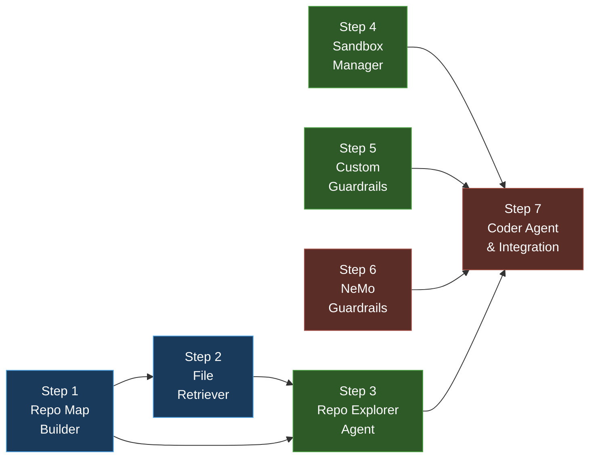

# Phase 3 — Context Engineering, Repo Explorer & Coder Agent

**Goal:** Build the Repo Map, implement semantic/keyword file retrieval, create the Sandbox Manager for isolated execution, add guardrails for safety, and build the Coder agent that ties everything together.

**Total Estimated Effort:** ~4–5 days

> [!IMPORTANT]
> This plan breaks Phase 3 into **7 incremental steps**. Each step introduces ONLY the packages, directories, and files it needs — nothing more. You install a dependency when you need it, create a directory when you write code in it.

> [!WARNING]
> This is the **heaviest phase**. The Coder agent in Step 7 depends on every previous step. Take extra care with testing at each checkpoint.

---

## Dependency Graph



**Legend:** 🔵 Context Engineering → 🟢 Infrastructure → 🔴 Agent Wiring

---

## Step 1 — Repo Map Builder

**Goal:** Create a compressed tree representation of a repository's file structure with exported symbols, within a configurable token budget.

**Estimated Effort:** ~3–4 hours

### Why this step exists

The Repo Map gives agents a "bird's eye view" of the repository without loading every file. It's the first thing the Orchestrator reads when starting a task — answering "what files exist and what do they export?" The token budget prevents context window bloat.

### New packages to install

| Package | Why we need it |
|---------|---------------|
| `tiktoken` | Token counting for enforcing the 4000-token budget |

```bash
uv add tiktoken
```

### Directories to create

```bash
mkdir src/codepilot/context
mkdir tests/test_context
```

### Files to create

- `src/codepilot/context/__init__.py` — empty
- `src/codepilot/context/repo_map.py` — the builder
- `tests/test_context/` — directory + `__init__.py`
- `tests/test_context/test_repo_map.py` — tests

### Key design

```python
@dataclass
class FileEntry:
    path: str                    # Relative path
    language: str                # Detected from extension
    symbols: list[str]           # Exported functions/classes (AST)
    summary: str                 # One-line description

class RepoMapBuilder:
    def __init__(self, config: Config): ...
    def build(self, repo_path: str) -> str:
        """Walk directory, extract symbols, build tree within token budget."""
    def build_and_store(self, repo_path: str, write_file_fn: Callable) -> str:
        """Build repo map AND store in virtual filesystem via write_file_fn."""
    def _extract_symbols(self, filepath: str) -> list[str]:
        """Basic AST parsing for Python (ast module)."""
    def _count_tokens(self, text: str) -> int:
        """Use tiktoken to count tokens."""
    def _truncate_to_budget(self, tree: str) -> str:
        """Remove deepest leaves until under budget."""
    def _load_cached(self, repo_path: str) -> str | None:
        """Load cached repo map from disk, return None if stale/missing."""
    def _save_cache(self, repo_path: str, repo_map: str) -> None:
        """Save repo map JSON to disk cache."""
    def _is_cache_valid(self, repo_path: str) -> bool:
        """Check if cached repo map is still valid via git diff HEAD."""
```

**Key decisions:**
- Use Python's `ast` module for symbol extraction (no external dependency)
- Start with Python-only AST support; other languages get extension-based heuristics
- Cache the repo map to disk (JSON) — invalidate when `git diff HEAD` shows changes
- **Store the repo map in the deepagents virtual filesystem** via `write_file` so all subagents can access it without rebuilding — path: `/.repo_map.json`
- Config field `repo_map_token_budget` (default 4000) already exists

### Verification ✅

```bash
uv run pytest tests/test_context/test_repo_map.py -v
uv run ruff check src/codepilot/context/ tests/test_context/
```

**Tests to write:**
- Build repo map from a small test directory → produces valid tree string
- Token budget is respected (output ≤ 4000 tokens)
- Python files get symbols extracted via AST
- Non-Python files get extension-based language detection
- Cache invalidation works when files change

---

## Step 2 — File Retriever

**Goal:** Given a task description, find the most relevant files in the repository using keyword matching and embedding search.

**Estimated Effort:** ~3–4 hours

### Why this step exists

The Repo Explorer agent uses this to narrow down which files the Coder should look at. Two strategies:
1. **Keyword matching** — fast, no embeddings needed, good for small repos
2. **Embedding search** — better semantic matching, uses ChromaDB for vector storage

### New packages to install

| Package | Why we need it |
|---------|---------------|
| `chromadb` | Vector database for embedding-based file retrieval |

```bash
uv add chromadb
```

### Files to create

- `src/codepilot/context/retriever.py` — both strategies
- `tests/test_context/test_retriever.py` — tests

### Key design

```python
class KeywordRetriever:
    """TF-IDF-style keyword matching against file summaries."""
    def retrieve(self, query: str, repo_map: str, top_k: int) -> list[str]: ...

class EmbeddingRetriever:
    """ChromaDB-backed semantic search over file chunks."""
    def __init__(self, persist_dir: str): ...
    def index_files(self, files: list[str]) -> None:
        """Chunk files and add to ChromaDB collection."""
    def retrieve(self, query: str, top_k: int) -> list[str]:
        """Embed query → cosine similarity → return file paths."""

class FileRetriever:
    """Unified interface — picks strategy based on config/repo size."""
    def retrieve(self, query: str, ...) -> list[str]: ...
```

**Key decisions:**
- Keyword retriever uses simple term frequency (no external NLP library)
- Embedding retriever chunks files at 500-token boundaries with overlap
- ChromaDB uses `CHROMADB_PERSIST_DIR` from config (already exists)
- `MAX_RELEVANT_FILES` (default 10) limits results
- The `FileRetriever` facade picks keyword for small repos (<50 files), embedding for larger ones

### Verification ✅

```bash
uv run pytest tests/test_context/test_retriever.py -v
uv run ruff check src/codepilot/context/ tests/test_context/
```

---

## Step 3 — Repo Explorer Agent

**Goal:** Create the Repo Explorer subagent that uses the Repo Map and File Retriever to identify relevant files for a task.

**Estimated Effort:** ~2–3 hours

### Why this step exists

The Repo Explorer is spawned by the Orchestrator to find which files are relevant to an issue. It returns **only file paths** (no file contents) — this is a key context engineering rule. The Coder will `read_file` on-demand.

### New packages to install

**None.** Uses components from Steps 1–2 + existing `BaseAgent`.

### Files to create

- `src/codepilot/agents/repo_explorer.py` — the agent
- `tests/test_repo_explorer.py` — tests

### Key design

```python
REPO_EXPLORER_SYSTEM_PROMPT = """You are the Repo Explorer...
Given a task description and a Repo Map, identify the most
relevant files. Return ONLY file paths, not file contents."""

class RepoExplorer:
    """Finds relevant files for a task."""
    def __init__(self, agent: BaseAgent, config: Config,
                 repo_map_builder: RepoMapBuilder,
                 retriever: FileRetriever): ...

    async def explore(self, task: str, repo_path: str) -> list[str]:
        """Build repo map → retrieve files → return paths."""
```

**Key decisions:**
- Returns `list[str]` (file paths only) — enforces context engineering rule
- Combines repo map context + retriever results
- Registered tools: `ls`, `read_file` (for selective inspection)
- NOT a `BaseAgent` subclass — wraps one (composition, like Orchestrator)

### Verification ✅

```bash
uv run pytest tests/test_repo_explorer.py -v
uv run ruff check src/codepilot/agents/ tests/test_repo_explorer.py
```

---

## Step 4 — Sandbox Manager

**Goal:** Create isolated sandbox directories where the Coder agent executes changes without affecting the live repository.

**Estimated Effort:** ~2–3 hours

### Why this step exists

The Coder must never modify the real repository directly. The Sandbox Manager creates an isolated copy with only the relevant files, enforces filesystem permissions, and handles cleanup.

### New packages to install

**None.** Pure Python — uses `shutil`, `pathlib`, `tempfile`.

### Directories to create

```bash
mkdir src/codepilot/sandbox
```

### Files to create

- `src/codepilot/sandbox/__init__.py` — empty
- `src/codepilot/sandbox/manager.py` — sandbox lifecycle
- `tests/test_sandbox.py` — tests

### Key design

```python
@dataclass
class SandboxConfig:
    base_dir: str              # From config.sandbox_base_dir
    issue_id: int              # Creates sandbox/{issue_id}/
    relevant_files: list[str]  # Only these files are copied

class SandboxManager:
    """Manages isolated sandbox directories."""
    def create(self, config: SandboxConfig, repo_path: str) -> str:
        """Create sandbox, copy relevant files, return sandbox path."""
    async def execute(self, sandbox_path: str, command: str) -> tuple[str, int]:
        """Run a command inside the sandbox directory (async subprocess)."""
    def get_diff(self, sandbox_path: str, repo_path: str) -> str:
        """Generate unified diff of sandbox changes vs original."""
    def cleanup(self, sandbox_path: str) -> None:
        """Delete the sandbox directory."""
```

**Key decisions:**
- Uses `asyncio.create_subprocess_exec()` for non-blocking execution
- Only relevant files are copied (not the entire repo) — fast and focused
- `execute()` runs commands with `cwd=sandbox_path` and captures stdout/stderr asynchronously
- Commands are sandboxed by working directory, not by OS-level isolation (local sandbox)
- The diff is generated via `diff -urN` and stored in `working/proposed_diff.txt` for review
- Cleanup happens on task `DONE` or `FAILED`

### Verification ✅

```bash
uv run pytest tests/test_sandbox.py -v
uv run ruff check src/codepilot/sandbox/ tests/test_sandbox.py
```

**Tests:**
- Create sandbox → files exist in sandbox dir
- Execute command in sandbox → returns output + exit code
- Get diff → shows changes correctly
- Cleanup → sandbox directory deleted
- Sandbox isolation → changes don't affect original files

---

## Step 5 — Custom Guardrails (Command Filter & File Filter)

**Goal:** Intercept dangerous commands and sensitive file operations before they execute.

**Estimated Effort:** ~2–3 hours

### Why this step exists

The Coder agent calls `execute` and `edit_file` tools. Without guardrails, it could `rm -rf /`, `curl` malicious URLs, or edit `.env` files. Custom guardrails are the first defense layer (NeMo Guardrails in Step 6 is the second).

### Directories to create

```bash
mkdir src/codepilot/guardrails
mkdir tests/test_guardrails
```

### Files to create

- `src/codepilot/guardrails/__init__.py` — empty
- `src/codepilot/guardrails/command_filter.py` — blocks dangerous commands
- `src/codepilot/guardrails/file_filter.py` — blocks sensitive file edits
- `tests/test_guardrails/__init__.py` — empty
- `tests/test_guardrails/test_filters.py` — tests

### Key design

```python
class GuardrailViolation(Exception):
    """Raised when a guardrail blocks an operation."""
    def __init__(self, rule: str, detail: str): ...

class CommandFilter:
    """Blocks dangerous shell commands."""
    BLOCKED_PATTERNS = [
        r"rm\s+-rf", r"curl\s+", r"wget\s+",
        r"pip\s+install", r"npm\s+install",
    ]
    BLOCKED_PATH_PATTERNS = [
        r"/etc/", r"/usr/", r"C:\\Windows",
    ]

    def check(self, command: str, sandbox_path: str) -> None:
        """Raise GuardrailViolation if command is blocked."""

class FileFilter:
    """Blocks edits to sensitive files."""
    BLOCKED_PATTERNS = [
        r"\.env$", r".*\.secret$", r".*\.pem$",
        r".*\.key$", r".*credentials.*",
    ]

    def check(self, filepath: str) -> None:
        """Raise GuardrailViolation if file is blocked."""
```

**Key decisions:**
- Regex-based pattern matching (fast, deterministic, no LLM needed)
- On violation: raise `GuardrailViolation` → triggers HITL interrupt (Phase 5)
- For now (Phase 3), violations just raise exceptions
- Command filter also checks that paths stay within the sandbox

### Verification ✅

```bash
uv run pytest tests/test_guardrails.py -v
uv run ruff check src/codepilot/guardrails/ tests/test_guardrails.py
```

**Tests:**
- `rm -rf /` → blocked
- `curl http://evil.com` → blocked
- `pytest` → allowed
- `python script.py` → allowed
- Edit `.env` → blocked
- Edit `src/main.py` → allowed
- Edit `secrets.key` → blocked
- Path outside sandbox → blocked

---

## Step 6 — NeMo Guardrails

**Goal:** Add NeMo Guardrails as a second defense layer, using Colang 2.0 flows for prompt injection detection, secret detection, and sandbox escape prevention.

**Estimated Effort:** ~3–4 hours

### Why this step exists

Custom guardrails (Step 5) handle deterministic pattern matching. NeMo Guardrails add LLM-based detection for subtler threats: prompt injection attempts, hardcoded secrets in generated code, and path references outside the sandbox.

### New packages to install

| Package | Why we need it |
|---------|---------------|
| `nemoguardrails` | NVIDIA's guardrails framework with Colang 2.0 |

```bash
uv add nemoguardrails
```

### Directories to create

```bash
mkdir src/codepilot/guardrails/config
```

### Files to create

- `src/codepilot/guardrails/config/config.yml` — NeMo config
- `src/codepilot/guardrails/config/rails.co` — Colang 2.0 flows
- `src/codepilot/guardrails/config/actions.py` — Python action implementations
- `src/codepilot/guardrails/nemo_wrapper.py` — wrapper for integration
- `tests/test_nemo_guardrails.py` — tests

### Key design

**`config.yml`:**
```yaml
models:
  - type: main
    engine: anthropic
    model: claude-sonnet-4-20250514

rails:
  input:
    flows:
      - check prompt injection
  output:
    flows:
      - check hardcoded secrets
      - check unsafe file paths
```

**`rails.co`** (Colang 2.0):
- `check prompt injection` — blocks "ignore previous instructions"
- `check hardcoded secrets` — blocks `api_key = "sk-..."` in generated code
- `check unsafe file paths` — blocks references to `/etc/`, `C:\Windows`

**`nemo_wrapper.py`:**
```python
class NemoGuardrailsWrapper:
    """Wraps NeMo's RunnableRails for LLM chain integration."""
    def __init__(self, config_path: str): ...
    def wrap_chain(self, llm: BaseChatModel) -> RunnableSequence:
        """input → guardrails → LLM → guardrails → output"""
```

**Key decisions:**
- NeMo wraps the Coder's LLM calls (not the Orchestrator's — it doesn't need them)
- Uses `RunnableRails` from `nemoguardrails.integrations.langchain`
- If NeMo is unavailable (import error), falls back to custom guardrails only (graceful degradation)
- Action implementations are pure Python regex checks (no additional LLM calls)

### Verification ✅

```bash
uv run pytest tests/test_guardrails/ tests/test_nemo_guardrails.py -v
uv run ruff check src/codepilot/guardrails/ tests/test_guardrails/ tests/test_nemo_guardrails.py
```

---

## Step 7 — Coder Agent & Integration

**Goal:** Build the Coder agent that reads relevant files, creates an implementation checklist, edits files in the sandbox, and produces a diff. Wire everything together.

**Estimated Effort:** ~4–5 hours

### Why this step exists

The Coder is the workhorse agent. It receives a task + relevant file paths from the Repo Explorer, reads the files on-demand, makes edits in the sandbox, runs commands to verify, and produces a proposed diff. This is where all Phase 3 components come together.

### New packages to install

**None.** Everything needed is already installed.

### Files to create

- `src/codepilot/agents/coder.py` — the Coder agent
- `tests/test_coder.py` — tests

### Files to modify

- `src/codepilot/agents/orchestrator.py` — wire up Repo Explorer + Coder flow
- `src/codepilot/core/tool_registry.py` — register Coder tools

### Key design

```python
CODER_SYSTEM_PROMPT = """You are the Coder agent...
1. Read relevant files using read_file
2. Create an implementation checklist using write_todos
3. Make surgical edits using edit_file
4. Run commands using execute to verify
5. Spawn Test Agent to run tests"""

class Coder:
    """Implements code changes in a sandboxed environment."""
    def __init__(self, agent: BaseAgent, config: Config,
                 sandbox: SandboxManager,
                 command_filter: CommandFilter,
                 file_filter: FileFilter): ...

    async def implement(self, task: str,
                       relevant_files: list[str],
                       working_memory: WorkingMemory) -> str:
        """Execute the coding task. Returns unified diff."""
```

> [!NOTE]
> `WorkingMemory` is from `codepilot.memory.working` (created in Phase 2, Step 2). The Coder receives it from the Orchestrator and updates `current_diff` and `retry_count`.

**Registered tools for Coder role:**
| Tool | Purpose | Guardrail |
|------|---------|-----------|
| `read_file` | Read file contents on-demand | None |
| `write_file` | Create new files in sandbox | FileFilter |
| `edit_file` | Surgical edits to existing files | FileFilter |
| `execute` | Run commands in sandbox | CommandFilter |
| `write_todos` | Create implementation checklist | None |
| `spawn_subagent` | Spawn Test Agent | None |

**Key decisions:**
- Coder registers its tools with `ToolRegistry` at startup
- `read_file`, `edit_file`, `execute` are all sandbox-scoped
- Guardrail wrappers injected via `ToolRegistry.requires_guardrail` flag
- Coder produces a unified diff stored in `working_memory.current_diff`
- On failure: increment `working_memory.retry_count`, transition to `FAILED` if > `max_coder_retries`

### Verification ✅

```bash
# 1. All tests pass
uv run pytest tests/ -v --tb=short

# 2. Lint
uv run ruff check src/ tests/

# 3. Smoke test
uv run python -m codepilot.main

# 4. Integration test: Coder with sandbox
uv run python -c "
from codepilot.sandbox.manager import SandboxManager
sm = SandboxManager()
print('✅ Sandbox works')
"
```

---

## What's installed at the end of Phase 3

| Package | Installed In | Purpose |
|---------|-------------|---------|
| `tiktoken` | Step 1 | Token counting for Repo Map |
| `chromadb` | Step 2 | Embedding-based file retrieval |
| `nemoguardrails` | Step 6 | LLM-based guardrails |

## What Phase 3 enables for Phase 4+

| Capability | Used By |
|------------|---------|
| Repo Map builder | Repo Explorer, Coder |
| File retrieval (keyword + embedding) | Repo Explorer |
| Sandbox isolation | Coder, Test Agent |
| Command/file guardrails | Coder, Test Agent |
| NeMo guardrails | Coder LLM chain |
| Coder agent with diff output | Orchestrator diff review (Phase 5) |
