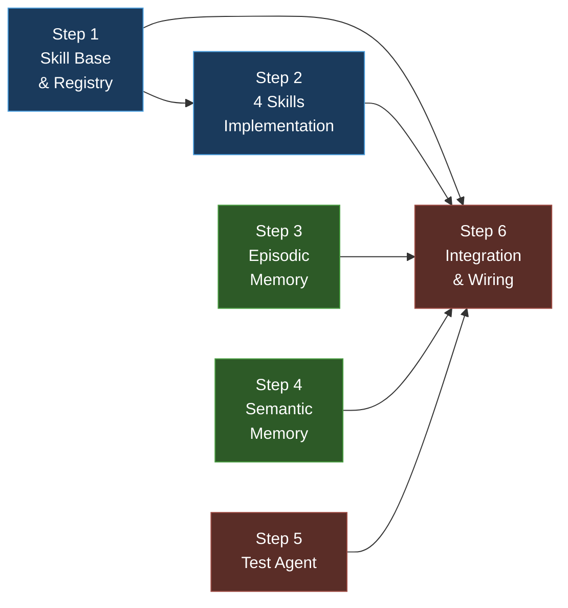

# Phase 4 — Skills, Memory & Test Agent

**Goal:** Implement the 4 task-type skills, the 3-tier memory system (working + episodic + semantic), and the Test Agent that runs and parses test results.

**Total Estimated Effort:** ~3 days

> [!IMPORTANT]
> This plan breaks Phase 4 into **6 incremental steps**. Each step introduces ONLY the packages, directories, and files it needs — nothing more.

---

## Dependency Graph



**Legend:** 🔵 Skills Foundation → 🟢 Memory Systems → 🔴 Agent + Wiring

---

## Step 1 — Skill Base & Registry

**Goal:** Create the base `Skill` class and a `SkillRegistry` that maps task classification types to their corresponding skill definitions.

**Estimated Effort:** ~1–2 hours

### Why this step exists

Skills are structured prompt templates + workflow instructions that the Orchestrator injects into the Coder's system prompt. A `SkillRegistry` allows the Orchestrator to look up skills by the classification type from Phase 2.

### New packages to install

**None.** Pure Python — `dataclasses` and `abc`.

### Directories to create

```bash
mkdir src/codepilot/skills
mkdir tests/test_skills
```

### Files to create

- `src/codepilot/skills/__init__.py` — empty
- `src/codepilot/skills/base.py` — abstract base skill + registry
- `tests/test_skills/` — directory + `__init__.py`
- `tests/test_skills/test_skill_base.py` — tests

### Key design

```python
from abc import ABC, abstractmethod
from dataclasses import dataclass, field

@dataclass
class SkillContext:
    """Injected context for a skill — what the skill knows."""
    issue_title: str
    issue_body: str
    relevant_files: list[str]
    repo_map: str
    previous_attempts: list[str] = field(default_factory=list)

class Skill(ABC):
    """Base class for all task-type skills."""
    name: str                      # e.g., "bug_fix"
    description: str               # Human-readable description
    example_prompts: list[str]     # Example inputs for few-shot learning
    forbidden_actions: list[str]   # Actions the Coder MUST NOT perform

    @abstractmethod
    def get_system_prompt(self, context: SkillContext) -> str:
        """Return the system prompt for the Coder agent."""

    @abstractmethod
    def get_workflow_steps(self) -> list[str]:
        """Return ordered workflow steps for the Coder."""

    @abstractmethod
    def get_checklist_template(self, context: SkillContext) -> list[str]:
        """Return a TODO checklist template."""

class SkillRegistry:
    """Maps task classification types to Skill instances."""
    def __init__(self): self._skills: dict[str, Skill] = {}
    def register(self, task_type: str, skill: Skill) -> None: ...
    def get(self, task_type: str) -> Skill | None:
        """Returns None for unknown types — Orchestrator handles gracefully."""
    def list_types(self) -> list[str]: ...
```

**Key decisions:**
- Skills are **prompt templates**, not agents — they don't make LLM calls
- Each skill provides: system prompt, workflow steps, checklist template, example prompts, forbidden actions
- `example_prompts` are used for few-shot examples injected into the Coder's prompt
- `forbidden_actions` are merged with the class-level guardrails to enforce skill-specific constraints
- `SkillContext` carries the necessary data from `WorkingMemory`
- Registry is populated at startup in `main.py`
- If `get()` returns `None` for a task type (e.g., `config_change`), the Orchestrator falls back to a generic Coder prompt

### Verification ✅

```bash
uv run pytest tests/test_skills/test_skill_base.py -v
uv run ruff check src/codepilot/skills/ tests/test_skills/
```

---

## Step 2 — Skills Implementation (All 5 Skills)

**Goal:** Implement the five concrete skills: `BugFixSkill`, `FeatureAdditionSkill`, `DependencyUpdateSkill`, `DocumentationSkill`, `ConfigChangeSkill`.

**Estimated Effort:** ~3–4 hours

### Why this step exists

Each task classification type maps to a different workflow. A bug fix skill emphasizes reproducing the bug first, while a feature addition skill starts with design considerations.

### New packages to install

**None.** These are prompt templates — no dependencies.

### Files to create

- `src/codepilot/skills/bug_fix.py`
- `src/codepilot/skills/feature_addition.py`
- `src/codepilot/skills/dependency_update.py`
- `src/codepilot/skills/documentation.py`
- `src/codepilot/skills/config_change.py`
- `tests/test_skills/test_all_skills.py`

### Skill summaries

| Skill | Workflow Focus | Key Checklist Items |
|-------|---------------|---------------------|
| `BugFixSkill` | Reproduce → Root cause → Fix → Test | "Reproduce the bug", "Identify root cause in X", "Add regression test" |
| `FeatureAdditionSkill` | Design → Implement → Tests → Docs | "Design the API surface", "Implement core logic", "Add unit tests" |
| `DependencyUpdateSkill` | Check compatibility → Update → Test | "Read changelog", "Update version in requirements", "Run full test suite" |
| `DocumentationSkill` | Audit → Write → Verify | "Identify undocumented functions", "Write docstrings", "Verify with pydoc" |
| `ConfigChangeSkill` | Identify → Validate → Update → Verify | "Identify config file(s) to modify", "Validate syntax", "Update config value", "Verify application behavior" |

### Key design

Each skill implements the same interface:

```python
class BugFixSkill(Skill):
    name = "bug_fix"
    description = "Fix a reported bug"
    example_prompts = [
        "Fix the division by zero error in the calculate() function",
        "The login endpoint returns 500 when password is empty",
    ]
    forbidden_actions = [
        "Modifying test infrastructure without approval",
        "Skipping existing tests",
        "Changing public API signatures",
    ]

    def get_system_prompt(self, context: SkillContext) -> str:
        return f"""You are fixing a bug:
        Issue: {context.issue_title}
        ...
        Workflow: {self.get_workflow_steps()}"""

    def get_workflow_steps(self) -> list[str]:
        return [
            "1. Read the relevant files to understand the code",
            "2. Reproduce the bug (write a failing test if possible)",
            "3. Identify the root cause",
            "4. Implement the minimal fix",
            "5. Run tests to verify the fix",
            "6. Ensure no regressions",
        ]

    def get_checklist_template(self, context: SkillContext) -> list[str]:
        return [
            f"Reproduce: {context.issue_title}",
            "Root cause identified",
            "Fix implemented",
            "Regression test added",
            "All existing tests pass",
        ]

class ConfigChangeSkill(Skill):
    name = "config_change"
    description = "Fix a configuration issue"
    example_prompts = [
        "Fix the typo in the database connection string in config.py",
        "Update the log level from WARN to INFO in settings.yaml",
    ]
    forbidden_actions = [
        "Modifying production credentials or secrets",
        "Changing config validation logic",
        "Removing existing config options without approval",
    ]

    def get_system_prompt(self, context: SkillContext) -> str:
        return f"""You are fixing a configuration issue:
        Issue: {context.issue_title}
        ...
        Workflow: {self.get_workflow_steps()}
        IMPORTANT: Never modify credentials, secrets, or validation logic."""

    def get_workflow_steps(self) -> list[str]:
        return [
            "1. Identify the config file(s) mentioned in the issue",
            "2. Read the current configuration",
            "3. Validate the proposed change (syntax, values)",
            "4. Apply the minimal config change",
            "5. Verify the application starts/behaves correctly",
            "6. Ensure no existing functionality is broken",
        ]

    def get_checklist_template(self, context: SkillContext) -> list[str]:
        return [
            "Config file(s) identified",
            "Current values understood",
            "Change validated for syntax",
            "Config updated",
            "Application verified",
        ]
```

### Verification ✅

```bash
uv run pytest tests/test_skills/ -v
uv run ruff check src/codepilot/skills/
```

**Tests:**
- Each skill instantiates correctly
- `get_system_prompt()` returns a non-empty string with context
- `get_workflow_steps()` returns 4+ ordered steps
- `get_checklist_template()` returns actionable items
- `example_prompts` is non-empty for each skill
- `forbidden_actions` is non-empty for each skill
- `SkillRegistry` can register and retrieve all 5 skills
- Unknown task type returns `None`

---

## Step 3 — Episodic Memory (LangGraph Memory Store)

**Goal:** Implement episodic memory that persists session summaries and failed issue tracking using LangGraph's built-in Memory Store.

**Estimated Effort:** ~2–3 hours

### Why this step exists

Episodic memory stores "what happened before" — summaries of past sessions, which issues were attempted, and what failures occurred. The Orchestrator queries this before starting a task to avoid repeating mistakes.

### New packages to install

**None.** Uses `langgraph.store` already installed in Phase 1.

### Files to create

- `src/codepilot/memory/episodic.py` — episodic memory implementation
- `tests/test_episodic_memory.py` — tests

### Key design

```python
from langgraph.store.memory import InMemoryStore

@dataclass
class SessionSummary:
    """Summary of a completed task session."""
    issue_id: int
    task_type: str
    success: bool
    summary: str           # LLM-generated summary
    files_changed: list[str]
    lessons_learned: str   # What worked/didn't
    timestamp: str

class EpisodicMemory:
    """Persists session summaries using LangGraph Memory Store."""
    def __init__(self, store: InMemoryStore | None = None): ...

    async def store_session(self, summary: SessionSummary) -> None:
        """Store a session summary."""

    async def get_recent_sessions(self, limit: int = 3) -> list[SessionSummary]:
        """Retrieve the N most recent session summaries."""

    async def get_failed_issues(self) -> list[int]:
        """Return IDs of issues that failed in previous attempts."""

    async def get_session_for_issue(self, issue_id: int) -> SessionSummary | None:
        """Check if we've attempted this issue before."""
```

**Key decisions:**
- Uses LangGraph `InMemoryStore` (upgradeable to `AsyncSqliteSaver` for persistence)
- Session summaries are generated by the Orchestrator via LLM after task completion
- Failed issues are tracked to prevent infinite retry loops
- `get_session_for_issue()` lets the Orchestrator inject "last time we tried this and it failed because..." into the Coder's prompt

### Verification ✅

```bash
uv run pytest tests/test_episodic_memory.py -v
uv run ruff check src/codepilot/memory/ tests/test_episodic_memory.py
```

---

## Step 4 — Semantic Memory (ChromaDB)

**Goal:** Implement semantic memory that stores "lessons learned" from past tasks and retrieves them by similarity to new issues.

**Estimated Effort:** ~2–3 hours

### Why this step exists

Semantic memory answers "have we seen something like this before?" Unlike episodic memory (which stores by issue ID), semantic memory stores by meaning — finding similar problems across different issues.

### New packages to install

**None.** `chromadb` was installed in Phase 3, Step 2.

### Files to create

- `src/codepilot/memory/semantic.py` — semantic memory implementation
- `tests/test_semantic_memory.py` — tests

### Key design

```python
@dataclass
class Lesson:
    """A lesson learned from a past task."""
    issue_id: int
    task_type: str
    problem: str          # What the issue was
    solution: str         # How it was solved
    pitfalls: str         # What didn't work
    patterns: list[str]   # Code patterns used

class SemanticMemory:
    """ChromaDB-backed semantic memory for lessons learned."""
    def __init__(self, persist_dir: str): ...

    async def store_lesson(self, lesson: Lesson) -> None:
        """Embed and store a lesson."""

    async def retrieve_similar(self, query: str, top_k: int = 3) -> list[Lesson]:
        """Find lessons similar to the query."""

    async def get_patterns_for_type(self, task_type: str) -> list[str]:
        """Get common patterns for a task type."""
```

**Key decisions:**
- Uses ChromaDB's default embedding function (no additional model needed)
- Lessons are generated by the Orchestrator after successful task completion
- Similarity threshold of 0.7 — below that, results are not returned
- Collection name: `codepilot_lessons`
- Persisted to `CHROMADB_PERSIST_DIR` from config

### Verification ✅

```bash
uv run pytest tests/test_semantic_memory.py -v
uv run ruff check src/codepilot/memory/ tests/test_semantic_memory.py
```

---

## Step 5 — Test Agent

**Goal:** Create the Test Agent subagent that runs `pytest` in the sandbox and returns structured test results.

**Estimated Effort:** ~3–4 hours

### Why this step exists

After the Coder makes changes, the Test Agent verifies them. It runs `pytest`, parses the output, and returns a structured `TestResult` (already defined in Phase 2's `working.py`). The Orchestrator uses test results to decide: pass → PR, fail → retry Coder.

### New packages to install

**None.** Uses existing components.

### Files to create

- `src/codepilot/agents/test_agent.py` — the Test Agent
- `tests/test_test_agent.py` — tests

### Key design

```python
TEST_AGENT_SYSTEM_PROMPT = """You are the Test Agent...
1. Run the existing test suite using execute
2. Parse the test output for pass/fail counts
3. If tests fail, analyze the error messages
4. Return structured test results"""

class TestAgent:
    """Runs tests in the sandbox and reports results."""
    def __init__(self, agent: BaseAgent, config: Config,
                 sandbox: SandboxManager,
                 command_filter: CommandFilter): ...

    async def run_tests(self, sandbox_path: str,
                       test_command: str = "pytest") -> TestResult:
        """Run tests and return structured results."""

    def _parse_pytest_output(self, output: str) -> TestResult:
        """Parse pytest output into TestResult dataclass."""
```

**Registered tools for TestAgent role:**
| Tool | Purpose | Guardrail |
|------|---------|-----------|
| `execute` | Run `pytest` in sandbox | CommandFilter |
| `read_file` | Read test files for analysis | None |

**Key decisions:**
- Test Agent only runs in the sandbox (never in the live repo)
- Parses pytest output using regex for pass/fail/error counts
- Returns `TestResult` (from `memory/working.py` — already defined)
- On failure: returns failure details with file + line info
- The Orchestrator decides retry logic, not the Test Agent

### Verification ✅

```bash
uv run pytest tests/test_test_agent.py -v
uv run ruff check src/codepilot/agents/ tests/test_test_agent.py
```

---

## Step 6 — Integration & Wiring

**Goal:** Wire skills, memory, and Test Agent into the Orchestrator. Complete the full task flow: classify → load skill → explore → code → test → store lesson.

**Estimated Effort:** ~3–4 hours

### Why this step exists

All Phase 4 components are standalone — they need to be connected through the Orchestrator. This step modifies `orchestrator.py` and `main.py` to create the full automated flow.

### Files to modify

- `src/codepilot/agents/orchestrator.py` — add skill loading, memory queries, test flow
- `src/codepilot/main.py` — initialize skills, memory at startup
- `tests/test_orchestrator.py` — integration tests

### Wiring changes

**In `main.py` startup:**
```python
# Initialize memory
episodic = EpisodicMemory()
semantic = SemanticMemory(config.chromadb_persist_dir)

# Initialize skills
skill_registry = SkillRegistry()
skill_registry.register("bug_fix", BugFixSkill())
skill_registry.register("feature_addition", FeatureAdditionSkill())
skill_registry.register("dependency_update", DependencyUpdateSkill())
skill_registry.register("documentation", DocumentationSkill())
skill_registry.register("config_change", ConfigChangeSkill())
```

**In Orchestrator task flow:**
1. Receive classified issue → look up skill via `SkillRegistry`
   - If skill is `None` (unknown type), use a generic Coder system prompt
2. Query episodic memory → "have we tried this before?"
3. Query semantic memory → "any similar issues with lessons?"
4. Inject skill prompt + memory context into Coder
5. Spawn Repo Explorer → get relevant files
6. Spawn Coder → implement changes
7. Spawn Test Agent → run tests
8. If tests pass → store lesson in semantic memory
9. Store session summary in episodic memory
10. Transition state machine (TESTING → PR_OPENED or → IMPLEMENTING for retry)

### Verification ✅

```bash
# 1. All tests pass
uv run pytest tests/ -v --tb=short

# 2. Lint
uv run ruff check src/ tests/

# 3. Integration: full flow with mocks
uv run pytest tests/test_orchestrator.py -v -k "integration"
```

---

## What's installed at the end of Phase 4

**No new packages.** Phase 4 uses only packages from Phase 1 (`langgraph`) and Phase 3 (`chromadb`).

## What Phase 4 enables for Phase 5+

| Capability | Used By |
|------------|---------|
| Skill-driven Coder prompts | Orchestrator |
| Episodic memory (past sessions) | Orchestrator, TUI |
| Semantic memory (lessons) | Orchestrator |
| Test Agent with structured results | Orchestrator, TUI |
| Full classify → code → test flow | End-to-end integration (Phase 5) |
