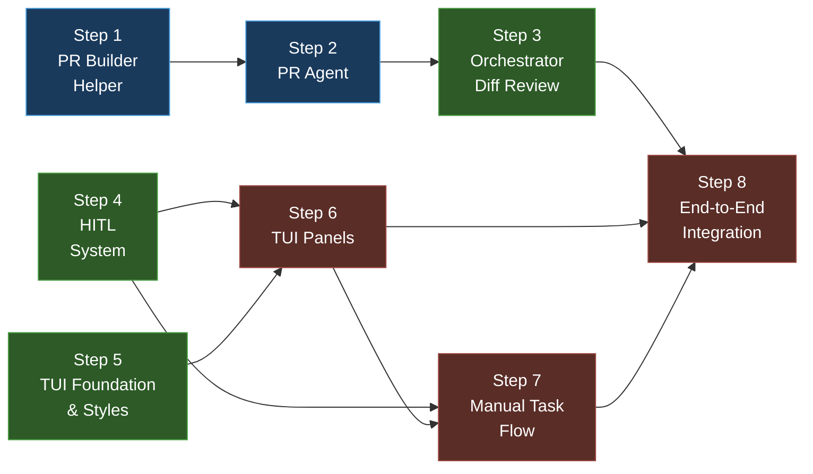

# Phase 5 — PR Agent, TUI & End-to-End Integration

**Goal:** Build the PR Agent, the full 4-panel TUI with Textual, the Human-in-the-Loop (HITL) approval workflow, manual task support, and validate the complete end-to-end flow from issue polling to PR creation.

**Total Estimated Effort:** ~3–4 days

> [!IMPORTANT]
> This plan breaks Phase 5 into **8 incremental steps**. Each step introduces ONLY the packages, directories, and files it needs — nothing more.

> [!WARNING]
> This phase brings everything together. Steps 7–8 are integration-heavy and depend on **all previous phases** working correctly. Run the full test suite after every step.

---

## Dependency Graph



**Legend:** 🔵 PR Pipeline → 🟢 TUI + HITL → 🔴 Integration

---

## Step 1 — PR Builder Helper

**Goal:** Create pure functions for building commit messages, PR bodies, and branch names — no API calls, just string construction.

**Estimated Effort:** ~1 hour

### Why this step exists

The PR Agent will use these helpers to construct GitHub-compatible metadata. Separating pure string functions from API calls (separation of concerns) makes them trivially testable and reusable.

### New packages to install

**None.** Pure Python string formatting.

### Files to create

- `src/codepilot/github_integration/pr_builder.py`
- `tests/test_pr_builder.py`

### Key design

```python
def build_branch_name(issue_number: int, title: str) -> str:
    """Generate a branch name like 'codepilot/issue-42-fix-division-by-zero'.

    Rules:
    - Prefix with 'codepilot/'
    - Slug the title (lowercase, hyphens, max 50 chars)
    - Include issue number
    """

def build_commit_message(
    issue_number: int,
    summary: str,
    changes: list[str],
    reason: str,
) -> str:
    """Generate a conventional commit message.

    Format:
        fix(#42): one-line summary

        - change 1
        - change 2
        - why
        - Closes #42
    """

def build_pr_body(
    issue_title: str,
    issue_body: str,
    approach: str,
    files_changed: list[str],
    test_results: str,
) -> str:
    """Generate a PR body with sections for approach, files, and tests."""
```

**Key decisions:**
- No API calls — these are pure, deterministic functions
- Branch names follow `codepilot/issue-{number}-{slug}` convention
- Manual tasks use `codepilot/manual-{slug}` convention
- Commit messages follow conventional commits (`fix`, `feat`, `chore`, `docs`)
- PR body includes a link back to the original issue

### Verification ✅

```bash
uv run pytest tests/test_pr_builder.py -v
uv run ruff check src/codepilot/github_integration/pr_builder.py tests/test_pr_builder.py
```

**Tests:**
- Branch name slugification (special chars, length limits)
- Commit message format matches conventional commits
- PR body includes all sections
- Manual task uses `chore(manual):` prefix

---

## Step 2 — PR Agent

**Goal:** Create the PR Agent subagent that creates a branch, commits changes, and opens a pull request on GitHub using the `GitHubService` from Phase 2.

**Estimated Effort:** ~3–4 hours

### Why this step exists

After the Coder produces a diff and tests pass, the PR Agent pushes changes to GitHub. It uses `GitHubService` (Phase 2) for API calls and `PRBuilder` (Step 1) for metadata construction.

### New packages to install

**None.** Uses existing `GitHubService` and `BaseAgent`.

### Files to create

- `src/codepilot/agents/pr_agent.py`
- `tests/test_pr_agent.py`

### Key design

```python
PR_AGENT_SYSTEM_PROMPT = """You are the PR Agent...
1. Create a branch from main
2. Apply the proposed diff
3. Commit with a descriptive message
4. Open a pull request
5. Add labels and assign reviewer"""

class PRAgent:
    """Creates branches and opens pull requests on GitHub."""
    def __init__(
        self,
        agent: BaseAgent,
        config: Config,
        github: GitHubService,
    ): ...

    async def create_pr(
        self,
        working_memory: WorkingMemory,
        diff: str,
        task_source: TaskSource,
    ) -> PullRequest:
        """Full PR workflow: branch → commit → PR."""

    async def _detect_merge_conflict(
        self, branch: str
    ) -> bool:
        """Check for merge conflicts against base branch."""
```

**Key decisions:**
- PR Agent does NOT decide whether to create a PR — the Orchestrator does
- On merge conflict: emit event, set task state to `FAILED`
- Adds labels: `codepilot-generated`, `needs-review`
- Assigns reviewer: issue reporter (if available via GitHub API)
- For manual tasks: optional PR creation (HITL gate in Step 4)

### Verification ✅

```bash
uv run pytest tests/test_pr_agent.py -v
uv run ruff check src/codepilot/agents/pr_agent.py tests/test_pr_agent.py
```

---

## Step 3 — Orchestrator Diff Review Step

**Goal:** Add a diff review step to the Orchestrator where it uses the LLM to review the Coder's proposed changes before approving them for PR creation.

**Estimated Effort:** ~2–3 hours

### Why this step exists

The Orchestrator acts as a code reviewer. Before spawning the PR Agent, it reviews the diff and makes one of three decisions: APPROVE (create PR), RETRY (send feedback to Coder), or ESCALATE (trigger HITL for human review).

### New packages to install

**None.** Uses existing `LLMProvider`.

### Files to modify

- `src/codepilot/agents/orchestrator.py` — add `review_diff()` method
- `tests/test_orchestrator.py` — add review tests

### Key design

```python
class DiffReviewResult(str, Enum):
    APPROVE = "APPROVE"     # Diff looks good → PR Agent
    RETRY = "RETRY"         # Send feedback → Coder retry
    ESCALATE = "ESCALATE"   # Needs human review → HITL

@dataclass
class DiffReview:
    decision: DiffReviewResult
    feedback: str           # LLM feedback (used in RETRY)
    confidence: float       # 0.0–1.0

# Added to Orchestrator class:
async def review_diff(
    self, working_memory: WorkingMemory
) -> DiffReview:
    """Review the Coder's proposed diff using the LLM.

    Decision logic:
    - APPROVE if: diff is clean, addresses the issue, tests pass
    - RETRY if: diff has issues but fixable, retry_count < max
    - ESCALATE if: diff is risky, touches many files, or unclear
    """
```

**Key decisions:**
- Review uses a dedicated prompt (not the Orchestrator's general prompt)
- RETRY decrements the retry budget and sends LLM feedback to the Coder
- ESCALATE triggers HITL (Step 4) — diff is shown in the Approval panel
- Auto-approve if confidence > 0.85 and < 5 files changed
- Auto-escalate if > 10 files changed or retry_count >= max_coder_retries

### Verification ✅

```bash
uv run pytest tests/test_orchestrator.py -v -k "review"
uv run ruff check src/codepilot/agents/ tests/test_orchestrator.py
```

---

## Step 4 — HITL (Human-in-the-Loop) System

**Goal:** Build the centralized HITL gate manager that blocks agent execution until a human approves, rejects, or inspects a proposed action.

**Estimated Effort:** ~3–4 hours

### Why this step exists

Risky operations (PRs to main, large commits, retries) need human approval. The HITL system is the bridge between the agent pipeline and the TUI Approval panel.

### New packages to install

**None.** Uses `asyncio.Event` for blocking.

### Files to create

- `src/codepilot/guardrails/hitl.py` — HITL gate manager
- `tests/test_hitl.py` — tests

### Key design

```python
class HITLAction(str, Enum):
    APPROVE = "approve"
    REJECT = "reject"
    INSPECT = "inspect"

class HITLGateType(str, Enum):
    PR_TO_PROTECTED = "pr_to_protected"
    LARGE_COMMIT = "large_commit"
    GIT_PUSH = "git_push"
    RETRY_AFTER_FAILURES = "retry_after_failures"
    DIFF_ESCALATION = "diff_escalation"

@dataclass
class HITLRequest:
    """A pending approval request."""
    gate_type: HITLGateType
    task_id: int
    description: str
    details: str             # Diff content, command, etc.
    event: asyncio.Event     # Blocks until resolved
    result: HITLAction | None = None

@dataclass
class HITLNotification:
    """A non-actionable alert (merge conflict, failure)."""
    type: str
    issue_id: int
    message: str
    actionable: bool = False

class HITLManager:
    """Centralized Human-in-the-Loop gate manager."""
    def __init__(self): ...

    async def request_approval(
        self, request: HITLRequest
    ) -> HITLAction:
        """Block until the human responds. Returns the action."""

    def should_gate(
        self, gate_type: HITLGateType, context: dict
    ) -> bool:
        """Check if this operation needs HITL approval."""

    def resolve(
        self, task_id: int, action: HITLAction
    ) -> None:
        """Called by TUI when user approves/rejects."""

    def get_pending(self) -> list[HITLRequest]:
        """Get all pending approval requests."""
```

**HITL gate rules:**

| Gate | Trigger Condition |
|------|-------------------|
| `PR_TO_PROTECTED` | PR target is `main` or `master` |
| `LARGE_COMMIT` | Diff touches > 5 files |
| `GIT_PUSH` | Command contains `git push` |
| `RETRY_AFTER_FAILURES` | `retry_count >= 2` |
| `DIFF_ESCALATION` | Orchestrator review returned `ESCALATE` |

**Key decisions:**
- Blocking is done via `asyncio.Event.wait()` — non-polling, efficient
- HITL requests are stored in a dict keyed by `task_id`
- TUI subscribes to pending requests and renders them in the Approval panel
- On `REJECT`: task transitions to `FAILED` with reason "Human rejected"
- On `INSPECT`: TUI shows the full diff/command before approve/reject

### Verification ✅

```bash
uv run pytest tests/test_hitl.py -v
uv run ruff check src/codepilot/guardrails/hitl.py tests/test_hitl.py
```

---

## Step 5 — TUI Foundation & Styles

**Goal:** Set up the Textual app skeleton with a 4-panel grid layout, keyboard bindings, and the CSS theme.

**Estimated Effort:** ~3–4 hours

### Why this step exists

The TUI is the user interface for CodePilot. This step creates the app shell and layout — panels are added in Step 6. Getting the layout and theme right first prevents rework.

### New packages to install

| Package | Why we need it |
|---------|---------------|
| `textual` | Terminal UI framework |

```bash
uv add textual
```

### Directories to create

```bash
mkdir src/codepilot/tui
mkdir src/codepilot/tui/panels
```

### Files to create

- `src/codepilot/tui/__init__.py` — empty
- `src/codepilot/tui/app.py` — main `App` subclass
- `src/codepilot/tui/styles.tcss` — CSS Grid layout + theme
- `src/codepilot/tui/panels/__init__.py` — empty
- `tests/test_tui.py` — basic app tests

### Key design

**`app.py`:**
```python
from textual.app import App, ComposeResult
from textual.binding import Binding

class CodePilotApp(App):
    """CodePilot TUI — 4-panel grid layout."""

    CSS_PATH = "styles.tcss"
    TITLE = "CodePilot"
    SUB_TITLE = "Multi-Agent Coding Platform"

    BINDINGS = [
        Binding("i", "new_task", "New Task"),
        Binding("s", "skip_issue", "Skip Issue"),
        Binding("q", "quit", "Quit"),
        Binding("l", "toggle_logs", "Toggle Logs"),
    ]

    def compose(self) -> ComposeResult:
        """Create the 4-panel layout."""
        yield Header()
        yield Container(
            IssuesPanel(),       # Top-left
            ActiveTaskPanel(),   # Top-right
            AgentLogsPanel(),    # Bottom-left
            ApprovalPanel(),     # Bottom-right
            id="main-grid",
        )
        yield Footer()
```

**`styles.tcss`:**
```css
#main-grid {
    layout: grid;
    grid-size: 2 2;        /* 2 columns, 2 rows */
    grid-gutter: 1;
}

/* Dark theme with accent colors */
Screen {
    background: $surface;
}

/* Green for success, yellow for warnings, red for failures */
.status-success { color: #4a9e42; }
.status-warning { color: #e5c07b; }
.status-failure { color: #e06c75; }
```

**Key decisions:**
- 2×2 CSS Grid layout matching the assignment mockup
- Dark background with green/yellow/red status indicators
- Keyboard bindings for all primary actions
- `@work` decorator for background workers (polling, agent execution)
- Panels are placeholder widgets in this step (replaced in Step 6)

### Verification ✅

```bash
# 1. App launches without errors
uv run python -c "
from codepilot.tui.app import CodePilotApp
app = CodePilotApp()
print('✅ TUI app instantiates')
"

# 2. Tests
uv run pytest tests/test_tui.py -v

# 3. Lint
uv run ruff check src/codepilot/tui/
```

---

## Step 6 — TUI Panels

**Goal:** Implement the 4 panels: Issues, Active Task, Agent Logs, and Human Approval.

**Estimated Effort:** ~4–5 hours

### Why this step exists

Each panel is a Textual widget that displays real-time data from the agent pipeline. They subscribe to events (polling results, state changes, HITL requests) and update reactively.

### New packages to install

**None.** Uses `textual` installed in Step 5.

### Files to create

- `src/codepilot/tui/panels/issues.py`
- `src/codepilot/tui/panels/active_task.py`
- `src/codepilot/tui/panels/agent_logs.py`
- `src/codepilot/tui/panels/approval.py`
- `tests/test_tui_panels.py`

### Panel details

#### Issues Panel (`issues.py`)
- `ListView` showing polled issues with status indicators
- Status icons: `●` open, `◐` in-progress, `✓` done, `✗` failed
- Shows issue number, title, classification type
- Manual tasks shown with `⌨` icon and `[manual]` label
- Updates when polling loop emits new issues

#### Active Task Panel (`active_task.py`)
- Displays current task: issue title, state machine status, active agent
- Shows TODO checklist with progress (`[✓]` / `[ ]`)
- Shows loaded skill name and type
- Updates on every state transition
- Shows retry count and failure reason (if applicable)

#### Agent Logs Panel (`agent_logs.py`)
- `RichLog` widget streaming agent thoughts and tool calls
- Prefix each line with agent name: `[Orchestrator]`, `[Coder]`, etc.
- Auto-scroll with max 1000 lines buffer
- Toggle full logs with `l` keybinding

#### Approval Panel (`approval.py`)
- Two notification types:
  1. **Actionable** — approve / reject / inspect buttons
  2. **Non-actionable** — yellow warning banners (merge conflicts, failures)
- `inspect` shows the proposed diff or command details
- "No pending approvals" placeholder when empty
- Subscribes to `HITLManager.get_pending()` for updates

### Verification ✅

```bash
uv run pytest tests/test_tui_panels.py -v
uv run ruff check src/codepilot/tui/ tests/test_tui_panels.py
```

---

## Step 7 — Manual Task Flow

**Goal:** Add support for free-form coding tasks entered via the TUI (not tied to GitHub issues).

**Estimated Effort:** ~2–3 hours

### Why this step exists

The `[i] New task` shortcut lets users type a coding task directly. These tasks follow the same agent pipeline but skip the polling step and have optional PR creation.

### Files to modify

- `src/codepilot/tui/app.py` — add `Input` modal for manual task entry
- `src/codepilot/agents/orchestrator.py` — handle `ManualTask` alongside `GitHubIssueTask`

### Key design

```python
# In app.py:
async def action_new_task(self) -> None:
    """Open modal for manual task input."""
    # Show textual.widgets.Input modal
    # On submit → create synthetic task → route to Orchestrator

# In orchestrator.py:
@dataclass
class ManualTask:
    task_id: str               # "manual-{uuid[:8]}"
    description: str
    source: str = "user_input"
    issue_id: None = None
    issue_number: None = None
```

**Differences for manual tasks:**
| Aspect | GitHub Issue Task | Manual Task |
|--------|------------------|-------------|
| Source | Polling loop | TUI `[i]` shortcut |
| Classification | LLM classifier | LLM classifier (same) |
| State machine | Full flow | Same, but TRIAGED immediately |
| PR creation | Automatic | HITL asks: "Open PR?" |
| Commit prefix | `fix(#42):` | `chore(manual):` |
| Branch name | `codepilot/issue-42-slug` | `codepilot/manual-slug` |
| Issues panel | Shows with issue icon | Shows with `⌨` icon |

### Verification ✅

```bash
uv run pytest tests/ -v --tb=short
uv run ruff check src/ tests/
```

---

## Step 8 — End-to-End Integration

**Goal:** Wire everything together, verify the full pipeline from issue polling to PR creation with human approval, and run integration tests.

**Estimated Effort:** ~3–4 hours

### Why this step exists

This is the final assembly step. All components exist — this step ensures they work together as a cohesive system.

### Files to modify

- `src/codepilot/main.py` — full startup with TUI launch
- `tests/test_e2e.py` — end-to-end integration tests

### Full startup sequence

```python
async def startup():
    # 1. Config
    # 2. LLM Provider
    # 3. Tool Registry (with all tools registered)
    # 4. Agent Factory
    # 5. GitHub Service (if configured)
    # 6. Issue Classifier
    # 7. Issue Poller
    # 8. Repo Map Builder
    # 9. File Retriever
    # 10. Sandbox Manager
    # 11. Guardrails (Command + File + NeMo)
    # 12. Memory (Episodic + Semantic)
    # 13. Skill Registry (all 4 skills)
    # 14. Agents: Orchestrator, Repo Explorer, Coder, Test Agent, PR Agent
    # 15. HITL Manager
    # 16. TUI App (launches last)
```

### End-to-end test scenario

```
Synthetic issue on codepilot-test-repo:
  "Fix division by zero in calculator"

Expected flow:
  1. Issue Poller detects the issue
  2. Classifier → "bug_fix"
  3. Orchestrator creates WorkingMemory, loads BugFixSkill
  4. Queries episodic/semantic memory
  5. Spawns Repo Explorer → finds calculator.py, test_calculator.py
  6. Spawns Coder with BugFixSkill prompt
  7. Coder reads files, implements fix, runs in sandbox
  8. Spawns Test Agent → tests pass
  9. Orchestrator reviews diff → APPROVE
  10. HITL check (< 5 files, so auto-approve)
  11. PR Agent creates branch + PR
  12. Session stored in episodic memory
  13. Lesson stored in semantic memory
  14. TUI shows: issue ✓, task DONE, PR link in logs
```

### Integration tests

```bash
# 1. Full test suite
uv run pytest tests/ -v --tb=short

# 2. E2E with mocks (no real GitHub calls)
uv run pytest tests/test_e2e.py -v

# 3. E2E with real GitHub (requires GITHUB_APP_ID in .env)
uv run pytest tests/test_e2e.py -v -k "real_github" --run-integration

# 4. Launch TUI
uv run python -m codepilot.main
```

### Manual verification

- [ ] Screen recording of TUI showing all 4 panels
- [ ] Issue appears in Issues panel
- [ ] Active Task shows state transitions
- [ ] Agent Logs stream in real-time
- [ ] HITL approval for PR → PR opens on GitHub
- [ ] Manual task via `[i]` → full flow → optional PR

---

## What's installed at the end of Phase 5

| Package | Installed In | Purpose |
|---------|-------------|---------|
| `textual` | Step 5 | TUI framework |

## What Phase 5 enables for Phase 6

| Capability | Used By |
|------------|---------|
| PR creation pipeline | ACP Integration (Bonus 5) |
| TUI framework | All bonuses add TUI features |
| HITL system | Cloud sandbox approval (Bonus 4) |
| End-to-end flow | All bonus features build on top |
| Manual task flow | ACP task submission (Bonus 5) |
