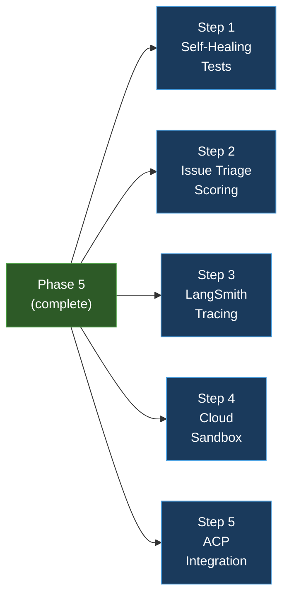

# Phase 6 — Bonus Challenges

**Goal:** With all core components stable and verified, implement all 5 bonus challenges as additive features that don't disturb the existing architecture.

**Total Estimated Effort:** ~4–5 days

> [!IMPORTANT]
> This plan breaks Phase 6 into **5 independent steps** — one per bonus challenge. Each bonus is self-contained and can be implemented in any order.

> [!NOTE]
> Unlike previous phases, Phase 6 steps have **no dependencies on each other**. Pick whichever bonus interests you most and start there.

---

## Dependency Graph



**Legend:** 🟢 Phase 5 (prerequisite) → 🔵 Independent bonuses

---

## Step 1 — Bonus 1: Self-Healing Tests

**Goal:** When the Test Agent's own tests fail due to infrastructure issues (import errors, missing fixtures, syntax errors in test files), spawn a meta-agent that debugs and fixes the test setup, then re-runs.

**Estimated Effort:** ~1 day

### Why this bonus exists

Sometimes the Coder's changes break the test infrastructure itself (not just failing assertions). A meta-agent can detect this difference and self-heal the test setup, reducing human intervention.

### New packages to install

**None.** Uses existing components.

### Files to create

- `src/codepilot/agents/meta_test_agent.py` — the self-healing meta-agent
- `tests/test_meta_test_agent.py` — tests

### Files to modify

- `src/codepilot/agents/test_agent.py` — add failure classification

### Key design

```python
class TestFailureType(str, Enum):
    ASSERTION_FAILURE = "assertion"       # Normal: test ran, assertion failed
    INFRASTRUCTURE_FAILURE = "infra"      # Meta: test couldn't even run

class MetaTestAgent:
    """Debugs and fixes test infrastructure failures."""
    def __init__(self, agent: BaseAgent, config: Config,
                 sandbox: SandboxManager): ...

    async def self_heal(
        self, error_output: str,
        test_files: list[str],
        sandbox_path: str,
    ) -> bool:
        """Analyze error → fix test setup → return success."""
```

**Key decisions:**
- Distinguishes assertion failures (normal) from infrastructure failures (meta)
- Infrastructure failures: `ImportError`, `ModuleNotFoundError`, `SyntaxError` in test files, missing fixtures
- Max 1 self-heal retry per task (prevents infinite loops)
- Meta-agent has same guardrails as Coder
- On self-heal success: re-run Test Agent with the fixed tests
- On self-heal failure: escalate to HITL

### Flow

```
Test Agent runs → infrastructure failure detected
  → classify as INFRASTRUCTURE_FAILURE
  → spawn MetaTestAgent
  → MetaTestAgent reads error + test files
  → MetaTestAgent fixes the setup issue
  → Re-run Test Agent
  → If still fails: mark task FAILED
```

### Verification ✅

```bash
uv run pytest tests/test_meta_test_agent.py -v
uv run ruff check src/codepilot/agents/meta_test_agent.py tests/test_meta_test_agent.py
```

**Test scenario:**
- Create a test file with a broken import → MetaTestAgent fixes it → tests re-run successfully

---

## Step 2 — Bonus 2: Issue Triage Scoring

**Goal:** Score each issue 1–10 for estimated complexity before attempting it. Skip issues above the threshold.

**Estimated Effort:** ~0.5 day

### Why this bonus exists

Not all issues are suitable for automated fixing. A triage scorer helps CodePilot focus on issues it can actually solve, avoiding wasted LLM calls and time on overly complex problems.

### New packages to install

**None.** Uses existing `LLMProvider`.

### Files to create

- `src/codepilot/github_integration/triage_scorer.py`
- `tests/test_triage_scorer.py`

### Files to modify

- `src/codepilot/github_integration/issue_poller.py` — add scoring step
- `src/codepilot/tui/panels/issues.py` — display score

### Key design

```python
@dataclass
class TriageScore:
    score: int                    # 1–10
    reasoning: str
    estimated_files_affected: int
    estimated_effort: str         # trivial/small/medium/large/complex

class TriageScorer:
    """Scores issues by estimated complexity using the LLM."""
    def __init__(self, llm_provider: LLMProvider,
                 config: Config): ...

    async def score(self, issue: Issue,
                   repo_map: str | None = None) -> TriageScore:
        """Score issue complexity 1–10."""
```

**Scoring inputs:**
- Issue description length and clarity
- Number of files likely affected (heuristic from repo map keywords)
- Issue labels (e.g., `bug` is typically simpler than `refactor`)
- Repository size and language complexity

**Key decisions:**
- Uses LLM with structured JSON output (same pattern as classifier)
- Cache scores by issue ID (avoid redundant LLM calls)
- Skip threshold: `COMPLEXITY_THRESHOLD` (default 7, already in config)
- Scores displayed in TUI Issues panel: `[3]` next to issue title
- Issues above threshold shown with `⚠` icon and greyed out

### Verification ✅

```bash
uv run pytest tests/test_triage_scorer.py -v
uv run ruff check src/codepilot/github_integration/triage_scorer.py tests/test_triage_scorer.py
```

**Test scenario:**
- Simple bug report → score 2–3
- Multi-file refactor → score 7–8
- Issue above threshold → skipped by poller

---

## Step 3 — Bonus 3: LangSmith Tracing

**Goal:** Instrument all agent calls with LangSmith tracing so the full multi-agent flow appears as a single trace tree.

**Estimated Effort:** ~0.5–1 day

### Why this bonus exists

LangSmith provides observability into LLM calls — latency, token usage, prompt/response pairs, and multi-step traces. Essential for debugging and optimizing agent behavior.

### New packages to install

| Package | Why we need it |
|---------|---------------|
| `langsmith` | LangSmith tracing SDK |

```bash
uv add langsmith
```

### .env additions

```env
LANGCHAIN_TRACING_V2=true
LANGCHAIN_API_KEY=<your-langsmith-api-key>
LANGCHAIN_PROJECT=codepilot
```

### Config additions

```python
# In config.py:
langsmith_enabled: bool = False
langchain_api_key: str = ""
langchain_project: str = "codepilot"
```

### Files to create

- `src/codepilot/core/tracing.py` — tracing setup and utilities
- `tests/test_tracing.py` — tests

### Files to modify

- `src/codepilot/config.py` — add LangSmith settings
- `src/codepilot/core/agent_factory.py` — wrap agent creation with callbacks

### Key design

```python
class TracingManager:
    """Manages LangSmith tracing configuration."""
    def __init__(self, config: Config): ...

    def is_enabled(self) -> bool:
        """Check if tracing is configured and enabled."""

    def get_callbacks(
        self, agent_name: str, issue_id: int | None = None
    ) -> list:
        """Get LangSmith callbacks for an agent invocation."""

    def create_run_config(
        self, agent_name: str, **tags
    ) -> RunnableConfig:
        """Create a RunnableConfig with tracing metadata."""
```

**Tags applied to each trace:**
- `agent_name`: Orchestrator, Coder, TestAgent, etc.
- `issue_id`: GitHub issue number (if applicable)
- `task_type`: bug_fix, feature_addition, etc.
- `phase`: exploring, implementing, testing, etc.

**Key decisions:**
- Tracing is opt-in — disabled by default (`langsmith_enabled: bool = False`)
- If disabled, no performance overhead (callbacks list is empty)
- Parent-child linking: Orchestrator trace is parent, subagent traces are children
- Include a screenshot of the LangSmith trace view in the README

### Verification ✅

```bash
uv run pytest tests/test_tracing.py -v
uv run ruff check src/codepilot/core/tracing.py tests/test_tracing.py

# With tracing enabled:
LANGSMITH_ENABLED=true uv run python -m codepilot.main
# → Check LangSmith dashboard for trace tree
```

**Deliverable:** Screenshot of LangSmith trace showing full multi-agent flow.

---

## Step 4 — Bonus 4: Cloud Sandbox (Daytona or Modal)

**Goal:** Replace the local sandbox with a cloud sandbox for true isolation. Support both Daytona and Modal as providers.

**Estimated Effort:** ~1–1.5 days

### Why this bonus exists

Local sandboxes provide directory-level isolation but not OS-level isolation. Cloud sandboxes run code in ephemeral containers/VMs, providing full security isolation.

### New packages to install

Choose one (or both):

| Package | Why we need it |
|---------|---------------|
| `daytona-sdk` | Daytona workspace API |
| `modal` | Modal cloud sandbox |

```bash
# Option A:
uv add daytona-sdk

# Option B:
uv add modal
```

### Config additions

```python
# In config.py:
sandbox_provider: str = "local"    # "local", "daytona", "modal"
daytona_api_key: str = ""
modal_token: str = ""
```

### Files to create

- `src/codepilot/sandbox/cloud_sandbox.py` — cloud sandbox implementation
- `tests/test_cloud_sandbox.py` — tests

### Files to modify

- `src/codepilot/sandbox/manager.py` — extract `SandboxInterface` ABC
- `src/codepilot/config.py` — add cloud sandbox settings

### Key design

```python
from abc import ABC, abstractmethod

class SandboxInterface(ABC):
    """Abstract sandbox interface — local or cloud."""
    @abstractmethod
    async def create(self, config: SandboxConfig, repo_path: str) -> str: ...
    @abstractmethod
    async def execute(self, sandbox_id: str, command: str) -> tuple[str, int]: ...
    @abstractmethod
    async def get_diff(self, sandbox_id: str) -> str: ...
    @abstractmethod
    async def cleanup(self, sandbox_id: str) -> None: ...

class LocalSandbox(SandboxInterface):
    """Existing local sandbox — directory-based isolation."""

class DaytonaSandbox(SandboxInterface):
    """Daytona cloud workspace sandbox."""

class ModalSandbox(SandboxInterface):
    """Modal cloud sandbox."""

def create_sandbox(config: Config) -> SandboxInterface:
    """Factory — picks sandbox based on SANDBOX_PROVIDER config."""
    match config.sandbox_provider:
        case "local": return LocalSandbox(config)
        case "daytona": return DaytonaSandbox(config)
        case "modal": return ModalSandbox(config)
```

**Key decisions:**
- Existing `SandboxManager` becomes `LocalSandbox` (no behavior change)
- Cloud sandboxes implement the same interface — drop-in replacement
- Factory function selects provider based on config
- Cloud-specific concerns: file upload/download, timeout, cost limits
- HITL gate for cloud sandbox usage (costs money)
- Graceful fallback: if cloud provider unavailable, fall back to local

### Verification ✅

```bash
uv run pytest tests/test_cloud_sandbox.py -v
uv run ruff check src/codepilot/sandbox/ tests/test_cloud_sandbox.py

# Integration test with Modal:
SANDBOX_PROVIDER=modal uv run pytest tests/test_cloud_sandbox.py -v -k "real_cloud" --run-integration
```

---

## Step 5 — Bonus 5: ACP Integration

**Goal:** Expose CodePilot as an ACP-compatible agent (Agent Communication Protocol) so it can be invoked from Zed, Cursor, or any ACP client via HTTP.

**Estimated Effort:** ~1 day

### Why this bonus exists

ACP makes CodePilot accessible programmatically. Instead of using the TUI, external tools can submit tasks, check status, and approve HITL gates via REST API.

### New packages to install

| Package | Why we need it |
|---------|---------------|
| `fastapi` | HTTP API framework |
| `uvicorn` | ASGI server |

```bash
uv add fastapi uvicorn
```

### Config additions

```python
# In config.py:
acp_enabled: bool = False
acp_port: int = 8420
```

### Files to create

- `src/codepilot/acp_server.py` — ACP-compatible HTTP server
- `tests/test_acp_server.py` — tests

### Key design

```python
from fastapi import FastAPI

app = FastAPI(title="CodePilot ACP Server")

@app.post("/tasks")
async def submit_task(description: str) -> dict:
    """Submit a coding task. Returns task_id."""

@app.get("/tasks/{task_id}")
async def get_task_status(task_id: str) -> dict:
    """Check task status (state machine position)."""

@app.get("/tasks/{task_id}/result")
async def get_task_result(task_id: str) -> dict:
    """Get task result (diff, PR URL, test results)."""

@app.post("/tasks/{task_id}/approve")
async def approve_hitl(task_id: str, action: str) -> dict:
    """Approve/reject a pending HITL gate."""

@app.get("/health")
async def health_check() -> dict:
    """Health check endpoint."""
```

**Key decisions:**
- Runs alongside the TUI (separate HTTP server on configurable port)
- ACP is opt-in (`ACP_ENABLED=true` in config)
- Routes tasks through the same Orchestrator as the TUI
- HITL approval via API mirrors TUI approval
- Task results include: state, diff, PR URL, test results
- Authentication: API key header (uses `ANTHROPIC_API_KEY` or a dedicated `ACP_API_KEY`)

### Verification ✅

```bash
uv run pytest tests/test_acp_server.py -v
uv run ruff check src/codepilot/acp_server.py tests/test_acp_server.py

# Manual test:
ACP_ENABLED=true uv run python -m codepilot.main &
curl -X POST http://localhost:8420/tasks -d '{"description": "Fix the bug"}'
curl http://localhost:8420/tasks/{task_id}
curl http://localhost:8420/tasks/{task_id}/result
```

---

## What's installed at the end of Phase 6

| Package | Installed In | Purpose |
|---------|-------------|---------|
| `langsmith` | Step 3 | LangSmith tracing |
| `daytona-sdk` or `modal` | Step 4 | Cloud sandbox |
| `fastapi` | Step 5 | ACP HTTP server |
| `uvicorn` | Step 5 | ASGI server |

## Submission Checklist

After completing Phase 6, verify all submission requirements:

- [ ] Public GitHub repo named `codepilot-agent`
- [ ] `README.md` with:
  - Setup instructions (`.env`, dependencies, GitHub App)
  - Architecture diagram (from `docs/architecture.md`)
  - Screen recording/GIF of TUI in action
  - Example PR created by CodePilot
- [ ] 5–7 minute demo video showing:
  - Issue polling and classification
  - Full task execution (explore → code → test → PR)
  - HITL approval workflow
  - Guardrail blocking a dangerous command
- [ ] LinkedIn post with demo video
- [ ] LangSmith trace screenshot (Bonus 3)
- [ ] All tests passing: `uv run pytest tests/ -v`
- [ ] Lint clean: `uv run ruff check src/ tests/`
