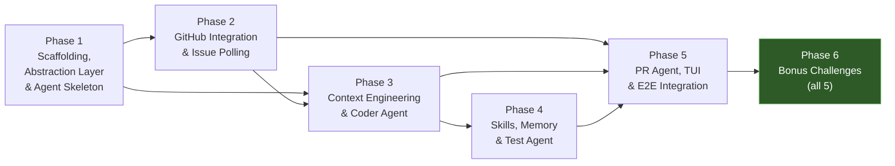

# CodePilot — Multi-Agent Coding Platform: Implementation Plan

## Background

CodePilot is a terminal-based, multi-agent AI coding platform that autonomously triages GitHub issues, implements fixes in a sandboxed environment, and opens pull requests — all while keeping a human in the loop for risky operations. It is built on top of `deepagents` (LangChain/LangGraph), uses `textual` for the TUI, and integrates ChromaDB for semantic memory.

The assignment specifies **7 components** across agent orchestration, context engineering, sandboxed execution, skills, memory, GitHub integration, and TUI. This plan breaks them into **6 phases** — 5 core phases ordered by dependency, plus a dedicated Phase 6 for all bonus challenges.

---

## Decisions (Resolved)

| Decision | Choice |
|----------|--------|
| **Primary LLM** | Claude Sonnet (via `langchain-anthropic`), with multi-provider fallback to GPT-4o and Gemini 1.5 Pro |
| **Test Repository** | New repo `codepilot-test-repo` with synthetic issues |
| **GitHub Auth** | GitHub App (App ID + private key) |
| **DeepAgents Strategy** | Build an **abstraction layer** over `deepagents` so we can swap to raw LangGraph if the API changes |
| **Storage** | LangGraph Memory Store (`langgraph.store`) for episodic memory + ChromaDB persistent directory for semantic memory |
| **Project Location** | `c:\ai-engineering\codepilot-agent\` |
| **Bonus Challenges** | All 5 — implemented in a separate Phase 6 after core components are stable |

---

## Proposed Architecture


---

## Phase 1 — Project Scaffolding, Abstraction Layer & Core Agent Skeleton

**Goal:** Set up the project structure, install dependencies, build the `deepagents` abstraction layer, create the Orchestrator agent with a basic tool-calling loop, and verify end-to-end integration.

**Estimated Effort:** ~3 days

---

### Scaffolding

#### [NEW] Project Root & Config Files

| File | Purpose |
|------|---------|
| `pyproject.toml` | Python project config, dependencies, scripts |
| `.env.example` | Template for required environment variables |
| `README.md` | Setup instructions, architecture diagram |
| `.gitignore` | Python/IDE/env exclusions |
| `Makefile` | Common dev commands (`make run`, `make test`, etc.) |

#### [NEW] Directory Structure

```
c:\ai-engineering\codepilot-agent\
├── src/
│   └── codepilot/
│       ├── __init__.py
│       ├── main.py                  # Entry point
│       ├── config.py                # Settings (pydantic-settings)
│       ├── core/                    # ★ Abstraction layer over deepagents
│       │   ├── __init__.py
│       │   ├── agent_factory.py     # Wraps create_deep_agent()
│       │   ├── base_agent.py        # Abstract agent interface
│       │   ├── tool_registry.py     # Tool management abstraction
│       │   └── llm_provider.py      # Multi-provider LLM factory
│       ├── agents/
│       │   ├── __init__.py
│       │   ├── orchestrator.py      # Root Orchestrator agent
│       │   ├── repo_explorer.py     # Repo Explorer subagent
│       │   ├── coder.py             # Coder subagent
│       │   ├── test_agent.py        # Test Agent subagent
│       │   └── pr_agent.py          # PR Agent subagent
│       ├── skills/
│       │   ├── __init__.py
│       │   ├── base.py              # Skill dataclass / base
│       │   ├── bug_fix.py
│       │   ├── feature_addition.py
│       │   ├── dependency_update.py
│       │   └── documentation.py
│       ├── memory/
│       │   ├── __init__.py
│       │   ├── episodic.py          # SQLite-backed episodic store
│       │   ├── semantic.py          # ChromaDB vector store
│       │   └── working.py           # In-memory task state
│       ├── guardrails/
│       │   ├── __init__.py
│       │   ├── command_filter.py    # Custom execute command blocker
│       │   ├── file_filter.py       # Sensitive file write blocker
│       │   ├── hitl.py              # Human-in-the-loop gate logic
│       │   └── config/              # NeMo Guardrails config directory
│       │       ├── config.yml
│       │       └── rails.co
│       ├── github_integration/
│       │   ├── __init__.py
│       │   ├── github_service.py    # ★ Wraps GitHubToolkit (swappable)
│       │   ├── issue_poller.py      # Polling loop & filtering
│       │   ├── pr_builder.py        # Branch, commit, PR creation
│       │   └── classifier.py        # Issue → task type classifier
│       ├── context/
│       │   ├── __init__.py
│       │   ├── repo_map.py          # Repo Map builder & cache
│       │   └── retriever.py         # Keyword + embedding retrieval
│       ├── sandbox/
│       │   ├── __init__.py
│       │   └── manager.py           # Sandbox setup, copy, teardown
│       └── tui/
│           ├── __init__.py
│           ├── app.py               # Textual App class
│           ├── panels/
│           │   ├── __init__.py
│           │   ├── issues.py        # GitHub Issues panel
│           │   ├── active_task.py   # Active Task panel
│           │   ├── agent_logs.py    # Streaming Agent Logs panel
│           │   └── approval.py      # Human Approval panel
│           └── styles.tcss          # Textual CSS
├── tests/
│   ├── __init__.py
│   ├── test_core/                   # Tests for abstraction layer
│   │   ├── test_agent_factory.py
│   │   └── test_llm_provider.py
│   ├── test_orchestrator.py
│   ├── test_repo_explorer.py
│   ├── test_coder.py
│   ├── test_skills.py
│   ├── test_memory.py
│   ├── test_guardrails.py
│   └── test_tui.py
└── docs/
    └── architecture.md
```

---

### Abstraction Layer (`core/`)

> [!IMPORTANT]
> This is the key architectural decision: all agents interact with `deepagents` only through our abstraction layer, so we can swap to raw LangGraph later without touching agent logic.

#### [NEW] [base_agent.py](file:///c:/ai-engineering/codepilot-agent/src/codepilot/core/base_agent.py)

- Define `BaseAgent` abstract class with:
  ```python
  class BaseAgent(ABC):
      @abstractmethod
      async def invoke(self, messages: list, context: dict) -> AgentResult: ...
      
      @abstractmethod
      async def stream(self, messages: list, context: dict) -> AsyncIterator[AgentEvent]: ...
      
      @abstractmethod
      def spawn_subagent(self, task: str, **kwargs) -> "BaseAgent": ...
  ```
- `AgentResult` and `AgentEvent` are our own dataclasses — not `deepagents` types
- This boundary ensures no `deepagents` types leak into business logic

#### [NEW] [agent_factory.py](file:///c:/ai-engineering/codepilot-agent/src/codepilot/core/agent_factory.py)

- `DeepAgentFactory` — the concrete implementation that wraps `create_deep_agent()`
- Maps our `BaseAgent` interface to `deepagents` API calls
- Handles `write_todos`, `task`, VFS tools (`read_file`, `write_file`, `edit_file`, `ls`)
- If `deepagents` breaks: swap this single file to a `LangGraphFactory` using raw LangGraph

#### [NEW] [llm_provider.py](file:///c:/ai-engineering/codepilot-agent/src/codepilot/core/llm_provider.py)

- Multi-provider LLM factory:
  ```python
  class LLMProvider:
      def get_model(self, provider: str = None) -> BaseChatModel:
          """Returns Claude Sonnet by default, with fallback chain."""
          providers = {
              "anthropic": ChatAnthropic(model="claude-sonnet-4-20250514"),
              "openai": ChatOpenAI(model="gpt-4o"),
              "google": ChatGoogleGenerativeAI(model="gemini-1.5-pro"),
          }
  ```
- Fallback logic: if primary (Claude Sonnet) fails with rate limit or API error, automatically retry with GPT-4o → Gemini
- All providers configured via environment variables

#### [NEW] [tool_registry.py](file:///c:/ai-engineering/codepilot-agent/src/codepilot/core/tool_registry.py)

- Centralized tool registration and management
- Maps tool names to implementations
- Injects guardrail wrappers around sensitive tools (`execute`, `edit_file`)

---

### Orchestrator Agent (Skeleton)

#### [NEW] [orchestrator.py](file:///c:/ai-engineering/codepilot-agent/src/codepilot/agents/orchestrator.py)

- Uses `BaseAgent` interface (via `agent_factory.create_orchestrator()`)
- Planning-oriented system prompt focused on task decomposition
- Registers `write_todos` for checklist-based planning
- Placeholder hooks for subagent spawning
- Wired to config for LLM model, polling interval, token budgets

#### [NEW] [config.py](file:///c:/ai-engineering/codepilot-agent/src/codepilot/config.py)

- Use `pydantic-settings` to load from `.env` + environment variables
- Key settings:

| Setting | Default | Description |
|---------|---------|-------------|
| `PRIMARY_LLM` | `anthropic:claude-sonnet-4-20250514` | Primary LLM model |
| `FALLBACK_LLMS` | `openai:gpt-4o,google:gemini-1.5-pro` | Comma-separated fallback chain |
| `GITHUB_APP_ID` | — | GitHub App ID |
| `GITHUB_APP_PRIVATE_KEY_PATH` | — | Path to GitHub App private key `.pem` file |
| `GITHUB_REPOSITORY` | `codepilot-test-repo` | Target repository |
| `POLL_INTERVAL_MINUTES` | `5` | Issue polling frequency |
| `REPO_MAP_TOKEN_BUDGET` | `4000` | Max tokens for Repo Map |
| `MAX_RELEVANT_FILES` | `10` | Top-K files from retriever |
| `MAX_CODER_RETRIES` | `3` | Max retry attempts for Coder |
| `SANDBOX_BASE_DIR` | `~/.codepilot/sandboxes/` | Sandbox root directory |
| `CHROMADB_PERSIST_DIR` | `~/.codepilot/data/chromadb/` | ChromaDB persistent directory |
| `COMPLEXITY_THRESHOLD` | `7` | Max issue complexity score (1–10) |
| `AUTO_SUMMARIZATION_ENABLED` | `True` | Enable auto-summarization of older conversation turns |
| `SUMMARIZATION_THRESHOLD` | `20` | Number of turns before summarization triggers |

### Verification (Phase 1)
- `python -m codepilot.main` → Orchestrator starts, loads config, enters idle loop
- Unit test: `LLMProvider` returns Claude Sonnet as default, falls back to GPT-4o on error
- Unit test: `BaseAgent` interface works via `DeepAgentFactory`
- Unit test: Orchestrator receives a mock message → produces a `write_todos` output

---

## Phase 2 — GitHub Integration, Issue Polling & Task Classification

**Goal:** Set up GitHub App auth, connect to GitHub, poll `codepilot-test-repo` for issues, classify them, and manage the Orchestrator state machine.

**Estimated Effort:** ~2–3 days

---

### GitHub Service (Abstraction)

#### [NEW] [github_service.py](file:///c:/ai-engineering/codepilot-agent/src/codepilot/github_integration/github_service.py)

- Wraps `GitHubToolkit` behind a clean interface:
  ```python
  class GitHubService:
      def __init__(self, app_id: str, private_key_path: str, repo: str): ...
      async def list_issues(self, labels: list[str], state: str) -> list[Issue]: ...
      async def create_branch(self, name: str, from_ref: str) -> Branch: ...
      async def create_commit(self, branch: str, message: str, files: dict) -> Commit: ...
      async def create_pull_request(self, title: str, body: str, ...) -> PullRequest: ...
  ```
- Internally uses `GitHubToolkit` + `GitHubAPIWrapper` with GitHub App auth:
  ```python
  github = GitHubAPIWrapper(
      github_app_id=config.GITHUB_APP_ID,
      github_app_private_key=config.GITHUB_APP_PRIVATE_KEY_PATH,
      github_repository=config.GITHUB_REPOSITORY,
  )
  ```
- Can be swapped to `PyGithub` directly if `langchain-community` becomes unusable

### Test Repository Setup

#### [NEW] `codepilot-test-repo` (GitHub)

- Create a public GitHub repo with:
  - A small Python project (e.g., a CLI calculator or a Flask API) — ~10–15 files
  - A `pytest` test suite with passing tests
  - Pre-created synthetic issues with labels:

| Issue # | Title | Label | Expected Task Type |
|---------|-------|-------|--------------------|
| #1 | Fix division by zero in calculator | `ai-assignable`, `bug` | `bug_fix` |
| #2 | Add modulo operation support | `ai-assignable`, `enhancement` | `feature_addition` |
| #3 | Update requests from 2.28 to 2.31 | `ai-assignable`, `dependencies` | `dependency_update` |
| #4 | Add docstrings to all public functions | `ai-assignable`, `documentation` | `documentation` |
| #5 | Fix typo in config file path | `ai-assignable`, `bug` | `config_change` |

### Issue Poller

#### [NEW] [issue_poller.py](file:///c:/ai-engineering/codepilot-agent/src/codepilot/github_integration/issue_poller.py)

- Uses `GitHubService` (not `GitHubToolkit` directly — goes through abstraction)
- Async polling loop:
  ```python
  async def poll_issues(github: GitHubService, config: Config):
      while True:
          issues = await github.list_issues(
              labels=["ai-assignable"],
              state="open"
          )
          for issue in issues:
              if issue.id not in working_memory.in_progress_ids:
                  if not issue.assignee:  # unassigned
                      yield issue
          await asyncio.sleep(config.POLL_INTERVAL_MINUTES * 60)
  ```
- Track in-progress issue IDs in working memory to avoid duplicate processing
- Emit events for the TUI to update the Issues panel

### Task Classifier

#### [NEW] [classifier.py](file:///c:/ai-engineering/codepilot-agent/src/codepilot/github_integration/classifier.py)

- Classify each issue into one of: `bug_fix`, `feature_addition`, `dependency_update`, `documentation`, `config_change`
- Use Claude Sonnet (via `LLMProvider`) with structured output (JSON mode):
  ```python
  class TaskClassification(BaseModel):
      type: Literal["bug_fix", "feature_addition", "dependency_update", "documentation", "config_change"]
      confidence: float
      reasoning: str
  ```
- Input: issue title + body + labels
- Cache classifications to avoid redundant LLM calls on re-polls

### Orchestrator State Machine

#### [MODIFY] [orchestrator.py](file:///c:/ai-engineering/codepilot-agent/src/codepilot/agents/orchestrator.py)

- Implement state machine per task:
  ```
  TRIAGED → EXPLORING → IMPLEMENTING → TESTING → PR_OPENED → DONE | FAILED
  ```
- State transition model:
  ```python
  class TaskState(str, Enum):
      TRIAGED = "TRIAGED"
      EXPLORING = "EXPLORING"
      IMPLEMENTING = "IMPLEMENTING"
      TESTING = "TESTING"
      PR_OPENED = "PR_OPENED"
      DONE = "DONE"
      FAILED = "FAILED"
  ```
- Store state transitions in working memory
- On each state transition, emit a TUI event for the Active Task panel
- Handle error states: if any subagent fails, transition to `FAILED` with reason

### Verification (Phase 2)
- Integration test: poll `codepilot-test-repo` → receive synthetic issues → classify correctly
- Unit test: state machine transitions work correctly (valid transitions + reject invalid ones)
- Unit test: classifier produces correct task types for sample issues
- Manual: watch the TUI Issues panel update with polled issues

---

## Phase 3 — Context Engineering, Repo Explorer & Coder Agent

**Goal:** Build the Repo Map, implement semantic/keyword file retrieval, and create the Coder agent with sandboxed execution and guardrails. This is the **heaviest phase**.

**Estimated Effort:** ~4–5 days

---

### Repo Map Builder

#### [NEW] [repo_map.py](file:///c:/ai-engineering/codepilot-agent/src/codepilot/context/repo_map.py)

- Recursively walk the target repository directory
- For each file, extract: `path`, `language` (from extension), `exported_symbols` (basic AST parsing for Python/JS), `one_line_description` (LLM-generated or heuristic)
- Build a compressed tree representation within the **token budget** (default 4000 tokens)
  - Strategy: start with full tree → truncate deepest leaves → summarize large directories
  - Use `tiktoken` for token counting
- **Caching**: serialize Repo Map to disk (JSON); invalidate when `git diff HEAD` shows changes since last build
- Store in DeepAgents virtual filesystem via `write_file` so subagents can `read_file` it

### File Retriever

#### [NEW] [retriever.py](file:///c:/ai-engineering/codepilot-agent/src/codepilot/context/retriever.py)

- **Keyword matching strategy:**
  - TF-IDF or simple keyword overlap against file summaries in the Repo Map
  - Return top-K files by relevance score
- **Embedding search strategy:**
  - Chunk file contents (500-token chunks with overlap)
  - Embed chunks using the configured embedding model (via `LLMProvider`)
  - Store in ChromaDB collection (keyed by repo path) — uses same `CHROMADB_PERSIST_DIR`
  - On query: embed task description → cosine similarity search → return top-K unique files
- Orchestrator selects strategy via config or heuristic (small repo → keyword, large repo → embedding)

### Repo Explorer Agent

#### [NEW] [repo_explorer.py](file:///c:/ai-engineering/codepilot-agent/src/codepilot/agents/repo_explorer.py)

- Spawned by Orchestrator via `BaseAgent.spawn_subagent()`
- Tools: `ls`, `read_file`, semantic code search, repo map builder
- Receives: task description + repo path
- Returns: list of relevant file paths (no file contents — context engineering rule)
- Uses `read_file` on-demand, NOT bulk file loading

### Sandbox Manager

#### [NEW] [manager.py](file:///c:/ai-engineering/codepilot-agent/src/codepilot/sandbox/manager.py)

- Create isolated sandbox directory per task under `SANDBOX_BASE_DIR`:
  ```
  ~/.codepilot/sandboxes/issue-{issue_id}/
  ```
- Copy only the relevant files identified by Repo Explorer (not the full repo)
- Configure filesystem permissions:
  ```python
  permissions = [
      FilesystemPermission(path="/sandbox/", access="read_write"),
      FilesystemPermission(path="/", access="read_only"),
  ]
  ```
- Cleanup: delete sandbox on task completion (`DONE` or `FAILED`)

### Coder Agent

#### [NEW] [coder.py](file:///c:/ai-engineering/codepilot-agent/src/codepilot/agents/coder.py)

- Spawned by Orchestrator with: relevant file paths, loaded Skill, working memory snapshot
- Uses `BaseAgent` interface (through abstraction layer)
- **Registered Tools:** `read_file`, `write_file`, `edit_file`, `execute` (sandboxed), `write_todos`, `spawn_subagent`
  - `write_todos` is explicitly registered so the Coder can create its own implementation checklist before making edits (mirrors the Orchestrator's planning capability at the implementation level)
- Inner loop:
  1. `read_file` for each relevant file (on-demand, context engineering)
  2. `write_todos` to create an edit-level implementation checklist (e.g., "Edit function X in file Y", "Add error handling to Z")
  3. `edit_file` for surgical changes (prefer over full-file rewrites)
  4. `execute` in sandbox to verify no crash
  5. Spawn Test Agent via `spawn_subagent()`; if tests fail, retry (max 3)
- **Diff preview**: generate unified diff → write to `working/proposed_diff.txt`
- On success: return diff + modified files to Orchestrator

### Guardrails

#### [NEW] [command_filter.py](file:///c:/ai-engineering/codepilot-agent/src/codepilot/guardrails/command_filter.py)

- Intercept all `execute` tool calls before they run
- **Blocked patterns:** `rm -rf`, `curl`, `wget`, `pip install`, paths outside `/sandbox/`
- On block: generate explanation → trigger HITL interrupt

#### [NEW] [file_filter.py](file:///c:/ai-engineering/codepilot-agent/src/codepilot/guardrails/file_filter.py)

- Intercept all `edit_file` / `write_file` tool calls
- **Blocked file patterns:** `.env`, `*.secret`, `*.pem`, `*.key`, `*credentials*`
- On block: generate explanation → trigger HITL interrupt

#### [NEW] NeMo Guardrails Config (`guardrails/config/`)

- Install `nemoguardrails` (version ≥0.10) and use **Colang 2.0** syntax
- Configure `RailsConfig` with concrete flows:

**`guardrails/config/config.yml`:**
```yaml
models:
  - type: main
    engine: anthropic
    model: claude-sonnet-4-20250514

rails:
  input:
    flows:
      - check prompt injection
  output:
    flows:
      - check hardcoded secrets
      - check unsafe file paths
```

**`guardrails/config/rails.co`** (Colang 2.0 flows):
```colang
define flow check prompt injection
  """Block prompts that attempt to override system instructions."""
  $has_injection = execute check_prompt_injection(text=$user_message)
  if $has_injection
    bot refuse to respond
    stop

define flow check hardcoded secrets
  """Block generated code containing hardcoded API keys, passwords, or tokens."""
  $has_secrets = execute check_for_secrets(text=$bot_message)
  if $has_secrets
    bot inform user about blocked secret
    stop

define flow check unsafe file paths
  """Block code referencing paths outside the sandbox."""
  $has_unsafe_paths = execute check_sandbox_escape(text=$bot_message)
  if $has_unsafe_paths
    bot inform user about blocked path
    stop
```

**`guardrails/config/actions.py`** — Python action implementations:
```python
import re

async def check_prompt_injection(text: str) -> bool:
    patterns = [r"ignore previous", r"disregard.*instructions", r"you are now"]
    return any(re.search(p, text, re.IGNORECASE) for p in patterns)

async def check_for_secrets(text: str) -> bool:
    patterns = [r"(?:api[_-]?key|password|secret|token)\s*=\s*[\"'][^\"']+[\"']"]
    return any(re.search(p, text, re.IGNORECASE) for p in patterns)

async def check_sandbox_escape(text: str) -> bool:
    # Block absolute paths outside /sandbox/ or ~/
    patterns = [r"(?:/etc/|/usr/|/var/|C:\\Windows|C:\\Program)"]
    return any(re.search(p, text, re.IGNORECASE) for p in patterns)
```

- Wrap the Coder agent's LLM calls with `RunnableRails`:
  ```python
  from nemoguardrails import RailsConfig
  from nemoguardrails.integrations.langchain import RunnableRails

  config = RailsConfig.from_path("src/codepilot/guardrails/config")
  guardrails = RunnableRails(config)
  # Chain: input → guardrails → LLM → guardrails → output
  coder_chain = guardrails | coder_llm | guardrails
  ```

### Context Engineering Rules

Enforced across all agents:
- Subagents use `read_file` on-demand — no file contents in spawning prompts
- Orchestrator passes **only file paths** in task delegation
- **Auto-summarization**: explicitly enabled in `agent_factory.py` when creating each agent:
  ```python
  # In agent_factory.py → create_agent()
  agent = create_deep_agent(
      ...,
      backend_config={
          "summarization": True,  # Compact older conversation turns automatically
          "summarization_threshold": 20,  # Summarize after 20 turns
      }
  )
  ```
- Add `AUTO_SUMMARIZATION_ENABLED` (default `True`) and `SUMMARIZATION_THRESHOLD` (default `20`) to `config.py` so this is configurable at runtime

### Verification (Phase 3)
- Unit test: Repo Map builder produces valid output under 4000-token budget
- Unit test: Keyword and embedding retrievers return relevant files for sample queries
- Unit test: Guardrails block `rm -rf /`, `curl`, edits to `.env`
- Integration test: Coder agent receives a simple bug → edits file → runs in sandbox → produces diff
- Manual: verify sandbox isolation (edits don't leak to live repo)

---

## Phase 4 — Skills, Memory & Test Agent

**Goal:** Implement the 4 skills, 3-tier memory system (LangGraph Memory Store episodic + ChromaDB semantic + in-memory working), and the Test Agent.

**Estimated Effort:** ~3 days

---

### Skills System

#### [NEW] [base.py](file:///c:/ai-engineering/codepilot-agent/src/codepilot/skills/base.py)

- Define the `Skill` dataclass:
  ```python
  @dataclass
  class Skill:
      name: str
      instructions: str
      workflow_steps: list[str]
      example_prompts: list[str]
      forbidden_actions: list[str]
  ```
- `SkillRegistry` class with `load(name: str) -> Skill` method
- Skills are registered at startup, not dynamically discovered from disk

#### [NEW] [bug_fix.py](file:///c:/ai-engineering/codepilot-agent/src/codepilot/skills/bug_fix.py)

- Workflow: `reproduce → localize → fix → verify`
- Instructions: write a failing test first, then fix, then verify test passes
- Includes: debugging checklist, common Python/JS bug patterns, stack trace parsing hints
- Forbidden: modifying test infrastructure, skipping tests

#### [NEW] [feature_addition.py](file:///c:/ai-engineering/codepilot-agent/src/codepilot/skills/feature_addition.py)

- Workflow: `explore_pattern → design → implement → test → document`
- Instructions: read existing similar features first, maintain consistency
- Includes: interface design checklist, backward compatibility reminder
- Forbidden: breaking existing public APIs without HITL approval

#### [NEW] [dependency_update.py](file:///c:/ai-engineering/codepilot-agent/src/codepilot/skills/dependency_update.py)

- Workflow: `check_changelog → update → resolve_conflicts → test_all`
- Instructions: read changelog between versions, update lockfiles
- Includes: breaking change patterns for pip/npm/cargo ecosystems
- Forbidden: updating major versions without HITL approval

#### [NEW] [documentation.py](file:///c:/ai-engineering/codepilot-agent/src/codepilot/skills/documentation.py)

- Workflow: `read_existing → draft → review_accuracy → update_index`
- Instructions: match existing style, include code examples
- Forbidden: removing existing documentation, changing code behavior

### Memory System

#### [NEW] [episodic.py](file:///c:/ai-engineering/codepilot-agent/src/codepilot/memory/episodic.py)

- **LangGraph Memory Store** — uses `langgraph.store` as required by the assignment, NOT raw SQLite
- Implementation using `InMemoryStore` (or `PostgresStore` for production persistence):
  ```python
  from langgraph.store.memory import InMemoryStore

  # Initialize the LangGraph Memory Store
  memory_store = InMemoryStore(
      index={  # Enable semantic search over memories
          "dims": 1536,
          "embed": embedding_function,
      }
  )
  ```
- **Namespace convention** for organizing episodic data:
  ```python
  # Session summaries stored under: ("sessions", session_id)
  # Task records stored under: ("tasks", issue_id)
  # Failed issues stored under: ("failed", repository)

  # Writing a session summary:
  memory_store.put(
      namespace=("sessions", session_id),
      key="summary",
      value={
          "started_at": timestamp,
          "ended_at": timestamp,
          "tasks_attempted": 3,
          "tasks_succeeded": 2,
          "tasks_failed": 1,
          "task_details": [
              {"issue_id": 42, "task_type": "bug_fix", "files_modified": [...], "outcome": "success", "duration": 120}
          ]
      }
  )

  # Reading last 3 session summaries at startup:
  recent_sessions = memory_store.search(
      namespace=("sessions",),
      limit=3,
      # Results ordered by recency
  )
  ```
- At session end: write structured session summary to the memory store
- At startup: load last 3 session summaries → inject into Orchestrator context
- Avoid retrying recently failed issues (search the `("failed", repo)` namespace)
- **Checkpointing** for agent state: use `langgraph`'s `MemorySaver` (or `SqliteSaver`) separately for LangGraph's built-in checkpointing — this is distinct from our episodic memory store

#### [NEW] [semantic.py](file:///c:/ai-engineering/codepilot-agent/src/codepilot/memory/semantic.py)

- ChromaDB persistent collection at `CHROMADB_PERSIST_DIR`
- Collection keyed by `{repository}_{issue_type}`
- After a successful PR merge, extract a "lesson learned" entry:
  ```python
  {
      "issue_summary": str,
      "files_changed": list[str],
      "approach": str,
      "outcome": str,
      # embedding auto-generated by ChromaDB
  }
  ```
- Before a new task: retrieve top-3 similar lessons → inject into Coder context
- Use the same embedding model as the file retriever (consistency)

#### [NEW] [working.py](file:///c:/ai-engineering/codepilot-agent/src/codepilot/memory/working.py)

- In-memory `dict` per active task:
  ```python
  @dataclass
  class WorkingMemory:
      issue_id: int
      issue_metadata: dict
      repo_map: str
      relevant_files: list[str]
      current_diff: str | None
      test_results: list[TestResult]
      retry_count: int
      state: TaskState
      in_progress_ids: set[int]  # global tracker across tasks
  ```
- Passed explicitly to subagents at spawn time (no reliance on conversation history)
- Cleared on `DONE` or `FAILED`

### Test Agent

#### [NEW] [test_agent.py](file:///c:/ai-engineering/codepilot-agent/src/codepilot/agents/test_agent.py)

- Spawned by Coder agent via `BaseAgent.spawn_subagent()`
- Tools: `write_file` (for new test files), `execute` (to run test suite in sandbox)
- Workflow:
  1. If the Skill says "write a failing test first" — verify the test was written
  2. Detect test runner: `pytest` (Python), `jest`/`vitest` (JS), `cargo test` (Rust)
  3. Run the test suite via `execute` in sandbox
  4. Parse test output → structured `TestResult`:
     ```python
     @dataclass
     class TestResult:
         passed: int
         failed: int
         errors: int
         failure_details: list[str]
         coverage: float | None
     ```
  5. Return results to Coder; if failures → Coder retries (up to `MAX_CODER_RETRIES`)

### Verification (Phase 4)
- Unit test: Each skill loads correctly with all required fields
- Unit test: Episodic memory persists to SQLite and retrieves last 3 session summaries
- Unit test: Semantic memory stores and retrieves lessons by similarity from ChromaDB
- Integration test: Test Agent runs pytest on sample project → parses results → returns structured output
- Integration test: Full flow — Orchestrator loads skill → passes to Coder → Coder follows skill workflow

---

## Phase 5 — PR Agent, TUI & End-to-End Integration

**Goal:** Build the PR Agent, the full 4-panel TUI, HITL approval workflow, and validate the complete end-to-end flow from issue to PR.

**Estimated Effort:** ~3–4 days

---

### Orchestrator Diff Review Step

> [!IMPORTANT]
> Before spawning the PR Agent, the Orchestrator **must review the proposed diff**. This is a quality gate between implementation and PR creation.

#### [MODIFY] [orchestrator.py](file:///c:/ai-engineering/codepilot-agent/src/codepilot/agents/orchestrator.py)

- After the Coder agent completes and Test Agent reports success, add an **Orchestrator Review Step** before spawning PR Agent:
  ```python
  # Orchestrator review step (between TESTING → PR_OPENED)
  async def review_proposed_diff(self, working_memory: WorkingMemory) -> ReviewDecision:
      # 1. Read the proposed diff
      diff_content = await self.read_file("working/proposed_diff.txt")
      
      # 2. Evaluate the diff against the original issue
      review = await self.llm.invoke(
          f"""Review this proposed diff for issue #{working_memory.issue_id}.
          Issue: {working_memory.issue_metadata['title']}
          Diff:\n{diff_content}
          
          Evaluate: Does this diff correctly address the issue?
          Are there any unintended side effects?
          Is the scope appropriate (not too broad, not too narrow)?
          
          Return: APPROVE, RETRY (with feedback), or ESCALATE (to human)"""
      )
      return review  # ReviewDecision enum
  ```
- Decision outcomes:
  - `APPROVE` → spawn PR Agent (transition to `PR_OPENED`)
  - `RETRY` → send feedback back to Coder, decrement retry count
  - `ESCALATE` → trigger HITL interrupt, show diff in Human Approval panel
- This prevents low-quality or off-target diffs from becoming PRs

---

### PR Agent

#### [NEW] [pr_agent.py](file:///c:/ai-engineering/codepilot-agent/src/codepilot/agents/pr_agent.py)

- Spawned by Orchestrator **after the diff review step approves** the proposed changes
- Uses `GitHubService` (through abstraction):
  1. Create branch: `codepilot/issue-{issue_number}-{slug}`
     - Slug: kebab-case of issue title (truncated to 50 chars)
  2. Commit changes with structured message:
     ```
     fix(#{issue_number}): {one-line summary}

     - {what changed}
     - {why}
     - Closes #{issue_number}
     ```
  3. Open PR to default branch with:
     - Title: `[CodePilot] {issue title}`
     - Body: issue summary, approach, files changed, test results, link to original issue
     - Labels: `codepilot-generated`, `needs-review`
     - Reviewer: issue reporter (if available)
- **Merge conflict handling**: detect conflict → set task state to `FAILED` → emit `MergeConflictEvent` to the **Human Approval panel** in the TUI:
  ```python
  # On merge conflict:
  await event_bus.emit(HITLNotification(
      type="merge_conflict",
      issue_id=issue_number,
      message=f"Merge conflict detected on branch codepilot/issue-{issue_number}-{slug}. "
              f"Manual resolution required.",
      actionable=False,  # User cannot approve/reject — must resolve manually
  ))
  working_memory.state = TaskState.FAILED
  working_memory.failure_reason = "Merge conflict — requires manual resolution"
  ```
- The Human Approval panel renders merge conflict notifications as **non-actionable alerts** (yellow warning banner, no approve/reject buttons — just an acknowledgment)

### PR Builder Helper

#### [NEW] [pr_builder.py](file:///c:/ai-engineering/codepilot-agent/src/codepilot/github_integration/pr_builder.py)

- Pure functions for building PR metadata (no API calls — separation of concerns)
- `build_commit_message(issue_number, summary, changes, reason) -> str`
- `build_pr_body(issue, approach, files, test_results) -> str`
- `build_branch_name(issue_number, title) -> str`

### Human-in-the-Loop (HITL) System

#### [NEW] [hitl.py](file:///c:/ai-engineering/codepilot-agent/src/codepilot/guardrails/hitl.py)

- Centralized HITL gate manager
- Gates requiring approval (per assignment):

| Gate | Trigger Condition |
|------|-------------------|
| PR to `main`/`master` | PR Agent targets protected branch |
| Large commit | Commit touches > 5 files |
| `git push` | Any `execute` containing `git push` |
| Retry after failures | `retry_count >= 2` for test failures |

- Implementation:
  - When a gate triggers, emit an `HITLRequest` event to the TUI
  - Block the agent's execution loop (async `asyncio.Event.wait()`)
  - TUI renders the approval panel
  - User input (`approve` / `reject` / `inspect`) → resolve the event
  - On `reject`: set task state to `FAILED` with reason "Human rejected"

### TUI Application

#### [NEW] [app.py](file:///c:/ai-engineering/codepilot-agent/src/codepilot/tui/app.py)

- Textual `App` subclass with 4-panel grid layout (CSS Grid via TCSS)
- Keyboard bindings: `i` (new task), `s` (skip issue), `q` (quit), `l` (toggle full logs)
- Background workers (Textual `@work` decorator) for:
  - Issue polling loop (updates Issues panel)
  - Agent execution (updates Active Task + Agent Logs)
  - HITL event listener (updates Approval panel)

#### [NEW] [panels/issues.py](file:///c:/ai-engineering/codepilot-agent/src/codepilot/tui/panels/issues.py)

- `ListView` or custom widget showing polled issues
- Status indicators: `●` open, `◐` in-progress, `✓` done, `✗` failed
- Real-time updates as polling loop emits events

#### [NEW] [panels/active_task.py](file:///c:/ai-engineering/codepilot-agent/src/codepilot/tui/panels/active_task.py)

- Displays current task: issue title, state machine status, active agent, loaded skill
- Shows todo checklist with progress (`[✓]` / `[ ]`)
- Updates on every state transition

#### [NEW] [panels/agent_logs.py](file:///c:/ai-engineering/codepilot-agent/src/codepilot/tui/panels/agent_logs.py)

- `RichLog` widget streaming agent thoughts and tool calls
- Prefix each line with agent name: `[Orchestrator]`, `[RepoExplorer]`, `[Coder]`, etc.
- Use DeepAgents' streaming via `BaseAgent.stream()` to capture intermediate outputs
- Auto-scroll, max 1000 lines buffer

#### [NEW] [panels/approval.py](file:///c:/ai-engineering/codepilot-agent/src/codepilot/tui/panels/approval.py)

- Renders **two types of notifications**:
  1. **Actionable HITL requests** — approve / reject / inspect buttons (for PR approval, retry approval, etc.)
  2. **Non-actionable alerts** — yellow warning banners for informational events (merge conflicts, task failures) with an `acknowledge` button to dismiss
- Input options for actionable requests: `approve` / `reject` / `inspect`
- `inspect` shows the proposed diff or command details
- When no HITL request pending: shows "No pending approvals" placeholder

#### [NEW] [styles.tcss](file:///c:/ai-engineering/codepilot-agent/src/codepilot/tui/styles.tcss)

- 2×2 grid layout matching the assignment mockup
- Color theme: dark background, green accents for success, yellow for warnings, red for failures
- Panel borders with titles

### Manual Task Flow (Non-Issue Tasks)

> [!IMPORTANT]
> The `[i] New task` shortcut allows the user to type a free-form coding task that is **not tied to a GitHub issue**. This requires a separate flow path through the system.

#### [MODIFY] [app.py](file:///c:/ai-engineering/codepilot-agent/src/codepilot/tui/app.py)

- When user presses `i`, open a `textual.widgets.Input` modal for free-form task entry
- On submit, create a **synthetic task** and route it to the Orchestrator:
  ```python
  async def on_new_task_submitted(self, task_description: str):
      synthetic_task = ManualTask(
          task_id=f"manual-{uuid4().hex[:8]}",
          description=task_description,
          source="user_input",  # vs "github_issue"
          issue_id=None,        # No GitHub issue
          issue_number=None,
      )
      await self.orchestrator.handle_task(synthetic_task)
  ```

#### [MODIFY] [orchestrator.py](file:///c:/ai-engineering/codepilot-agent/src/codepilot/agents/orchestrator.py)

- Handle both `GitHubIssueTask` and `ManualTask` through a unified interface:
  ```python
  @dataclass
  class TaskSource:
      source: Literal["github_issue", "user_input"]
      issue_id: int | None       # None for manual tasks
      issue_number: int | None   # None for manual tasks
      description: str           # Issue body OR user-typed task
      title: str                 # Issue title OR first line of task
  ```
- **Differences in flow for manual tasks:**
  - **Classification**: still runs — determines which Skill to load
  - **State machine**: same states, but `TRIAGED` is set immediately (no polling step)
  - **PR creation**: **optional** — after Coder completes, Orchestrator asks the user via HITL:
    - "Task complete. Open a PR? (approve) / Keep changes local only (reject)"
    - If approved: PR Agent runs with a synthetic branch name `codepilot/manual-{slug}`
    - If rejected: changes stay in sandbox, diff written to `working/proposed_diff.txt` for manual application
  - **Commit message**: uses `chore(manual): {one-line summary}` format (no issue number to close)
- Display manual tasks in the Issues panel with a `⌨` icon and source label `[manual]`

### Verification (Phase 5)
- Integration test: PR Agent creates branch + commit + PR on `codepilot-test-repo`
- Integration test: HITL gate blocks on "PR to main" → user approves → PR opens
- Integration test: HITL gate blocks on "large commit" → user rejects → task fails
- Integration test: Orchestrator reviews diff → approves → PR Agent spawns
- Integration test: Orchestrator reviews diff → returns RETRY → Coder receives feedback
- Integration test: Merge conflict → Human Approval panel shows non-actionable alert
- Integration test: User presses `i` → types manual task → Orchestrator classifies → full agent chain runs → HITL asks about PR
- **End-to-end test**: synthetic issue on `codepilot-test-repo` → CodePilot polls → classifies → explores → codes fix → runs tests → Orchestrator reviews diff → opens PR → human approves
- Manual: screen recording of TUI showing all 4 panels in action (for README + demo)

---

## Phase 6 — Bonus Challenges

**Goal:** With all core components stable and verified, implement all 5 bonus challenges as additive features that don't disturb the existing architecture.

**Estimated Effort:** ~4–5 days

> [!NOTE]
> Each bonus is self-contained. They can be implemented in any order; dependencies between them are minimal.

---

### Bonus 1 — Self-Healing Tests

#### [NEW] [meta_test_agent.py](file:///c:/ai-engineering/codepilot-agent/src/codepilot/agents/meta_test_agent.py)

- When the Test Agent's tests themselves fail to parse or run (e.g., import errors, missing fixtures, syntax errors in test files), spawn a **meta-agent** that debugs the test setup
- Workflow:
  1. Detect test infrastructure failure (vs. a normal test assertion failure)
  2. Spawn meta-agent with the error output + test file contents
  3. Meta-agent diagnoses the issue (missing dependency, broken fixture, syntax error)
  4. Meta-agent fixes the test setup
  5. Re-run the Test Agent
- Safety: meta-agent has the same guardrails as the Coder; max 1 self-heal retry per task

#### [MODIFY] [test_agent.py](file:///c:/ai-engineering/codepilot-agent/src/codepilot/agents/test_agent.py)

- Add test output classification: `ASSERTION_FAILURE` vs `INFRASTRUCTURE_FAILURE`
- On `INFRASTRUCTURE_FAILURE`, trigger the meta-agent flow instead of normal retry

---

### Bonus 2 — Issue Triage Scoring

#### [NEW] [triage_scorer.py](file:///c:/ai-engineering/codepilot-agent/src/codepilot/github_integration/triage_scorer.py)

- Before attempting any issue, score it 1–10 for estimated complexity
- Inputs:
  - Issue description length and clarity
  - Number of files likely affected (heuristic from Repo Map keywords)
  - Issue labels and historical difficulty of similar issues (from semantic memory)
  - Repository size and language complexity
- Scoring via LLM (Claude Sonnet) with structured output:
  ```python
  class TriageScore(BaseModel):
      score: int  # 1-10
      reasoning: str
      estimated_files_affected: int
      estimated_effort: str  # "trivial", "small", "medium", "large", "complex"
  ```
- Skip issues above `COMPLEXITY_THRESHOLD` (default 7)
- Display score in the TUI Issues panel next to each issue

#### [MODIFY] [issue_poller.py](file:///c:/ai-engineering/codepilot-agent/src/codepilot/github_integration/issue_poller.py)

- Add scoring step after polling, before yielding issues to the Orchestrator
- Cache scores to avoid redundant LLM calls

---

### Bonus 3 — LangSmith Tracing

#### [NEW] [tracing.py](file:///c:/ai-engineering/codepilot-agent/src/codepilot/core/tracing.py)

- Instrument all agent calls with LangSmith tracing
- Configure via environment variables:
  ```
  LANGCHAIN_TRACING_V2=true
  LANGCHAIN_API_KEY=<key>
  LANGCHAIN_PROJECT=codepilot
  ```
- Tag each trace with: `agent_name`, `issue_id`, `task_type`, `phase`
- Add parent-child trace linking so multi-agent flows appear as a single trace tree
- Include a screenshot of the LangSmith trace view in the README

#### [MODIFY] [agent_factory.py](file:///c:/ai-engineering/codepilot-agent/src/codepilot/core/agent_factory.py)

- Wrap all `create_deep_agent()` calls with LangSmith callbacks when tracing is enabled
- Pass `RunnableConfig` with `callbacks=[LangSmithCallbackHandler()]`

#### [MODIFY] [config.py](file:///c:/ai-engineering/codepilot-agent/src/codepilot/config.py)

- Add settings: `LANGSMITH_ENABLED`, `LANGCHAIN_API_KEY`, `LANGCHAIN_PROJECT`

---

### Bonus 4 — Cloud Sandbox (Daytona or Modal)

#### [NEW] [cloud_sandbox.py](file:///c:/ai-engineering/codepilot-agent/src/codepilot/sandbox/cloud_sandbox.py)

- Replace the local sandbox with a cloud sandbox for true isolation
- Support both Daytona and Modal (selectable via config):
  ```python
  class CloudSandboxProvider(str, Enum):
      LOCAL = "local"       # default — existing local sandbox
      DAYTONA = "daytona"   # Daytona workspace
      MODAL = "modal"       # Modal sandbox
  ```
- Implement the same interface as `manager.py` so it's a drop-in replacement
- Handle cloud-specific concerns: file upload/download, timeout, cost limits

#### [MODIFY] [manager.py](file:///c:/ai-engineering/codepilot-agent/src/codepilot/sandbox/manager.py)

- Extract `SandboxInterface` ABC from existing logic
- Local sandbox becomes `LocalSandbox(SandboxInterface)`
- Cloud sandbox becomes `CloudSandbox(SandboxInterface)`
- Factory selects based on `SANDBOX_PROVIDER` config

#### [MODIFY] [config.py](file:///c:/ai-engineering/codepilot-agent/src/codepilot/config.py)

- Add settings: `SANDBOX_PROVIDER`, `DAYTONA_API_KEY`, `MODAL_TOKEN`, etc.

---

### Bonus 5 — ACP Integration

#### [NEW] [acp_server.py](file:///c:/ai-engineering/codepilot-agent/src/codepilot/acp_server.py)

- Expose CodePilot as an **ACP-compatible agent** (Agent Communication Protocol)
- Implement the ACP server spec so CodePilot can be invoked from Zed, Cursor, or any ACP client
- Endpoints:
  - `POST /tasks` — submit a coding task
  - `GET /tasks/{id}` — check task status
  - `GET /tasks/{id}/result` — get task result (diff, PR URL)
  - `POST /tasks/{id}/approve` — approve HITL gate
- Runs alongside the TUI (separate HTTP server on configurable port)

#### [MODIFY] [config.py](file:///c:/ai-engineering/codepilot-agent/src/codepilot/config.py)

- Add settings: `ACP_ENABLED`, `ACP_PORT` (default: `8420`)

### Verification (Phase 6)
- Bonus 1: Create a test with a broken import → meta-agent fixes it → tests re-run successfully
- Bonus 2: Create issues of varying complexity → scores assigned correctly → high-complexity issues skipped
- Bonus 3: Run a full task → LangSmith shows complete trace tree with all agents → screenshot captured
- Bonus 4: Run a task with `SANDBOX_PROVIDER=modal` → code executes in cloud → results returned
- Bonus 5: Send a task via `curl POST /tasks` → task executes → result returned via API

---

## Dependency Map Between Phases



> [!NOTE]
> Phase 6 (Bonus) depends on Phase 5 being fully stable. Each bonus within Phase 6 is independent and can be implemented in any order.

---

## Key Dependencies (Python Packages)

| Package | Purpose |
|---------|---------|
| `deepagents` | Core agent framework |
| `langchain-anthropic` | **Primary LLM** — Claude Sonnet |
| `langchain-openai` | Fallback LLM — GPT-4o |
| `langchain-google-genai` | Fallback LLM — Gemini 1.5 Pro |
| `langchain-community` | GitHub Toolkit |
| `langgraph` | Agent runtime + checkpointing |
| `chromadb` | Semantic memory vector store (persistent dir) |
| `textual` | TUI framework |
| `nemoguardrails` | Guardrails framework |
| `pydantic-settings` | Configuration management |
| `tiktoken` | Token counting for Repo Map budget |
| `pygithub` | GitHub API (fallback behind `GitHubService`) |
| `aiosqlite` | Async SQLite for LangGraph `SqliteSaver` checkpointing |
| `pytest` + `pytest-asyncio` | Testing |
| `langsmith` | Tracing (Bonus 3) |

---

## Risk Assessment

| Risk | Impact | Mitigation |
|------|--------|------------|
| `deepagents` API instability | High — could break core agent creation | **Abstraction layer** (`core/`) isolates all agents; swap to `LangGraphFactory` in one file |
| `langchain-community` GitHub Toolkit deprecation | Medium — toolkit works but unmaintained | `GitHubService` wrapper abstracts it; can swap to `PyGithub` |
| Claude Sonnet rate limits | Medium — primary LLM unavailable | Multi-provider fallback to GPT-4o → Gemini 1.5 Pro |
| GitHub App auth complexity | Low — more setup than PAT | Provide clear `.env.example` + setup guide in README |
| ChromaDB performance at scale | Low — CodePilot handles small repos | Persistent storage; set collection size limits |
| LLM rate limits during polling | Medium — frequent LLM calls for classification | Cache classifications; batch polling; configurable intervals |
| Sandbox escape via `execute` | High — security risk | Multi-layer: command filter + NeMo + filesystem permissions |
| TUI complexity | Medium — 4-panel streaming layout is non-trivial | Build panels incrementally; use Textual's `RichLog` + `ListView` |

---

## Total Estimated Effort

| Phase | Effort |
|-------|--------|
| Phase 1 — Scaffolding & Abstraction Layer | ~3 days |
| Phase 2 — GitHub Integration & Polling | ~2–3 days |
| Phase 3 — Context Engineering & Coder | ~4–5 days |
| Phase 4 — Skills, Memory & Test Agent | ~3 days |
| Phase 5 — PR Agent, TUI & E2E | ~3–4 days |
| Phase 6 — Bonus Challenges | ~4–5 days |
| **Total** | **~19–23 days** |

---

## Submission Checklist (from Assignment)

- [ ] Public GitHub repo named `codepilot-agent`
- [ ] `README.md` with: setup instructions, architecture diagram, screen recording/GIF, example PR
- [ ] 5–7 minute demo video: issue polling, full task execution, HITL approval, guardrail block
- [ ] LinkedIn post with demo video
- [ ] LangSmith trace screenshot (Bonus 3)
