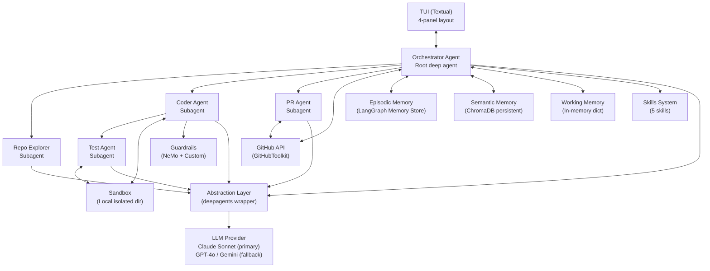
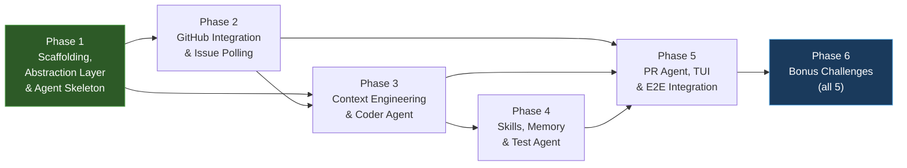

# CodePilot — Multi-Agent Coding Platform: Implementation Plan

## Background

CodePilot is a terminal-based, multi-agent AI coding platform that autonomously triages GitHub issues, implements fixes in a sandboxed environment, and opens pull requests — all while keeping a human in the loop for risky operations. It is built on top of `deepagents` (LangChain/LangGraph), uses `textual` for the TUI, and integrates ChromaDB for semantic memory.

The assignment specifies **7 components** across agent orchestration, context engineering, sandboxed execution, skills, memory, GitHub integration, and TUI. This plan breaks them into **6 phases** — 5 core phases ordered by dependency, plus a dedicated Phase 6 for all bonus challenges.

---

## Implementation Principles

> [!IMPORTANT]
> **Incremental construction:** Dependencies are installed when the step that needs them arrives. Directories are created when code is written into them. Environment variables are added when a module requires them. Each step ends with a verification checkpoint (tests pass, lint clean, smoke test works). Nothing is scaffolded "for later."

Each phase has its own detailed plan in `docs/implementation_phases/phaseN/plan.md` that breaks the phase into ordered, verifiable steps. The plan below is the **high-level overview** — refer to the phase-specific plans for exact code, commands, and reasoning.

---

## Decisions (Resolved)

| Decision | Choice |
|----------|--------|
| **Primary LLM** | Claude Sonnet (via `langchain-anthropic`), with multi-provider fallback to GPT-4o and Gemini 1.5 Pro |
| **Test Repository** | New repo `codepilot-test-repo` with synthetic issues |
| **GitHub Auth** | GitHub App (App ID + private key) |
| **DeepAgents Strategy** | Build an **abstraction layer** over `deepagents` so we can swap to raw LangGraph if the API changes |
| **Storage** | LangGraph Memory Store (`langgraph.store`) for episodic memory + ChromaDB persistent directory for semantic memory |
| **Project Location** | `c:\ai-engineering\codepilot-agent\` |
| **Bonus Challenges** | All 5 — implemented in a separate Phase 6 after core components are stable |

---

## Proposed Architecture



---

## Phase 1 — Project Scaffolding, Abstraction Layer & Core Agent Skeleton ✅

**Goal:** Set up the project structure, install dependencies, build the `deepagents` abstraction layer, create the Orchestrator agent with a basic tool-calling loop, and verify end-to-end integration.

**Status:** Complete — 59 tests passing, lint clean.

**Estimated Effort:** ~3 days

> [!IMPORTANT]
> Phase 1 follows an **incremental, step-by-step approach**. Dependencies are installed when needed, directories are created when code goes in them, and each step has its own verification checkpoint. See the detailed plan: [phase1/plan.md](file:///c:/ai-engineering/codepilot-agent/docs/implementation_phases/phase1/plan.md)

### Steps Overview

| Step | What | Dependencies Installed | Directories Created |
|------|------|----------------------|---------------------|
| 1 ✅ | Dev Tooling & Test Setup | `pytest`, `pytest-asyncio`, `pytest-cov`, `ruff` | `tests/` |
| 2 ✅ | Configuration System | `pydantic-settings` | — (file in existing `src/codepilot/`) |
| 3 ✅ | Data Types & Base Classes | *(none — pure Python)* | `src/codepilot/core/`, `tests/test_core/` |
| 4 ✅ | LLM Provider | `langchain-anthropic`, `langchain-openai`, `langchain-google-genai` | — |
| 5 ✅ | Tool Registry | *(none — pure Python)* | — |
| 6 ✅ | Agent Factory | `deepagents`, `langgraph` | — |
| 7 ✅ | Orchestrator & Entry Point | *(none)* | `src/codepilot/agents/` |

### Config fields added in Phase 1

| Setting | Default | Added In |
|---------|---------|----------|
| `PRIMARY_LLM` | `anthropic:claude-sonnet-4-20250514` | Step 2 |
| `FALLBACK_LLMS` | `openai:gpt-4o,google:gemini-1.5-pro` | Step 2 |
| `ANTHROPIC_API_KEY` | `""` | Step 2 |
| `OPENAI_API_KEY` | `""` | Step 2 |
| `GOOGLE_API_KEY` | `""` | Step 2 |
| `GITHUB_APP_ID` | `""` | Step 2 |
| `GITHUB_APP_PRIVATE_KEY_PATH` | `""` | Step 2 |
| `GITHUB_REPOSITORY` | `codepilot-test-repo` | Step 2 |
| `POLL_INTERVAL_MINUTES` | `5` | Step 2 |
| `MAX_CODER_RETRIES` | `3` | Step 2 |
| `AUTO_SUMMARIZATION_ENABLED` | `True` | Step 2 |
| `SUMMARIZATION_THRESHOLD` | `20` | Step 2 |

### Files created in Phase 1

```
src/codepilot/
├── config.py                       # Step 2
├── main.py                         # Step 7 (replaced placeholder)
├── core/
│   ├── __init__.py                 # Step 3
│   ├── base_agent.py               # Step 3
│   ├── llm_provider.py             # Step 4
│   ├── tool_registry.py            # Step 5
│   └── agent_factory.py            # Step 6
└── agents/
    ├── __init__.py                 # Step 7
    └── orchestrator.py             # Step 7

tests/
├── __init__.py                     # Step 1
├── test_config.py                  # Step 2
├── test_orchestrator.py            # Step 7
└── test_core/
    ├── __init__.py                 # Step 3
    ├── test_base_agent.py          # Step 3
    ├── test_llm_provider.py        # Step 4
    ├── test_tool_registry.py       # Step 5
    └── test_agent_factory.py       # Step 6
```

### What Phase 1 enables

| Capability | Used By |
|------------|---------|
| Config loads from `.env` | Everything |
| LLM calls with fallback | All agents |
| Tool registration per role | Coder, Test Agent |
| Agent creation via factory | All agents |
| Orchestrator receives messages | Phase 2 (issue polling) |
| Subagent spawning defined | Phase 3 (Repo Explorer, Coder) |

### Verification (Phase 1)

```bash
uv run pytest tests/ -v --tb=short           # 59 tests pass
uv run ruff check src/ tests/                # All checks passed
uv run python -m codepilot.main              # Full startup → idle loop
grep -rn "from deepagents\|import deepagents" src/codepilot/ --include="*.py"
# Only hits in agent_factory.py (isolation confirmed)
```

---

## Phase 2 — GitHub Integration, Issue Polling & Task Classification

**Goal:** Set up GitHub App auth, connect to GitHub, poll `codepilot-test-repo` for issues, classify them, and manage the Orchestrator state machine.

**Status:** Not started

**Estimated Effort:** ~2–3 days

> [!IMPORTANT]
> See the detailed step-by-step plan: [phase2/plan.md](file:///c:/ai-engineering/codepilot-agent/docs/implementation_phases/phase2/plan.md)

### Steps Overview

| Step | What | Dependencies Installed | Directories Created |
|------|------|----------------------|---------------------|
| 1 | GitHub Service Abstraction | `langchain-community`, `pygithub` | `src/codepilot/github_integration/` |
| 2 | Working Memory & Task Types | *(none — pure Python)* | `src/codepilot/memory/` |
| 3 | Orchestrator State Machine | *(none)* | — (modifies existing files) |
| 4 | Task Classifier | *(none)* | — |
| 5 | Issue Poller | *(none)* | — |
| 6 | Test Repo & Integration | *(none)* | — (modifies `main.py`) |

### Config fields added in Phase 2

| Setting | Default | Added In |
|---------|---------|----------|
| *(No new config fields — GitHub settings already exist from Phase 1 Step 2)* | | |

### .env additions in Phase 2

```env
# Values for existing config fields (set actual values):
GITHUB_APP_ID=123456
GITHUB_APP_PRIVATE_KEY_PATH=./keys/codepilot.pem
GITHUB_REPOSITORY=owner/codepilot-test-repo
```

### Files created/modified in Phase 2

```
src/codepilot/
├── main.py                                 # Step 6 (modified — add polling)
├── agents/
│   └── orchestrator.py                     # Step 3 (modified — add state machine)
├── github_integration/                     # NEW directory
│   ├── __init__.py                         # Step 1
│   ├── github_service.py                   # Step 1
│   ├── classifier.py                       # Step 4
│   └── issue_poller.py                     # Step 5
└── memory/                                 # NEW directory
    ├── __init__.py                         # Step 2
    └── working.py                          # Step 2

tests/
├── test_github_service.py                  # Step 1
├── test_working_memory.py                  # Step 2
├── test_orchestrator.py                    # Step 3 (modified — add state tests)
├── test_classifier.py                      # Step 4
├── test_issue_poller.py                    # Step 5
└── test_main.py                            # Step 6
```

### What Phase 2 enables

| Capability | Used By |
|------------|---------|
| GitHub API abstraction | Repo Explorer, PR Agent |
| Issue polling loop | Orchestrator, TUI |
| Task classification | Skill selection (Phase 4) |
| State machine | All agent subcommands |
| Working memory | Coder, Test Agent |

### Manual: Test Repository

Create `codepilot-test-repo` on GitHub with synthetic issues:

| Issue | Title | Labels | Expected Type |
|-------|-------|--------|---------------|
| #1 | Fix division by zero in calculator | `ai-assignable`, `bug` | `bug_fix` |
| #2 | Add modulo operation support | `ai-assignable`, `enhancement` | `feature_addition` |
| #3 | Update requests from 2.28 to 2.31 | `ai-assignable`, `dependencies` | `dependency_update` |
| #4 | Add docstrings to all public functions | `ai-assignable`, `documentation` | `documentation` |
| #5 | Fix typo in config file path | `ai-assignable`, `bug` | `config_change` |

### Verification (Phase 2)

```bash
uv run pytest tests/ -v --tb=short           # All tests pass (Phase 1 + Phase 2)
uv run ruff check src/ tests/                # All checks passed
uv run python -m codepilot.main              # Starts polling (or skips if no GitHub config)
```

---

## Phase 3 — Context Engineering, Repo Explorer & Coder Agent

**Goal:** Build the Repo Map, implement semantic/keyword file retrieval, and create the Coder agent with sandboxed execution and guardrails. This is the **heaviest phase**.

**Status:** Not started

**Estimated Effort:** ~4–5 days

> [!IMPORTANT]
> See the detailed step-by-step plan: [phase3/plan.md](file:///c:/ai-engineering/codepilot-agent/docs/implementation_phases/phase3/plan.md)

### Components (high-level)

| Component | Key Files | Dependencies to Install |
|-----------|-----------|------------------------|
| Repo Map Builder | `src/codepilot/context/repo_map.py` | `tiktoken` |
| File Retriever | `src/codepilot/context/retriever.py` | `chromadb` (for embedding search) |
| Repo Explorer Agent | `src/codepilot/agents/repo_explorer.py` | *(none)* |
| Sandbox Manager | `src/codepilot/sandbox/manager.py` | *(none)* |
| Coder Agent | `src/codepilot/agents/coder.py` | *(none)* |
| Command Filter | `src/codepilot/guardrails/command_filter.py` | *(none)* |
| File Filter | `src/codepilot/guardrails/file_filter.py` | *(none)* |
| NeMo Guardrails | `src/codepilot/guardrails/config/` | `nemoguardrails` |

### Directories created in Phase 3

```
src/codepilot/context/          # Repo Map + Retriever
src/codepilot/sandbox/          # Sandbox Manager
src/codepilot/guardrails/       # Guardrails (command filter, file filter, NeMo)
```

### Config fields to add in Phase 3

| Setting | Default | Purpose |
|---------|---------|---------|
| `REPO_MAP_TOKEN_BUDGET` | `4000` | Already exists in config — used when Repo Map builder is implemented |
| `MAX_RELEVANT_FILES` | `10` | Already exists — used by retriever |
| `SANDBOX_BASE_DIR` | `~/.codepilot/sandboxes/` | Already exists — used by sandbox manager |

### Context Engineering Rules (enforced in Phase 3)

- Subagents use `read_file` on-demand — no file contents in spawning prompts
- Orchestrator passes **only file paths** in task delegation
- Auto-summarization enabled via `agent_factory.py` config

### Verification (Phase 3)

- Repo Map builder produces valid output under 4000-token budget
- Keyword and embedding retrievers return relevant files
- Guardrails block `rm -rf /`, `curl`, edits to `.env`
- Coder agent receives a simple bug → edits file → runs in sandbox → produces diff
- Sandbox isolation verified (edits don't leak to live repo)

---

## Phase 4 — Skills, Memory & Test Agent

**Goal:** Implement the 5 skills, 3-tier memory system (LangGraph Memory Store episodic + ChromaDB semantic + in-memory working), and the Test Agent.

**Status:** Not started

**Estimated Effort:** ~3 days

> [!IMPORTANT]
> See the detailed step-by-step plan: [phase4/plan.md](file:///c:/ai-engineering/codepilot-agent/docs/implementation_phases/phase4/plan.md)

### Components (high-level)

| Component | Key Files | Dependencies to Install |
|-----------|-----------|------------------------|
| Skill Base + Registry | `src/codepilot/skills/base.py` | *(none)* |
| Bug Fix Skill | `src/codepilot/skills/bug_fix.py` | *(none)* |
| Feature Addition Skill | `src/codepilot/skills/feature_addition.py` | *(none)* |
| Dependency Update Skill | `src/codepilot/skills/dependency_update.py` | *(none)* |
| Documentation Skill | `src/codepilot/skills/documentation.py` | *(none)* |
| Config Change Skill | `src/codepilot/skills/config_change.py` | *(none)* |
| Episodic Memory | `src/codepilot/memory/episodic.py` | *(uses `langgraph.store` already installed)* |
| Semantic Memory | `src/codepilot/memory/semantic.py` | `chromadb` (if not installed in Phase 3) |
| Test Agent | `src/codepilot/agents/test_agent.py` | *(none)* |

### Directories created in Phase 4

```
src/codepilot/skills/           # Skill definitions
```

### Config fields to add in Phase 4

| Setting | Default | Purpose |
|---------|---------|---------|
| `CHROMADB_PERSIST_DIR` | `~/.codepilot/data/chromadb/` | Already exists — used by semantic memory |
| `COMPLEXITY_THRESHOLD` | `7` | Already exists — used by triage scorer (Bonus 2) |

### Memory Architecture

| Layer | Technology | Persistence | Used For |
|-------|-----------|-------------|----------|
| Working | Python `dict` | In-memory (per-task) | Active task state, retries, files |
| Episodic | LangGraph Memory Store | Persisted | Session summaries, failed issue tracking |
| Semantic | ChromaDB | Persisted | Lessons learned from past PRs |

### Verification (Phase 4)

- Each skill loads correctly with all required fields (name, instructions, workflow_steps, example_prompts, forbidden_actions)
- Episodic memory persists and retrieves last 3 session summaries
- Semantic memory stores and retrieves lessons by similarity
- Test Agent runs pytest on sample project → parses results → returns structured output
- Full flow: Orchestrator loads skill → passes to Coder → Coder follows skill workflow

---

## Phase 5 — PR Agent, TUI & End-to-End Integration

**Goal:** Build the PR Agent, the full 4-panel TUI, HITL approval workflow, and validate the complete end-to-end flow from issue to PR.

**Status:** Not started

**Estimated Effort:** ~3–4 days

> [!IMPORTANT]
> See the detailed step-by-step plan: [phase5/plan.md](file:///c:/ai-engineering/codepilot-agent/docs/implementation_phases/phase5/plan.md)

### Components (high-level)

| Component | Key Files | Dependencies to Install |
|-----------|-----------|------------------------|
| Orchestrator Diff Review | `src/codepilot/agents/orchestrator.py` (modify) | *(none)* |
| PR Agent | `src/codepilot/agents/pr_agent.py` | *(none)* |
| PR Builder Helper | `src/codepilot/github_integration/pr_builder.py` | *(none)* |
| HITL System | `src/codepilot/guardrails/hitl.py` | *(none)* |
| TUI App | `src/codepilot/tui/app.py` | `textual` |
| Issues Panel | `src/codepilot/tui/panels/issues.py` | *(none)* |
| Active Task Panel | `src/codepilot/tui/panels/active_task.py` | *(none)* |
| Agent Logs Panel | `src/codepilot/tui/panels/agent_logs.py` | *(none)* |
| Approval Panel | `src/codepilot/tui/panels/approval.py` | *(none)* |
| TUI Styles | `src/codepilot/tui/styles.tcss` | *(none)* |

### Directories created in Phase 5

```
src/codepilot/tui/              # TUI application
src/codepilot/tui/panels/       # Individual TUI panels
```

### HITL Gates

| Gate | Trigger Condition |
|------|-------------------|
| PR to `main`/`master` | PR Agent targets protected branch |
| Large commit | Commit touches > 5 files |
| `git push` | Any `execute` containing `git push` |
| Retry after failures | `retry_count >= 2` for test failures |

### Orchestrator Diff Review Step

Before spawning the PR Agent, the Orchestrator reviews the proposed diff:
- **APPROVE** → spawn PR Agent (transition to `PR_OPENED`)
- **RETRY** → send feedback back to Coder, decrement retry count
- **ESCALATE** → trigger HITL interrupt, show diff in Human Approval panel

### Manual Task Flow

The `[i] New task` TUI shortcut allows free-form coding tasks not tied to a GitHub issue. These follow the same state machine but with optional PR creation.

### Verification (Phase 5)

- PR Agent creates branch + commit + PR on `codepilot-test-repo`
- HITL gate blocks on "PR to main" → user approves → PR opens
- Orchestrator reviews diff → approves → PR Agent spawns
- Merge conflict → Human Approval panel shows alert
- Manual task → full agent chain runs → HITL asks about PR
- **End-to-end**: synthetic issue → poll → classify → explore → code → test → review diff → open PR → approve

---

## Phase 6 — Bonus Challenges

**Goal:** With all core components stable and verified, implement all 5 bonus challenges as additive features that don't disturb the existing architecture.

**Status:** Not started

**Estimated Effort:** ~4–5 days

> [!NOTE]
> Each bonus is self-contained. They can be implemented in any order; dependencies between them are minimal.

> [!IMPORTANT]
> See the detailed step-by-step plan: [phase6/plan.md](file:///c:/ai-engineering/codepilot-agent/docs/implementation_phases/phase6/plan.md)

### Bonus Overview

| # | Bonus | Key Files | Dependencies |
|---|-------|-----------|-------------|
| 1 | Self-Healing Tests | `src/codepilot/agents/meta_test_agent.py` | *(none)* |
| 2 | Issue Triage Scoring | `src/codepilot/github_integration/triage_scorer.py` | *(none)* |
| 3 | LangSmith Tracing | `src/codepilot/core/tracing.py` | `langsmith` |
| 4 | Cloud Sandbox (Daytona/Modal) | `src/codepilot/sandbox/cloud_sandbox.py` | `daytona-sdk` or `modal` |
| 5 | ACP Integration | `src/codepilot/acp_server.py` | `fastapi`, `uvicorn` |

### Config fields to add in Phase 6

| Setting | Default | Bonus | Purpose |
|---------|---------|-------|---------|
| `LANGSMITH_ENABLED` | `False` | 3 | Enable LangSmith tracing |
| `LANGCHAIN_API_KEY` | `""` | 3 | LangSmith API key |
| `LANGCHAIN_PROJECT` | `codepilot` | 3 | LangSmith project name |
| `SANDBOX_PROVIDER` | `local` | 4 | `local`, `daytona`, or `modal` |
| `DAYTONA_API_KEY` | `""` | 4 | Daytona API key |
| `MODAL_TOKEN` | `""` | 4 | Modal token |
| `ACP_ENABLED` | `False` | 5 | Enable ACP server |
| `ACP_PORT` | `8420` | 5 | ACP server port |

### Verification (Phase 6)

- Bonus 1: Broken test import → meta-agent fixes it → tests re-run successfully
- Bonus 2: Issues of varying complexity → scores assigned correctly → high-complexity issues skipped
- Bonus 3: Full task → LangSmith shows complete trace tree → screenshot captured
- Bonus 4: Task with `SANDBOX_PROVIDER=modal` → code executes in cloud → results returned
- Bonus 5: `curl POST /tasks` → task executes → result returned via API

---

## Dependency Map Between Phases



> [!NOTE]
> Phase 6 (Bonus) depends on Phase 5 being fully stable. Each bonus within Phase 6 is independent and can be implemented in any order.

---

## Key Dependencies (Installed Incrementally)

| Package | Installed In | Purpose |
|---------|-------------|---------|
| `pytest` | Phase 1, Step 1 | Run tests |
| `pytest-asyncio` | Phase 1, Step 1 | Async test support |
| `pytest-cov` | Phase 1, Step 1 | Test coverage |
| `ruff` | Phase 1, Step 1 | Linting & formatting |
| `pydantic-settings` | Phase 1, Step 2 | Config from .env |
| `langchain-anthropic` | Phase 1, Step 4 | Claude Sonnet (primary LLM) |
| `langchain-openai` | Phase 1, Step 4 | GPT-4o (fallback) |
| `langchain-google-genai` | Phase 1, Step 4 | Gemini (fallback) |
| `deepagents` | Phase 1, Step 6 | Agent framework |
| `langgraph` | Phase 1, Step 6 | Agent runtime |
| `aiosqlite` | Phase 1, Step 6 | Async SQLite for LangGraph checkpointing |
| `langchain-community` | Phase 2, Step 1 | GitHub Toolkit |
| `pygithub` | Phase 2, Step 1 | Fallback GitHub API |
| `tiktoken` | Phase 3 | Token counting for Repo Map |
| `chromadb` | Phase 3 or 4 | Semantic memory vector store |
| `nemoguardrails` | Phase 3 | Guardrails framework |
| `textual` | Phase 5 | TUI framework |
| `langsmith` | Phase 6, Bonus 3 | LangSmith tracing |

---

## Risk Assessment

| Risk | Impact | Mitigation |
|------|--------|------------|
| `deepagents` API instability | High — could break core agent creation | **Abstraction layer** (`core/`) isolates all agents; swap to `LangGraphFactory` in one file |
| `langchain-community` GitHub Toolkit deprecation | Medium — toolkit works but unmaintained | `GitHubService` wrapper abstracts it; can swap to `PyGithub` |
| Claude Sonnet rate limits | Medium — primary LLM unavailable | Multi-provider fallback to GPT-4o → Gemini 1.5 Pro |
| GitHub App auth complexity | Low — more setup than PAT | Provide clear `.env.example` + setup guide in README |
| ChromaDB performance at scale | Low — CodePilot handles small repos | Persistent storage; set collection size limits |
| LLM rate limits during polling | Medium — frequent LLM calls for classification | Cache classifications; batch polling; configurable intervals |
| Sandbox escape via `execute` | High — security risk | Multi-layer: command filter + NeMo + filesystem permissions |
| TUI complexity | Medium — 4-panel streaming layout is non-trivial | Build panels incrementally; use Textual's `RichLog` + `ListView` |

---

## Total Estimated Effort

| Phase | Effort | Status |
|-------|--------|--------|
| Phase 1 — Scaffolding & Abstraction Layer | ~3 days | ✅ Complete |
| Phase 2 — GitHub Integration & Polling | ~2–3 days | ⬜ Not started |
| Phase 3 — Context Engineering & Coder | ~4–5 days | ⬜ Not started |
| Phase 4 — Skills, Memory & Test Agent | ~3 days | ⬜ Not started |
| Phase 5 — PR Agent, TUI & E2E | ~3–4 days | ⬜ Not started |
| Phase 6 — Bonus Challenges | ~4–5 days | ⬜ Not started |
| **Total** | **~19–23 days** | |

---

## Submission Checklist (from Assignment)

- [ ] Public GitHub repo named `codepilot-agent`
- [ ] `README.md` with: setup instructions, architecture diagram, screen recording/GIF, example PR
- [ ] 5–7 minute demo video: issue polling, full task execution, HITL approval, guardrail block
- [ ] LinkedIn post with demo video
- [ ] LangSmith trace screenshot (Bonus 3)
