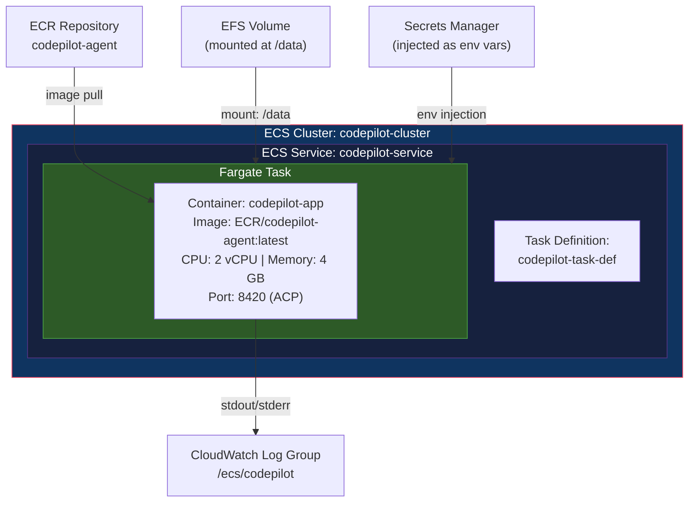
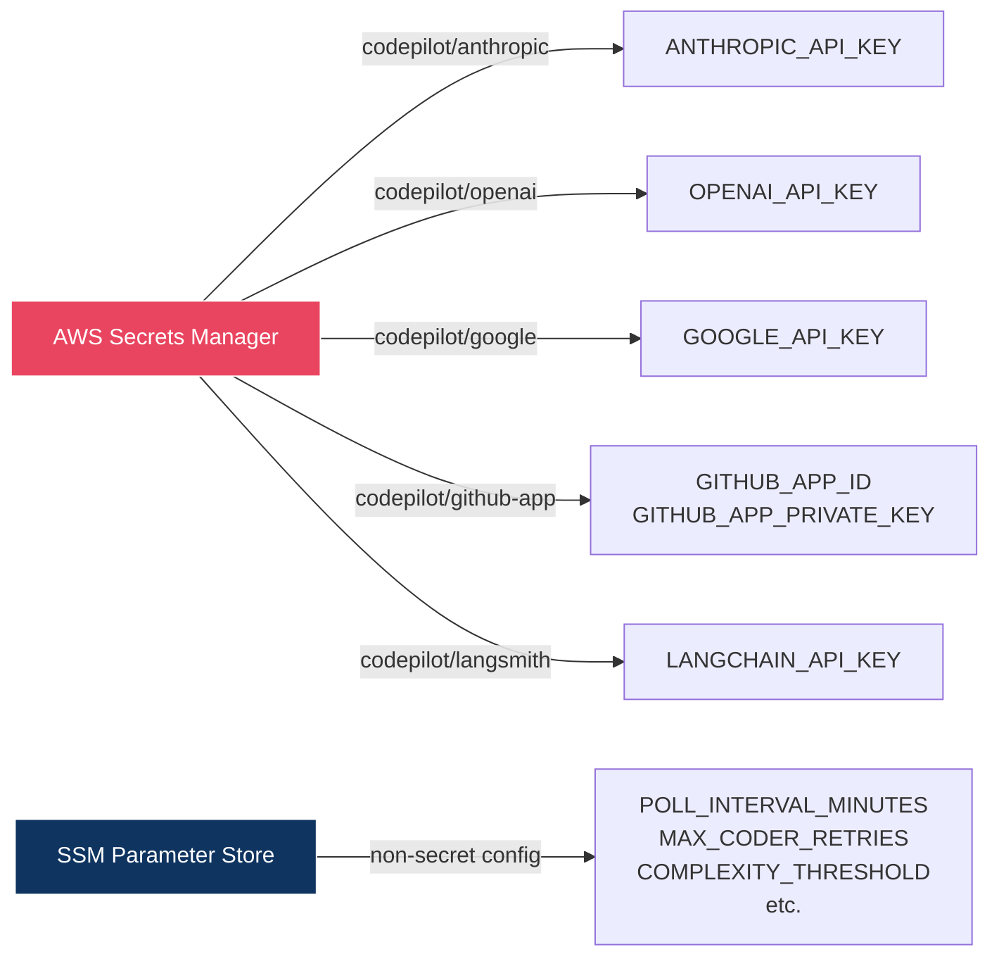
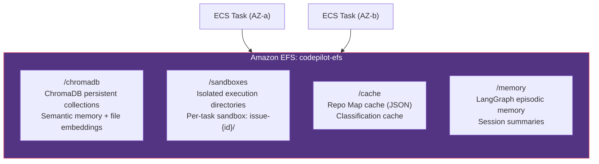
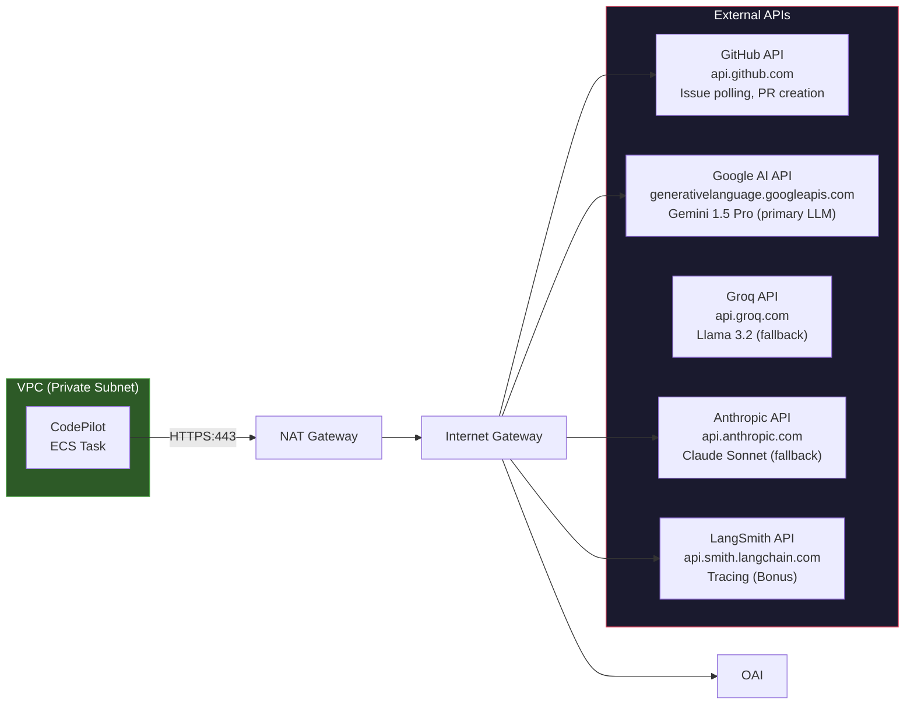
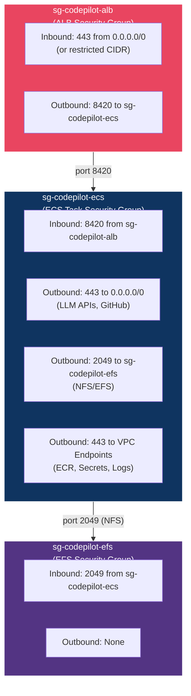
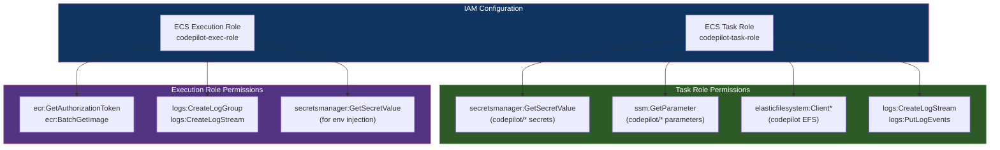
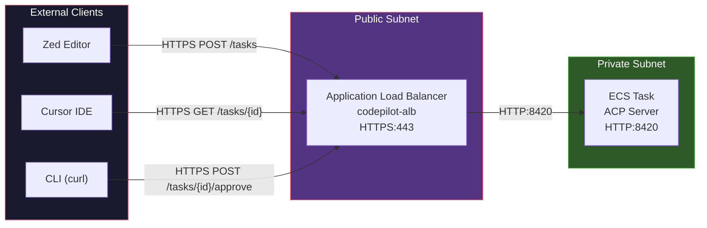
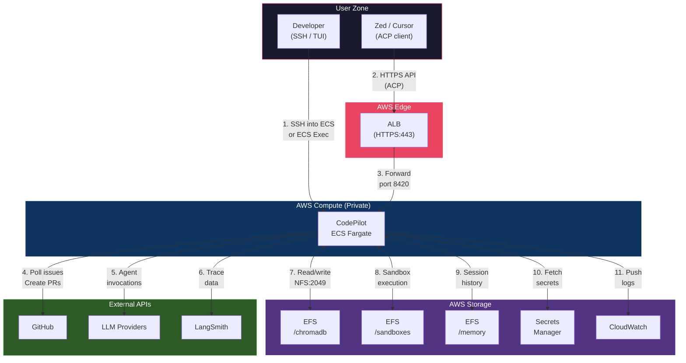
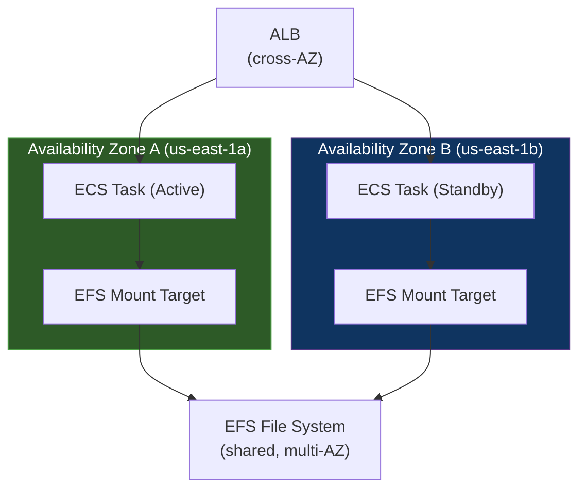

# CodePilot — AWS Network Architecture

> **Version:** 1.0  
> **Last Updated:** 2026-07-19  
> **Cloud Provider:** Amazon Web Services (AWS)  
> **Region:** User-configurable (default: `us-east-1`)  
> **Related:** [architecture.md](file:///c:/ai-engineering/codepilot-agent/docs/architecture.md) · [implementation_plan.md](file:///c:/ai-engineering/codepilot-agent/docs/implementation_plan.md)

---

## Table of Contents

1. [Network Overview](#1-network-overview)
2. [AWS Network Topology](#2-aws-network-topology)
3. [VPC & Subnet Design](#3-vpc--subnet-design)
4. [Compute Layer](#4-compute-layer)
5. [Storage Layer](#5-storage-layer)
6. [External API Connectivity](#6-external-api-connectivity)
7. [Security & Access Control](#7-security--access-control)
8. [ACP API Gateway (Bonus)](#8-acp-api-gateway-bonus)
9. [Data Flow Across Network Boundaries](#9-data-flow-across-network-boundaries)
10. [High Availability & Scaling](#10-high-availability--scaling)
11. [Cost Optimization](#11-cost-optimization)
12. [AWS Resource Inventory](#12-aws-resource-inventory)

---

## 1. Network Overview

CodePilot is deployed on AWS as a containerized application running inside a VPC. The system makes **outbound-only** connections to external LLM providers and GitHub, with an optional inbound API endpoint for ACP integration (Bonus 5).

```
┌─────────────────────────────────────────────────────────────────────────┐
│                           AWS Cloud (us-east-1)                         │
│                                                                         │
│  ┌───────────────────────────── VPC ──────────────────────────────────┐ │
│  │                         10.0.0.0/16                                │ │
│  │                                                                    │ │
│  │  ┌─ Private Subnet ────────────┐  ┌─ Private Subnet ───────────┐ │ │
│  │  │  10.0.1.0/24 (AZ-a)        │  │  10.0.2.0/24 (AZ-b)       │ │ │
│  │  │                             │  │                             │ │ │
│  │  │  ┌─────────────────────┐   │  │  ┌──────────────────────┐  │ │ │
│  │  │  │  ECS Fargate Task   │   │  │  │  ECS Fargate Task    │  │ │ │
│  │  │  │  (CodePilot App)    │   │  │  │  (Standby / Scale)   │  │ │ │
│  │  │  └─────────────────────┘   │  │  └──────────────────────┘  │ │ │
│  │  │                             │  │                             │ │ │
│  │  │  ┌─────────────────────┐   │  │                             │ │ │
│  │  │  │  EFS Mount Target   │   │  │  ┌──────────────────────┐  │ │ │
│  │  │  │  (ChromaDB + Cache) │   │  │  │  EFS Mount Target    │  │ │ │
│  │  │  └─────────────────────┘   │  │  └──────────────────────┘  │ │ │
│  │  └────────────────────────────┘  └─────────────────────────────┘ │ │
│  │                                                                    │ │
│  │  ┌─ Public Subnet (optional, Bonus ACP) ────────────────────────┐ │ │
│  │  │  10.0.100.0/24                                                │ │ │
│  │  │  ┌──────────────┐    ┌──────────────┐                        │ │ │
│  │  │  │  NAT Gateway │    │     ALB      │  ← ACP inbound only    │ │ │
│  │  │  └──────────────┘    └──────────────┘                        │ │ │
│  │  └───────────────────────────────────────────────────────────────┘ │ │
│  └────────────────────────────────────────────────────────────────────┘ │
│                                                                         │
│  ┌─────────────┐  ┌──────────────────┐  ┌──────────────────────────┐   │
│  │  Secrets     │  │  CloudWatch      │  │  ECR                     │   │
│  │  Manager     │  │  Logs + Metrics  │  │  (Container Registry)    │   │
│  └─────────────┘  └──────────────────┘  └──────────────────────────┘   │
│                                                                         │
└──────────────────────────┬──────────────────────────────────────────────┘
                           │ NAT Gateway (outbound)
                           ▼
              ┌────────────────────────┐
              │    Internet Gateway     │
              └────────┬───────────────┘
         ┌─────────────┼──────────────────────┐
         ▼             ▼                      ▼
   ┌───────────┐ ┌───────────┐         ┌───────────┐
   │  GitHub   │ │  LLM APIs │         │ LangSmith │
   │  API      │ │  (Claude, │         │  (Bonus)  │
   └───────────┘ │  GPT, etc)│         └───────────┘
                 └───────────┘
```

---

## 2. AWS Network Topology

```mermaid
graph TB
    subgraph Internet["Internet / External Services"]
        GH["GitHub API<br/>api.github.com"]
        ANTH["Anthropic API<br/>api.anthropic.com"]
        OAI["OpenAI API<br/>api.openai.com"]
        GOOG["Google AI API<br/>generativelanguage.googleapis.com"]
        LS["LangSmith<br/>api.smith.langchain.com"]
        USER_EXT["Remote User<br/>(SSH / ACP client)"]
    end

    subgraph AWS["AWS Cloud — Region: us-east-1"]
        IGW["Internet Gateway"]

        subgraph VPC["VPC: 10.0.0.0/16"]
            subgraph Public_Subnet["Public Subnet: 10.0.100.0/24"]
                NAT["NAT Gateway<br/>(Elastic IP)"]
                ALB["Application Load Balancer<br/>(Bonus: ACP endpoint)<br/>Port 443"]
            end

            subgraph Private_AZa["Private Subnet AZ-a: 10.0.1.0/24"]
                ECS_TASK_1["ECS Fargate Task<br/>CodePilot Container<br/>(vCPU: 2, Memory: 4GB)"]
                EFS_MT_A["EFS Mount Target"]
            end

            subgraph Private_AZb["Private Subnet AZ-b: 10.0.2.0/24"]
                ECS_TASK_2["ECS Fargate Task<br/>(Standby / HA)"]
                EFS_MT_B["EFS Mount Target"]
            end

            SG_ECS["Security Group:<br/>sg-codepilot-ecs"]
            SG_EFS["Security Group:<br/>sg-codepilot-efs"]
            SG_ALB["Security Group:<br/>sg-codepilot-alb"]
        end

        ECR["ECR<br/>codepilot-agent"]
        SM["Secrets Manager<br/>API Keys, GitHub PEM"]
        CW["CloudWatch<br/>Logs + Metrics + Alarms"]
        EFS["EFS File System<br/>(ChromaDB + Sandboxes + Cache)"]
        SSM["Systems Manager<br/>Parameter Store"]
    end

    USER_EXT -->|"HTTPS:443"| ALB
    ALB -->|"HTTP:8420"| ECS_TASK_1
    ECS_TASK_1 --> EFS_MT_A
    ECS_TASK_2 --> EFS_MT_B
    EFS_MT_A --> EFS
    EFS_MT_B --> EFS

    ECS_TASK_1 -->|"outbound via NAT"| NAT
    ECS_TASK_2 -->|"outbound via NAT"| NAT
    NAT --> IGW

    IGW --> GH
    IGW --> ANTH
    IGW --> OAI
    IGW --> GOOG
    IGW --> LS

    ECS_TASK_1 -.->|"VPC Endpoint"| SM
    ECS_TASK_1 -.->|"VPC Endpoint"| CW
    ECS_TASK_1 -.->|"VPC Endpoint"| ECR
    ECS_TASK_1 -.->|"VPC Endpoint"| SSM

    style Internet fill:#1a1a2e,stroke:#e94560,color:#fff
    style AWS fill:#0f3460,stroke:#e94560,color:#fff
    style VPC fill:#16213e,stroke:#533483,color:#fff
    style Public_Subnet fill:#533483,stroke:#e94560,color:#fff
    style Private_AZa fill:#2d5a27,stroke:#4a9e42,color:#fff
    style Private_AZb fill:#2d5a27,stroke:#4a9e42,color:#fff
```



---

## 3. VPC & Subnet Design

### CIDR Allocation

| Resource | CIDR | Availability Zone | Purpose |
|---|---|---|---|
| **VPC** | `10.0.0.0/16` | — | Root VPC (65,536 IPs) |
| **Private Subnet A** | `10.0.1.0/24` | `us-east-1a` | Primary ECS tasks, EFS mount |
| **Private Subnet B** | `10.0.2.0/24` | `us-east-1b` | HA standby ECS tasks, EFS mount |
| **Public Subnet** | `10.0.100.0/24` | `us-east-1a` | NAT Gateway, ALB (ACP bonus) |

### Route Tables

#### Private Subnet Route Table

| Destination | Target | Purpose |
|---|---|---|
| `10.0.0.0/16` | `local` | Intra-VPC traffic |
| `0.0.0.0/0` | NAT Gateway | Outbound internet (LLM APIs, GitHub) |

#### Public Subnet Route Table

| Destination | Target | Purpose |
|---|---|---|
| `10.0.0.0/16` | `local` | Intra-VPC traffic |
| `0.0.0.0/0` | Internet Gateway | Inbound/outbound internet |

### VPC Endpoints (Private Link — no NAT cost for AWS services)

| Endpoint | Type | Service |
|---|---|---|
| `vpce-ecr-api` | Interface | `com.amazonaws.us-east-1.ecr.api` |
| `vpce-ecr-dkr` | Interface | `com.amazonaws.us-east-1.ecr.dkr` |
| `vpce-s3` | Gateway | `com.amazonaws.us-east-1.s3` (for ECR layer pulls) |
| `vpce-secretsmanager` | Interface | `com.amazonaws.us-east-1.secretsmanager` |
| `vpce-logs` | Interface | `com.amazonaws.us-east-1.logs` |
| `vpce-ssm` | Interface | `com.amazonaws.us-east-1.ssm` |

> [!TIP]
> VPC Endpoints keep AWS service traffic within the AWS network, avoiding NAT Gateway data processing charges and improving security.

---

## 4. Compute Layer

### ECS Fargate Configuration



#### Task Definition Parameters

| Parameter | Value | Notes |
|---|---|---|
| **CPU** | 2048 (2 vCPU) | Sufficient for multi-agent orchestration |
| **Memory** | 4096 MB (4 GB) | ChromaDB embeddings + agent context windows |
| **Ephemeral Storage** | 30 GB | Sandbox directories for code execution |
| **Network Mode** | `awsvpc` | Each task gets its own ENI |
| **Platform Version** | `1.4.0+` | Required for EFS support |
| **Log Driver** | `awslogs` | CloudWatch log group: `/ecs/codepilot` |

#### EFS Volume Mounts

| Container Path | EFS Path | Access | Purpose |
|---|---|---|---|
| `/data/chromadb` | `/chromadb` | Read/Write | ChromaDB persistent vector store |
| `/data/sandboxes` | `/sandboxes` | Read/Write | Sandbox working directories |
| `/data/cache` | `/cache` | Read/Write | Repo Map cache, classification cache |
| `/data/memory` | `/memory` | Read/Write | Episodic memory (LangGraph store) |

#### Container Environment Variables (from Secrets Manager)



---

## 5. Storage Layer



### EFS Configuration

| Parameter | Value | Rationale |
|---|---|---|
| **Performance Mode** | General Purpose | Sufficient for CodePilot's I/O patterns |
| **Throughput Mode** | Bursting | Cost-effective; handles spike during sandbox ops |
| **Encryption** | At rest (AWS-managed KMS key) | Protects cached code and credentials |
| **Lifecycle Policy** | Transition to IA after 30 days | Cost savings on old sandbox artifacts |
| **Backup** | AWS Backup — daily, 7-day retention | Protect semantic memory |

### Why EFS (not EBS or S3)?

| Requirement | EFS | EBS | S3 |
|---|---|---|---|
| Shared across AZs | ✅ | ❌ (single AZ) | ✅ |
| POSIX filesystem (ChromaDB needs this) | ✅ | ✅ | ❌ |
| Concurrent read/write from multiple tasks | ✅ | ❌ (single attach) | ✅ (but not POSIX) |
| Low latency file access | ✅ | ✅ | ❌ |
| Auto-scales capacity | ✅ | ❌ (fixed size) | ✅ |

---

## 6. External API Connectivity

All external traffic flows **outbound** through the NAT Gateway. No inbound connections are accepted except for the optional ACP endpoint.



### Outbound Traffic Summary

| Destination | Protocol | Port | Frequency | Data Volume |
|---|---|---|---|---|
| `api.github.com` | HTTPS | 443 | Every 5 min (polling) + per PR | Low (~KBs per request) |
| `api.anthropic.com` | HTTPS | 443 | Per agent invocation | Medium (~10–50 KB per call) |
| `api.openai.com` | HTTPS | 443 | On primary LLM failure | Low (fallback only) |
| `generativelanguage.googleapis.com` | HTTPS | 443 | On double LLM failure | Low (fallback only) |
| `api.smith.langchain.com` | HTTPS | 443 | Per agent call (if enabled) | Low (~KBs per trace) |

### NAT Gateway Considerations

> [!IMPORTANT]
> NAT Gateway incurs per-hour and per-GB charges. Estimated cost: ~$35/month (1 NAT, standard usage). Use VPC Endpoints for AWS services (ECR, Secrets Manager, CloudWatch) to minimize NAT data processing.

---

## 7. Security & Access Control

### Security Group Configuration



#### Security Group Rules (Detailed)

**sg-codepilot-alb** (Application Load Balancer — Bonus ACP only)

| Direction | Protocol | Port | Source/Dest | Description |
|---|---|---|---|---|
| Inbound | TCP | 443 | `0.0.0.0/0` (or user CIDR) | HTTPS from ACP clients |
| Outbound | TCP | 8420 | `sg-codepilot-ecs` | Forward to ECS tasks |

**sg-codepilot-ecs** (ECS Fargate Tasks)

| Direction | Protocol | Port | Source/Dest | Description |
|---|---|---|---|---|
| Inbound | TCP | 8420 | `sg-codepilot-alb` | ACP API requests |
| Outbound | TCP | 443 | `0.0.0.0/0` | LLM APIs, GitHub API, LangSmith |
| Outbound | TCP | 2049 | `sg-codepilot-efs` | EFS (NFS) mount |
| Outbound | TCP | 443 | VPC Endpoint SGs | ECR, Secrets Manager, CloudWatch, SSM |

**sg-codepilot-efs** (EFS File System)

| Direction | Protocol | Port | Source/Dest | Description |
|---|---|---|---|---|
| Inbound | TCP | 2049 | `sg-codepilot-ecs` | NFS from ECS tasks |

### IAM Roles



### Secrets Manager Layout

| Secret Name | Contents | Rotation |
|---|---|---|
| `codepilot/anthropic` | `ANTHROPIC_API_KEY` | Manual |
| `codepilot/openai` | `OPENAI_API_KEY` | Manual |
| `codepilot/google` | `GOOGLE_API_KEY` | Manual |
| `codepilot/github-app` | `GITHUB_APP_ID`, `GITHUB_APP_PRIVATE_KEY` (PEM) | Manual |
| `codepilot/langsmith` | `LANGCHAIN_API_KEY` | Manual |

### Encryption

| Data | At Rest | In Transit |
|---|---|---|
| EFS volumes | AWS KMS (aws/elasticfilesystem) | TLS via EFS mount helper |
| Secrets Manager | AWS KMS (aws/secretsmanager) | TLS |
| CloudWatch Logs | AWS KMS (optional CMK) | TLS |
| ECR images | AWS KMS (aws/ecr) | TLS |
| External API calls | N/A | TLS 1.2+ |

---

## 8. ACP API Gateway (Bonus)

When ACP integration (Bonus 5) is enabled, an Application Load Balancer provides a secure HTTPS endpoint for external Zed/Cursor clients.



### ALB Configuration

| Parameter | Value |
|---|---|
| **Scheme** | Internet-facing |
| **Listener** | HTTPS:443 (ACM certificate) |
| **Target Group** | `codepilot-tg` (port 8420, health check: `/health`) |
| **SSL Policy** | `ELBSecurityPolicy-TLS13-1-2-2021-06` |
| **Access Logs** | S3 bucket: `codepilot-alb-logs` |

### ACP API Endpoints

| Method | Path | Description |
|---|---|---|
| `POST` | `/tasks` | Submit a coding task |
| `GET` | `/tasks/{id}` | Check task status |
| `GET` | `/tasks/{id}/result` | Get result (diff, PR URL) |
| `POST` | `/tasks/{id}/approve` | Approve HITL gate |
| `GET` | `/health` | Health check (ALB target group) |

> [!NOTE]
> If ACP is not enabled, the ALB and public subnet can be removed entirely — the system operates as **outbound-only** with no inbound internet access.

---

## 9. Data Flow Across Network Boundaries



### Network Flow Summary

| # | Flow | Protocol | Path | Frequency |
|---|---|---|---|---|
| 1 | Developer → ECS (TUI) | SSH / ECS Exec | SSM Session Manager | On-demand |
| 2 | IDE → ALB (ACP) | HTTPS | Internet → ALB → ECS | On-demand |
| 3 | ALB → ECS | HTTP | VPC internal | Per ACP request |
| 4 | ECS → GitHub | HTTPS | Private → NAT → IGW → Internet | Every 5 min + per PR |
| 5 | ECS → LLM APIs | HTTPS | Private → NAT → IGW → Internet | Per agent call |
| 6 | ECS → LangSmith | HTTPS | Private → NAT → IGW → Internet | Per agent call (bonus) |
| 7–9 | ECS ↔ EFS | NFS | VPC internal (port 2049) | Continuous |
| 10 | ECS → Secrets Manager | HTTPS | VPC Endpoint (private) | At task startup |
| 11 | ECS → CloudWatch | HTTPS | VPC Endpoint (private) | Continuous (log stream) |

---

## 10. High Availability & Scaling

### HA Architecture



### Scaling Strategy

| Scenario | Strategy | Config |
|---|---|---|
| **Single developer** | 1 Fargate task, no ALB | Minimum viable deployment |
| **Team deployment** | 1–2 tasks, ALB for ACP | HA with EFS-shared state |
| **Multi-repo scale** | Auto-scaling on CPU/memory | ECS Service auto-scaling (target tracking) |

### Auto-Scaling Policy (if enabled)

| Metric | Target | Scale Out | Scale In |
|---|---|---|---|
| CPU Utilization | 70% | +1 task (max 4) | -1 task (min 1) |
| Memory Utilization | 75% | +1 task (max 4) | -1 task (min 1) |
| Cooldown | — | 300s | 600s |

---

## 11. Cost Optimization

### Estimated Monthly Cost (Single Developer, us-east-1)

| Resource | Configuration | Est. Monthly Cost |
|---|---|---|
| **ECS Fargate** | 2 vCPU, 4 GB, ~12 hrs/day | ~$55 |
| **EFS** | 5 GB standard, bursting throughput | ~$1.50 |
| **NAT Gateway** | 1 gateway, ~10 GB data processed | ~$38 |
| **Secrets Manager** | 5 secrets, ~1000 API calls | ~$3 |
| **CloudWatch Logs** | ~5 GB ingestion | ~$2.50 |
| **ECR** | ~2 GB image storage | ~$0.20 |
| **ALB** (Bonus ACP) | 1 ALB, low traffic | ~$18 |
| **Total (without ALB)** | — | **~$100/month** |
| **Total (with ALB)** | — | **~$118/month** |

> [!TIP]
> **Cost reduction strategies:**
> - Use **ECS Fargate Spot** for non-critical workloads (up to 70% savings)
> - Schedule ECS task to run only during business hours via EventBridge
> - Use **S3 Gateway Endpoint** (free) to avoid NAT charges for ECR pulls
> - Consider **single-AZ deployment** for development environments

---

## 12. AWS Resource Inventory

### Complete Resource List

| Resource | Name/ID | Purpose |
|---|---|---|
| **VPC** | `codepilot-vpc` | Network isolation |
| **Private Subnet A** | `codepilot-private-a` | Primary compute (AZ-a) |
| **Private Subnet B** | `codepilot-private-b` | HA compute (AZ-b) |
| **Public Subnet** | `codepilot-public` | NAT GW + ALB |
| **Internet Gateway** | `codepilot-igw` | Outbound internet |
| **NAT Gateway** | `codepilot-nat` | Private subnet outbound |
| **ECS Cluster** | `codepilot-cluster` | Container orchestration |
| **ECS Service** | `codepilot-service` | Task lifecycle management |
| **ECS Task Definition** | `codepilot-task-def` | Container configuration |
| **ECR Repository** | `codepilot-agent` | Docker image storage |
| **EFS File System** | `codepilot-efs` | Persistent storage |
| **ALB** (Bonus) | `codepilot-alb` | ACP HTTPS endpoint |
| **Target Group** (Bonus) | `codepilot-tg` | ALB target routing |
| **Secrets Manager** | `codepilot/*` | API keys, GitHub PEM |
| **SSM Parameters** | `/codepilot/*` | Non-secret config |
| **CloudWatch Log Group** | `/ecs/codepilot` | Application logs |
| **CloudWatch Alarms** | `codepilot-*` | CPU, memory, error alerts |
| **Security Groups** | `sg-codepilot-{ecs,efs,alb}` | Network access control |
| **IAM Role (Task)** | `codepilot-task-role` | Runtime permissions |
| **IAM Role (Exec)** | `codepilot-exec-role` | ECS agent permissions |
| **VPC Endpoints** | `vpce-codepilot-*` | Private AWS service access |

### Tagging Strategy

All resources are tagged with:

| Tag Key | Example Value | Purpose |
|---|---|---|
| `Project` | `codepilot` | Cost allocation |
| `Environment` | `production` / `staging` | Environment identification |
| `ManagedBy` | `terraform` / `manual` | IaC tracking |
| `Owner` | `engineering-team` | Ownership |

---

*This document describes the AWS network deployment architecture for CodePilot. For application architecture, see [architecture.md](file:///c:/ai-engineering/codepilot-agent/docs/architecture.md). For implementation details, see [implementation_plan.md](file:///c:/ai-engineering/codepilot-agent/docs/implementation_plan.md).*
